# Ardour Shorcuts

## Playing Music
| Action                       | Shortcut                | Images|
|------------------------------|--------------------------|------|
| Play / Pause                 | Space                   | 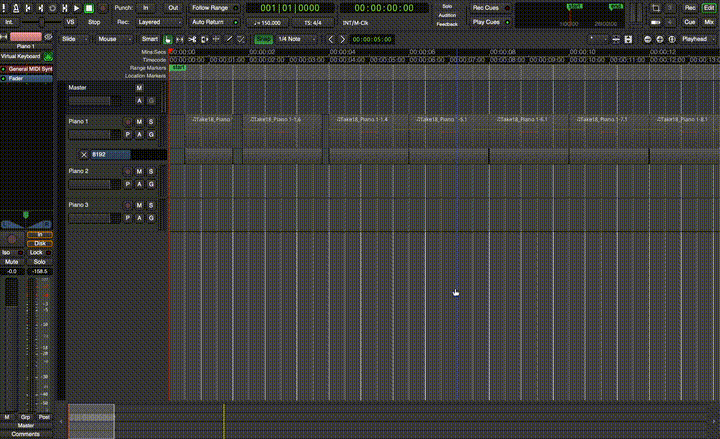 |
| Start Recording              | Shift + Space           | 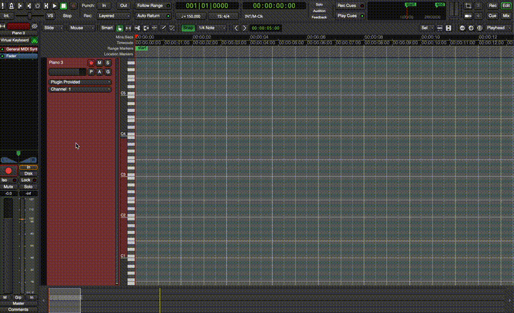 |
| Metronome                    | ` or ~                  | 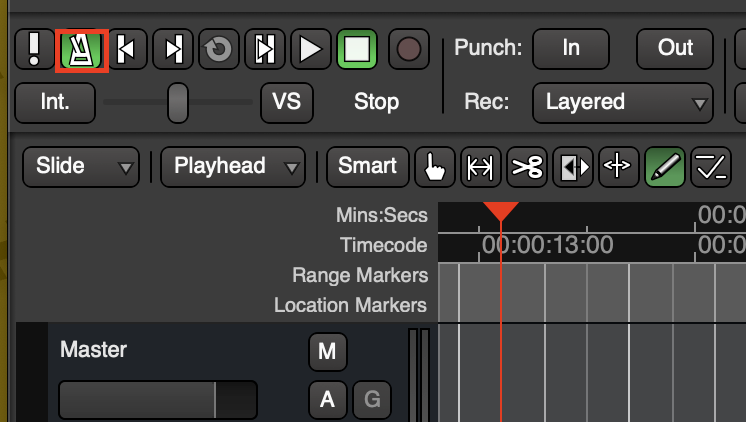 |

## Navigation
| Action                       | Shortcut                | Images|
|------------------------------|--------------------------|------|
| Zoom In / Zoom Out           | = / – or CMD + Scroll | 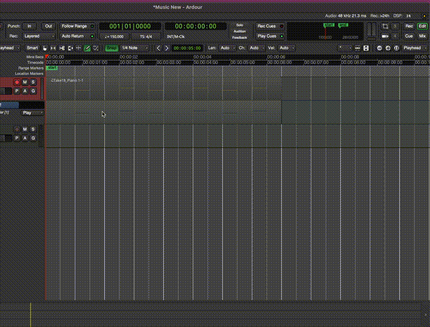 |
| Focus on Selected | Z and Shift + Z to undo | 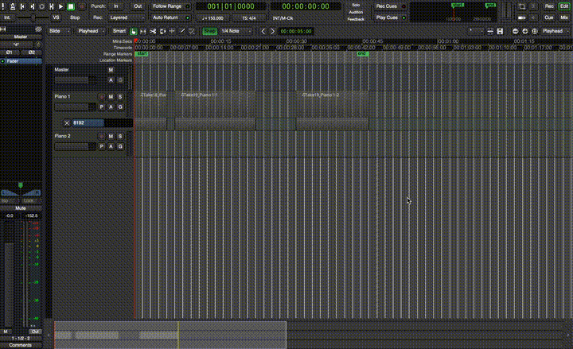 |
| Fit Selection (Vertical) | F and Shift + Z to undo | 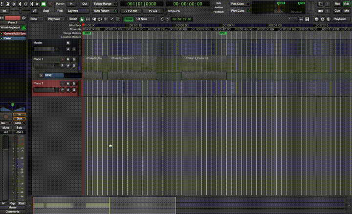 |

## Views
| Action                       | Shortcut                | Images|
|------------------------------|--------------------------|------|
| Toggle Editor/Mixer Window   | Shift + E               | 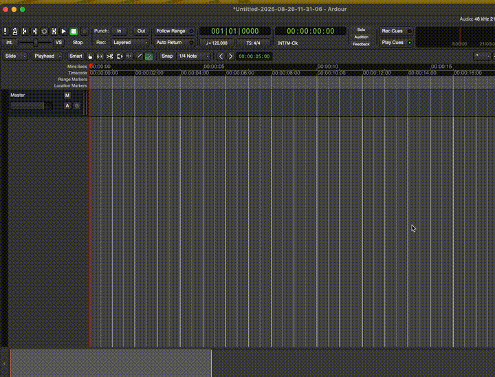 |
| Hide/Show Mixer List         | Shift + L               | 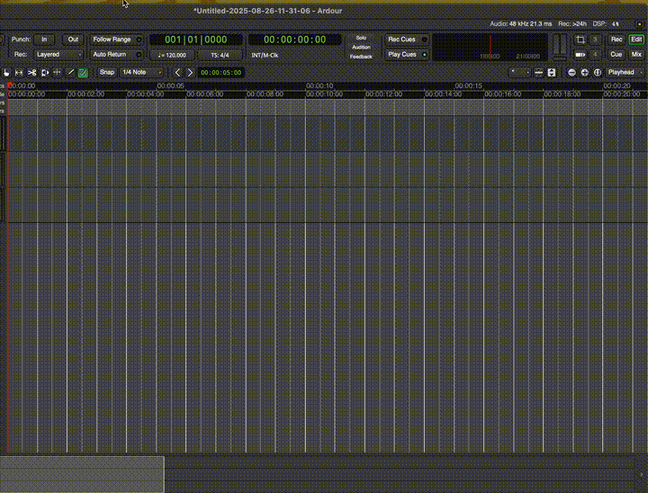 |

## Editing Track
| Action                       | Shortcut                | Images|
|------------------------------|--------------------------|------|
| Split at Edit Point          | S  | 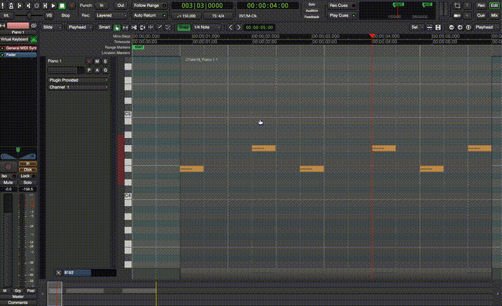 |
| Delete | Delete or Shift + Right-Click | 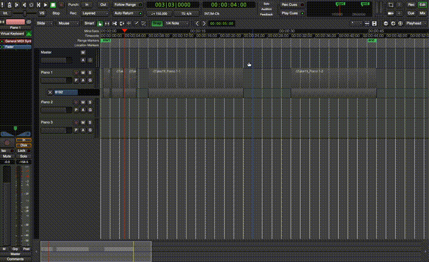
| Crop to Range | R > Drag Area > Right Click > Crop Region to Range | 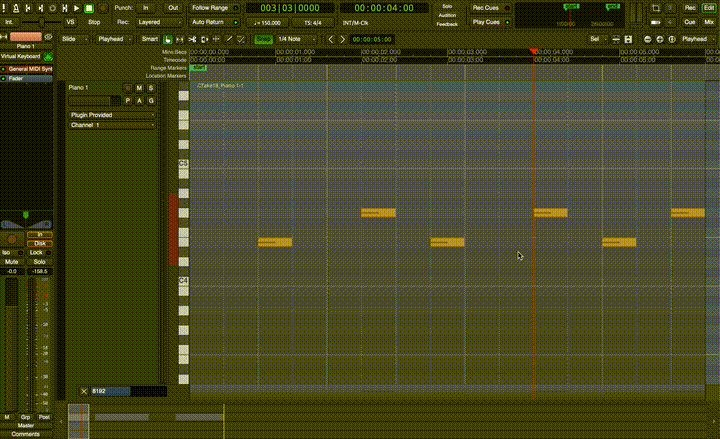 |
| Duplicate | Alt + D | 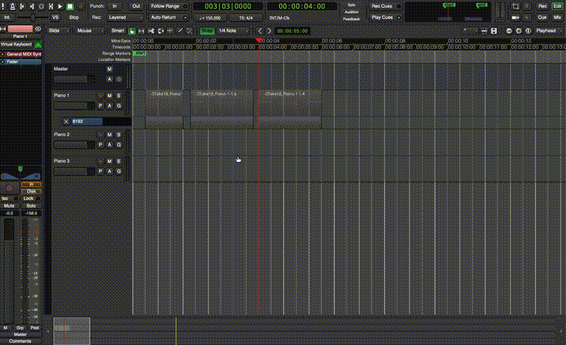
| Timestretch | T | 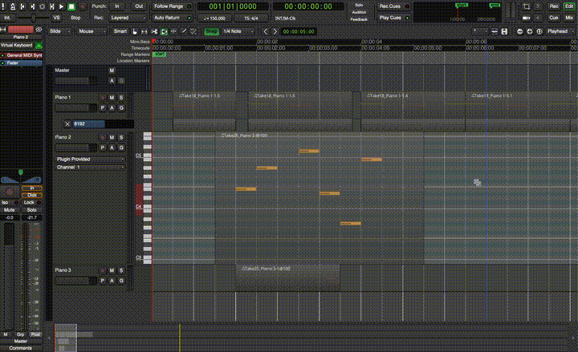 |
| Add Track | CMD + Shift + N | 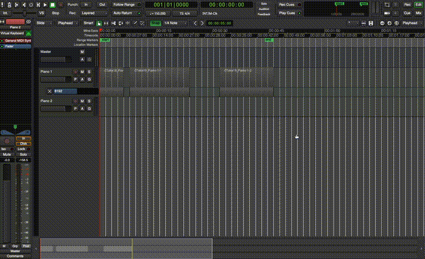 |