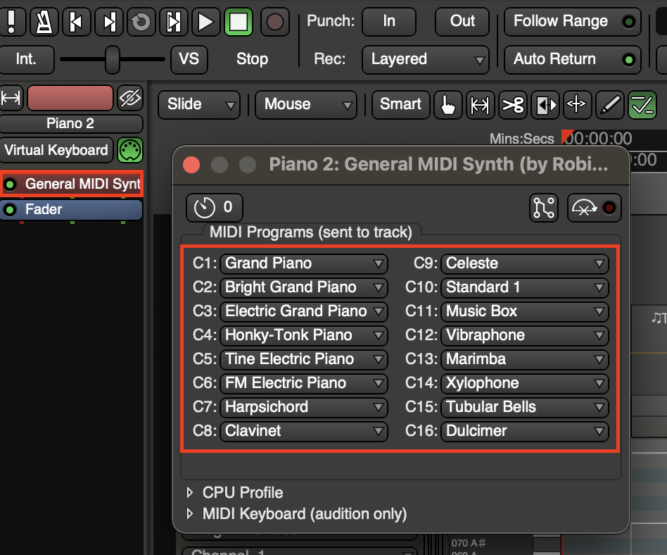

# MIDI Channels
MIDI has 16 separate lanes within a single connection that let different instruments receive their own musical instructions.

1. You can adjust the channel for the whole track

2. If you have multiple channels in one track, you won't be able to see them unless you enable **Color Mode > Channel Colors** (Right-Click on track to open options)

3. To change notes to a different channel use **Internal Edit Mode** with **E** and highlight the notes you want to change. Then press **C** to open the **MIDI Channel Chooser**

4. To see what each instrument each channel plays you can click on the plugin for the track and it will tell you what instrument corresponds with each channel
