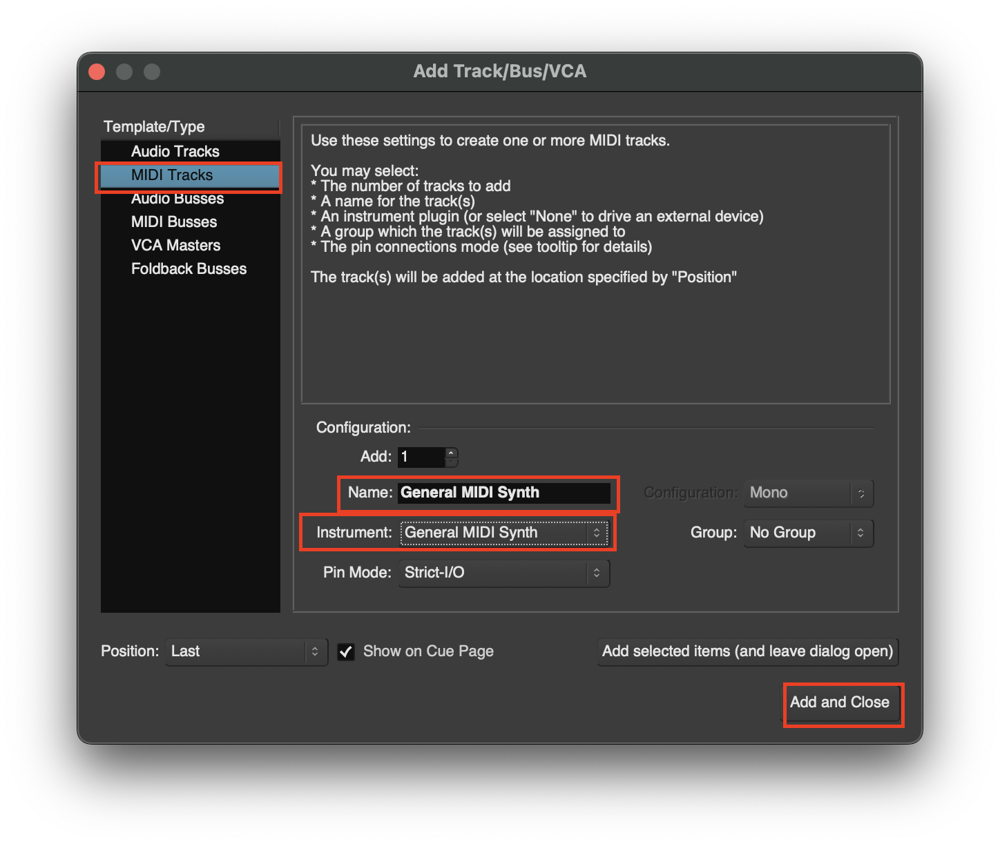
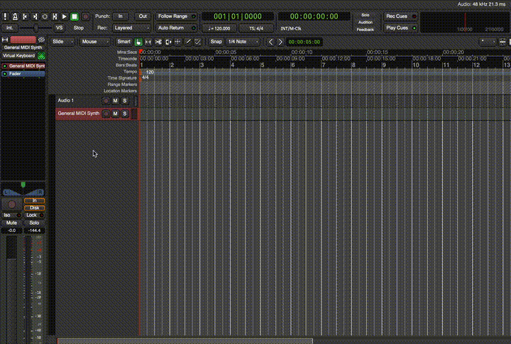
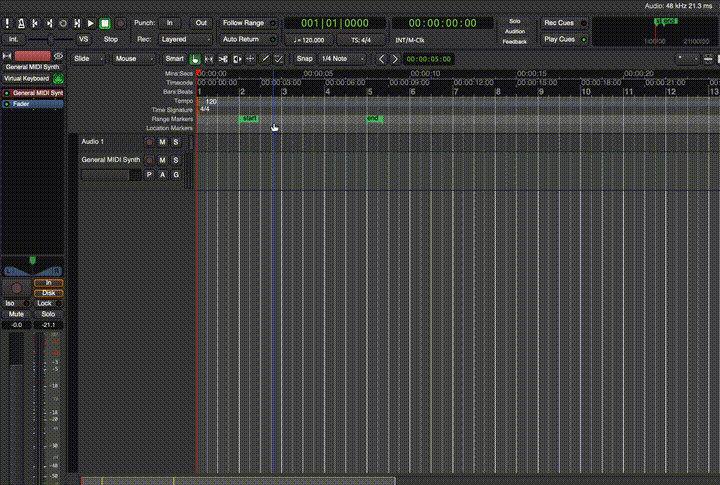
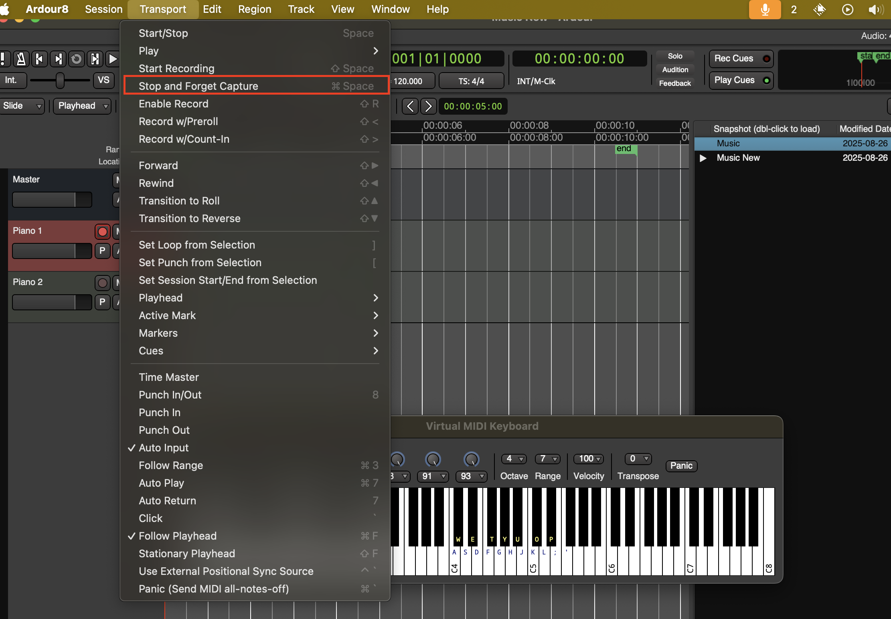
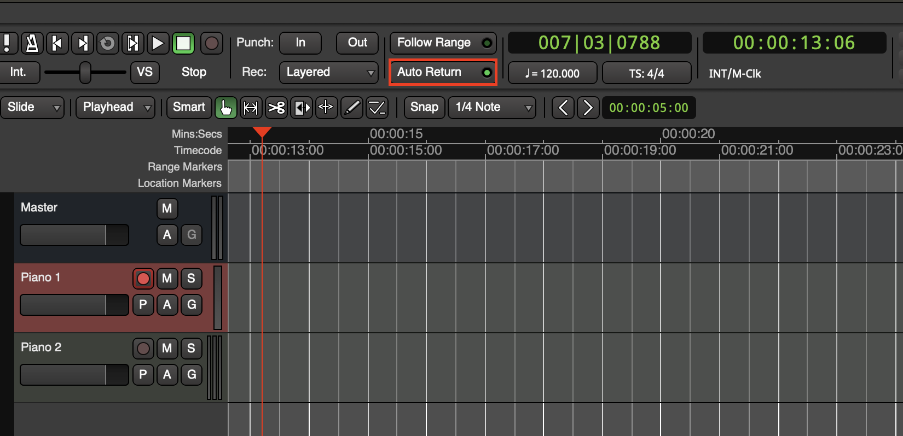
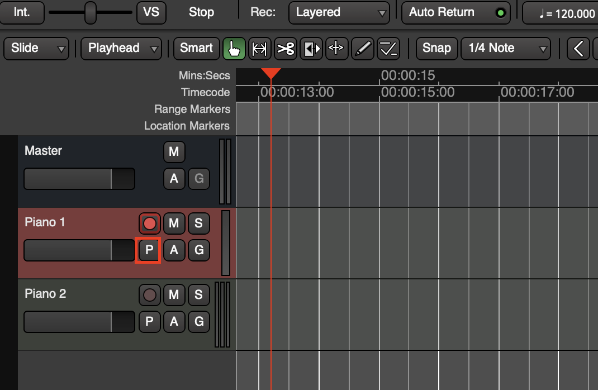
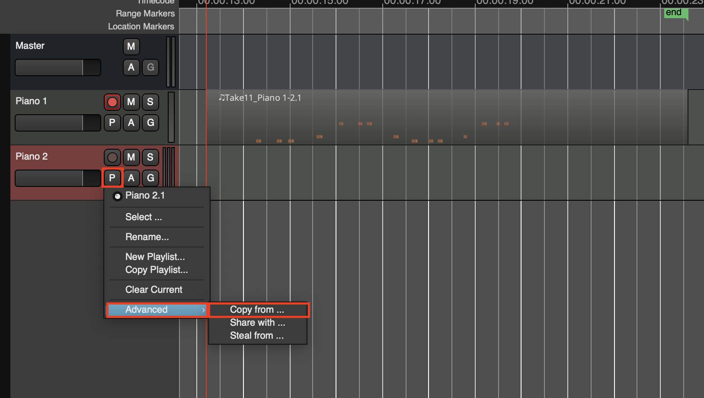
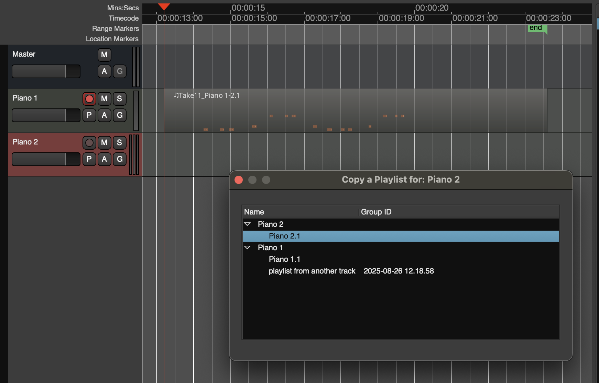

# Using MIDI Tracks

### Create a MIDI Clip
1. First add a MIDI clip with **CMD + Shift + N**

2. Drag the bottom of the track to see the **Piano Roll**

3. Use the draw tool to add an **Empty MIDI region**. Then you can add notes using the draw tool

4. You can move notes and extend them use the **Internal Edit Mode**. You can **Hold CTRL** while in the **Internal Edit Mode** to create notes

## Create a MIDI Track Using Virtual Keyboard
1. Create a simple **MIDI Track**

2. To play music with your keyboard you can open up a virtual keyboard **Window > Virtual Keyboard** or with **Ctrl + K**

> If you want to change the input select the input on the **Mixer** on the left
> 

3. You can use the keys on your computer keyboard to play music

4. To start recording **arm** the track for recording

5. Then you need to **arm** the whole session and start the **transporter** the shortcut is **Shift + Space**

6. To forget the recording go to **Transport > Stop and Forget Capture**

## Navigation
1. When quickly listening to a track it can be beneficial to enable **Auto Return**

## Playlists
1. Playlists are beneficial when testing multiple takes of a specific track. They are signified by the **P**

2. To select or create a playlists that was made click on the **P** and various options will appear

3. If you need to access a playlist from another track you can select 

4. Here you can find the playlist you want to take from the popup window

