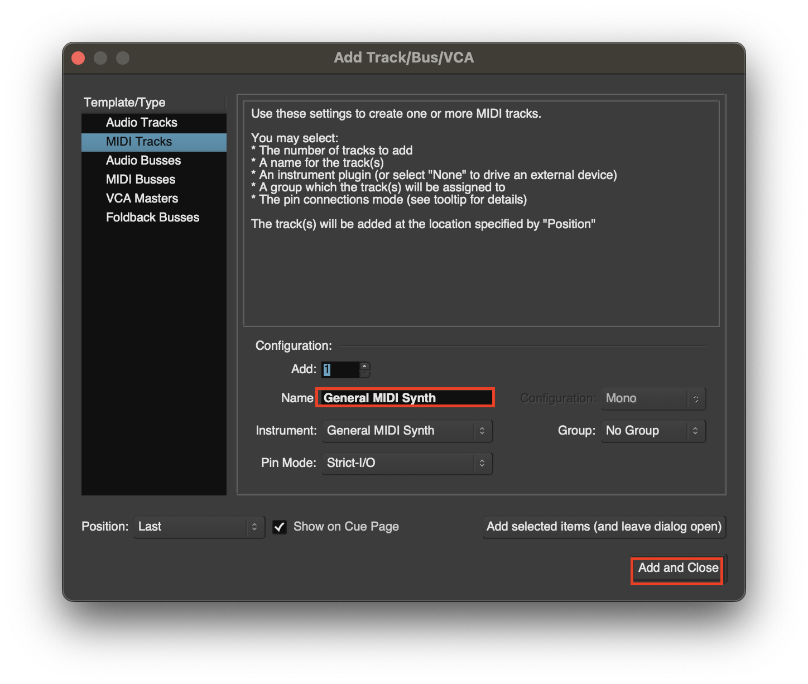
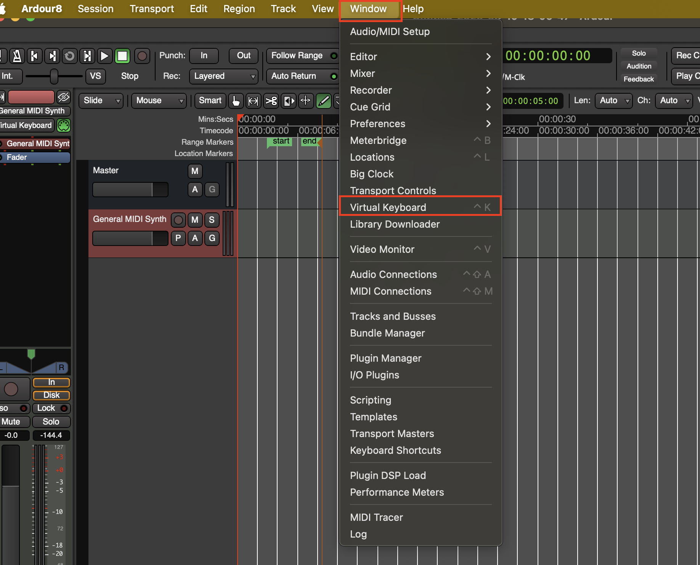
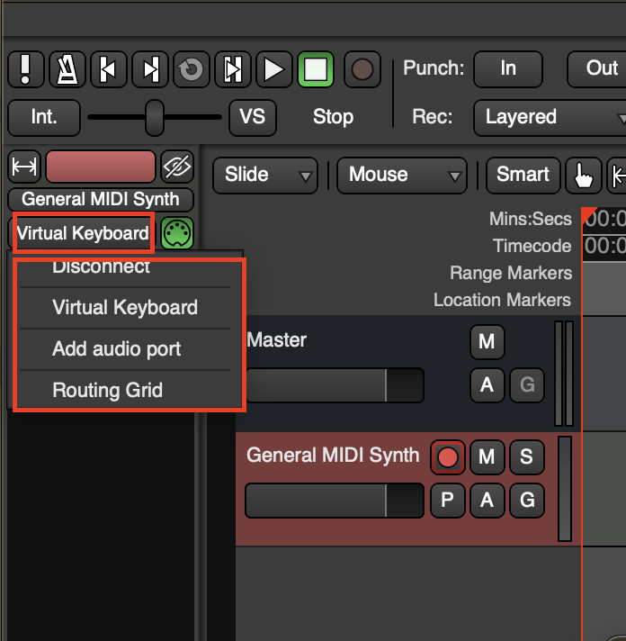
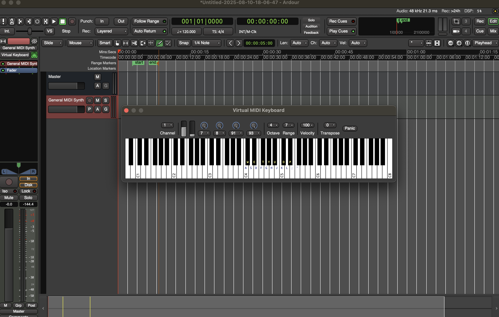
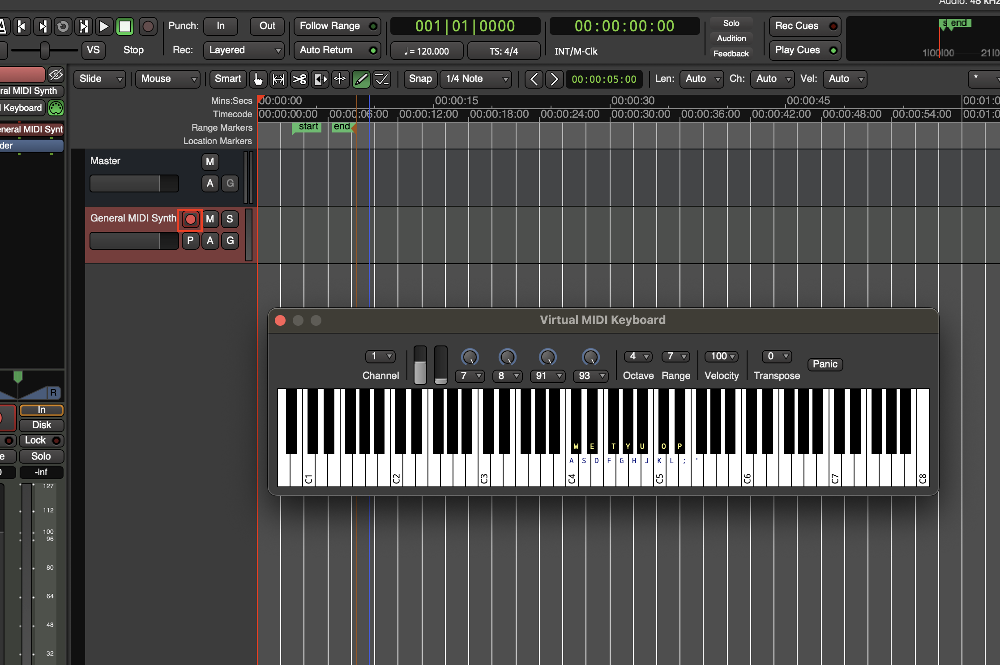
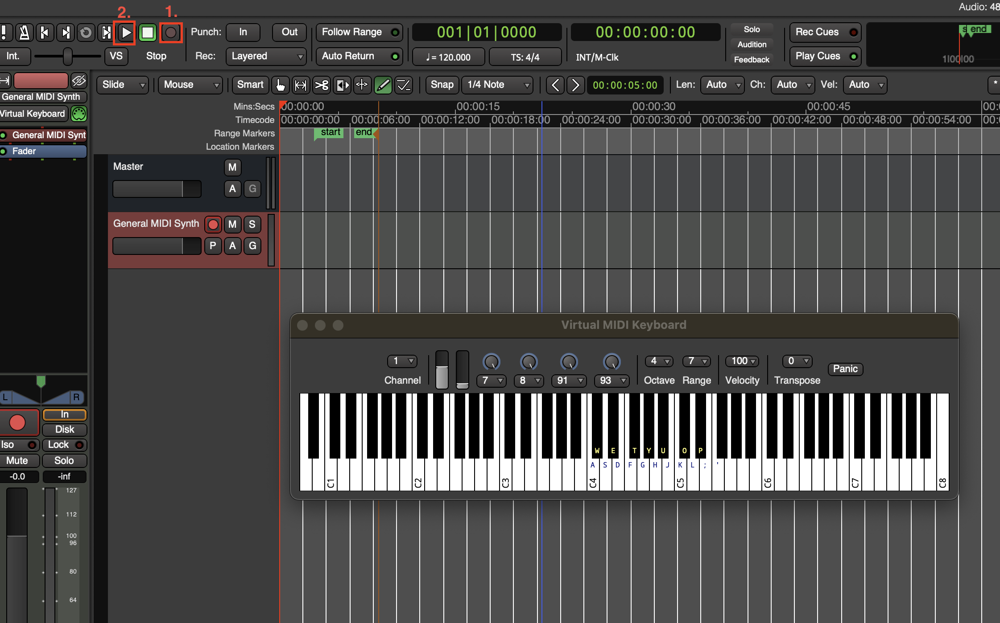

# Using MIDI Tracks

## Create Piano Tracks
1. Create a simple **MIDI Track**

2. To play music with your keyboard you can open up a virtual keyboard **Window > Virtual Keyboard** or with **Ctrl + K**

> If you want to change the input select the input on the **Mixer** on the left
> 

3. You can use the keys on your computer keyboard to play music

4. To start recording **arm** the track for recording

5. Then you need to **arm** the whole session and start the **transporter** the shortcut is **Ctrl + Space**
