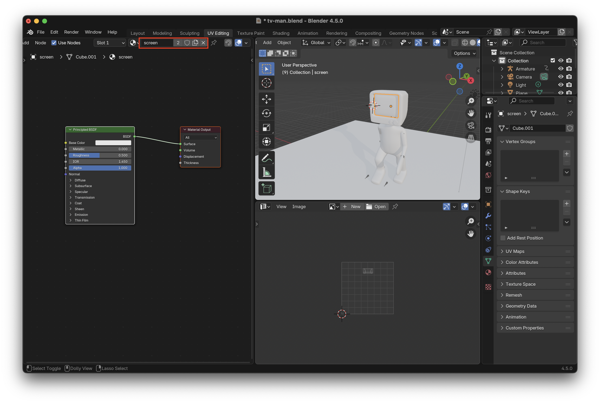
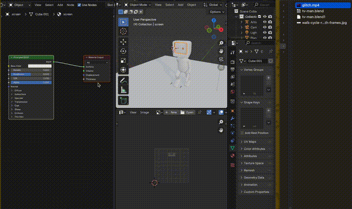
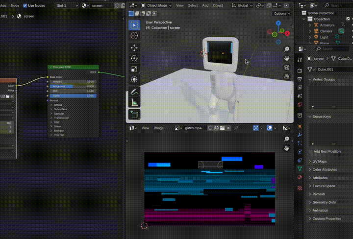

# Animated Textures

1. Add a texture for the animated texture

2. Drag and drop the new texture in and Blender will adjust the node appropriately

3. Unwrap the texture with **U** then select **Unwrap Angle Based** you may need to apply your mirror modifiers here and unwrap again

