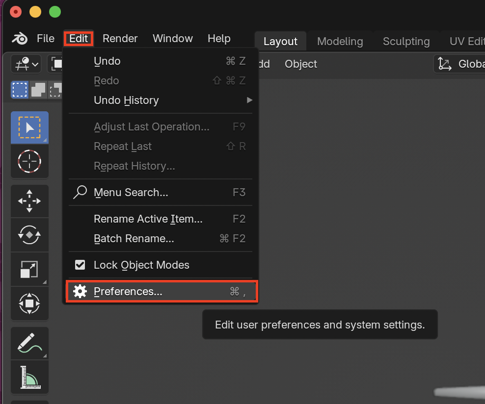
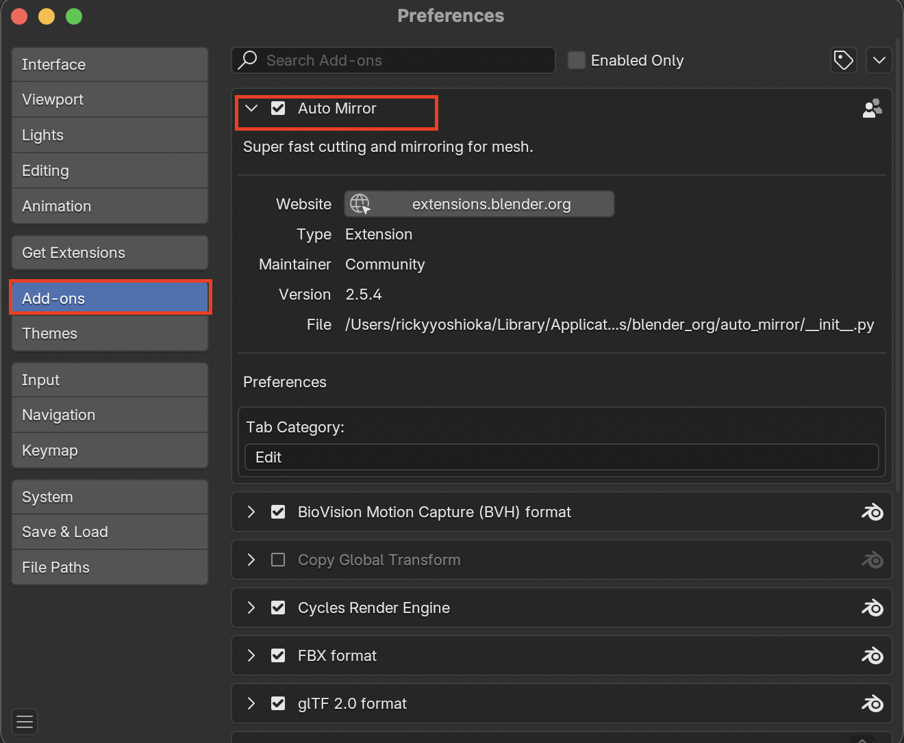
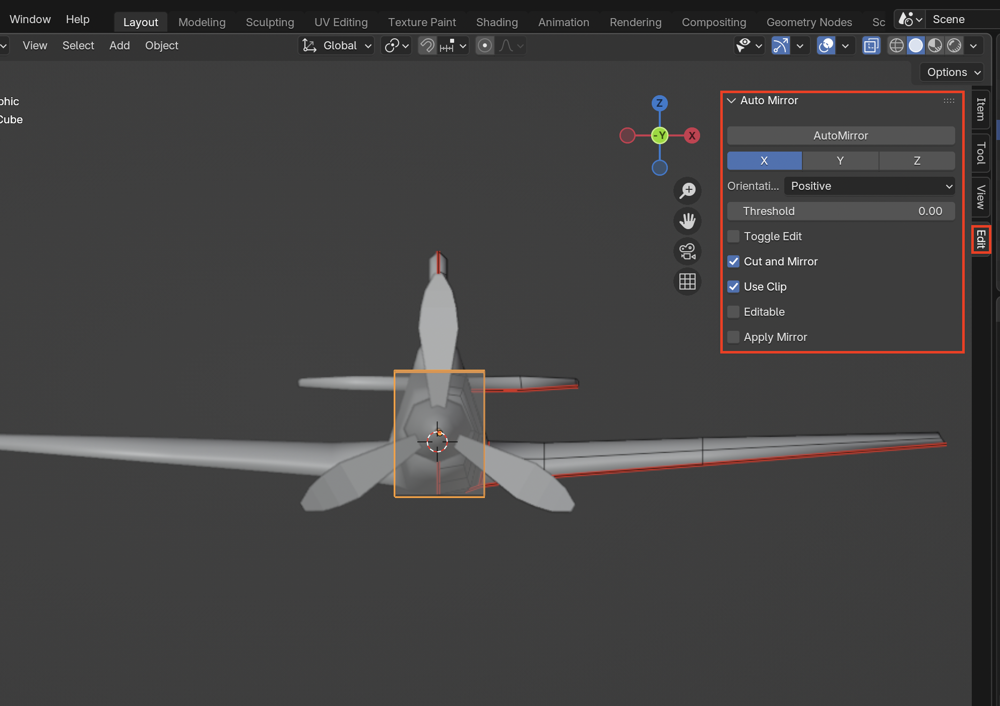
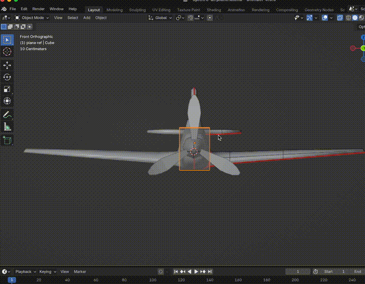
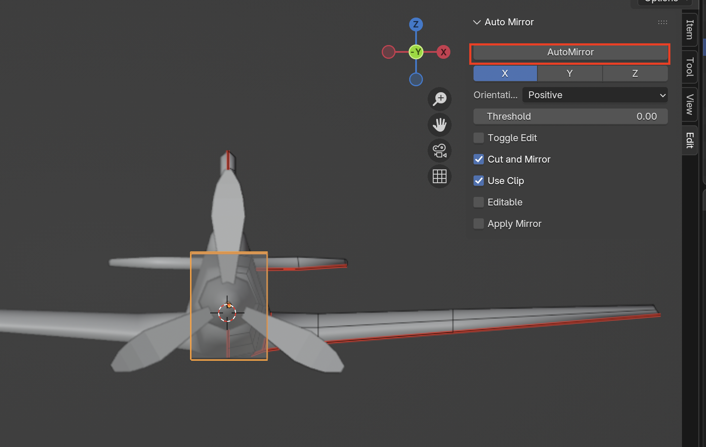
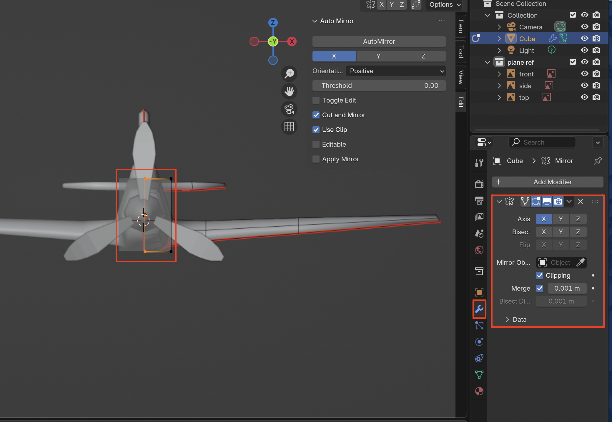

# Auto Mirror Add-On
Rather than going into edit mode, deleting half the mesh, then applying the mirror modifier, we can use the **Auto Mirror Add-On**
## Download the Auto Mirror Add-On
1. Go to **Edit > Preferences...**

2. In the **Add-ons** tab enable **Auto Mirror**

3. Toggle the **Properties Panel** with **N** and under **Edit** there is now an Auto Mirror

## Using the Auto Mirror Add-On
1. Make sure that your object's origin is centered. An easy way to do this is to **Right-click** on your object then select **Set Origin > Origin to Geometry**

2. Now just select the correct axis you want to mirror and select **AutoMirror**

3. To check if the AutoMirror worked you can go into **Edit Mode** and view your object or select the **Modifiers** tab and check if the **Mirror Modifier** is enabled
