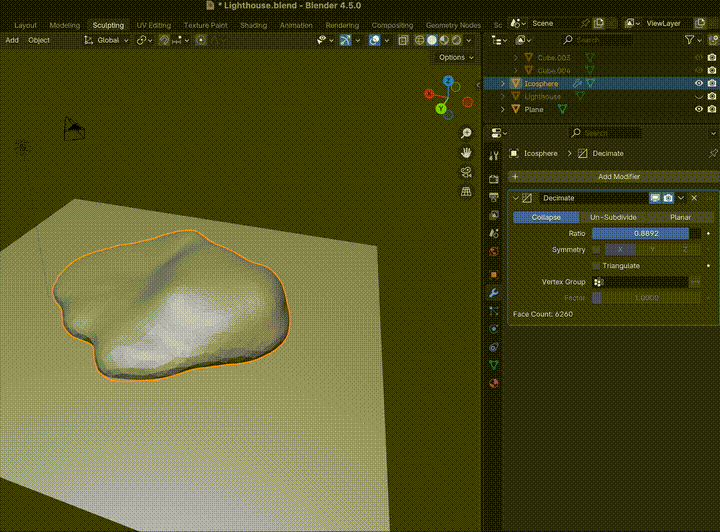
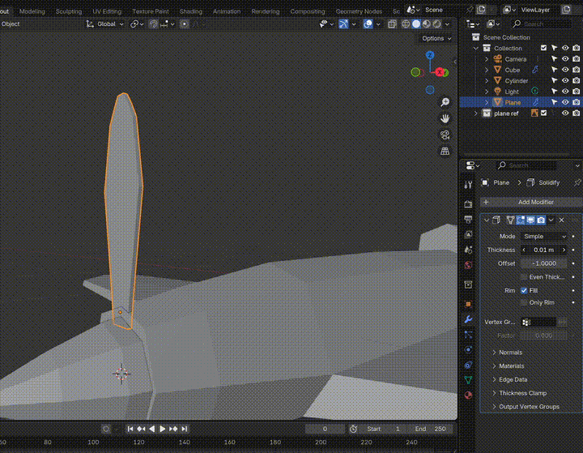
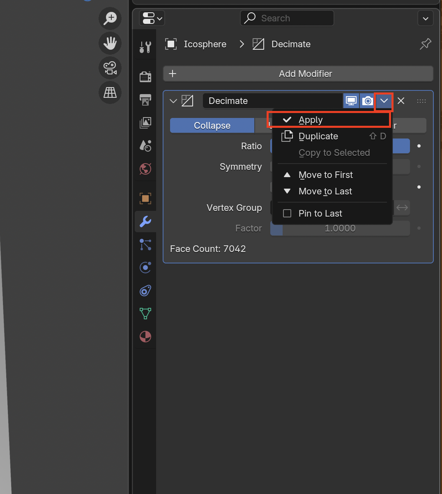
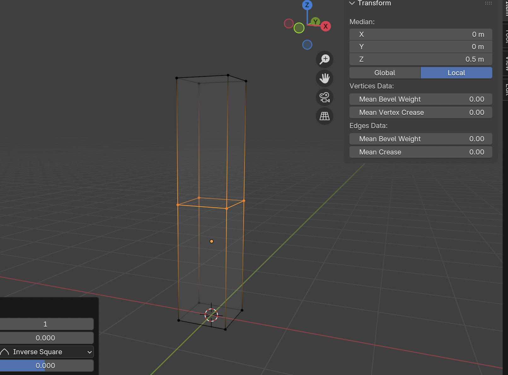
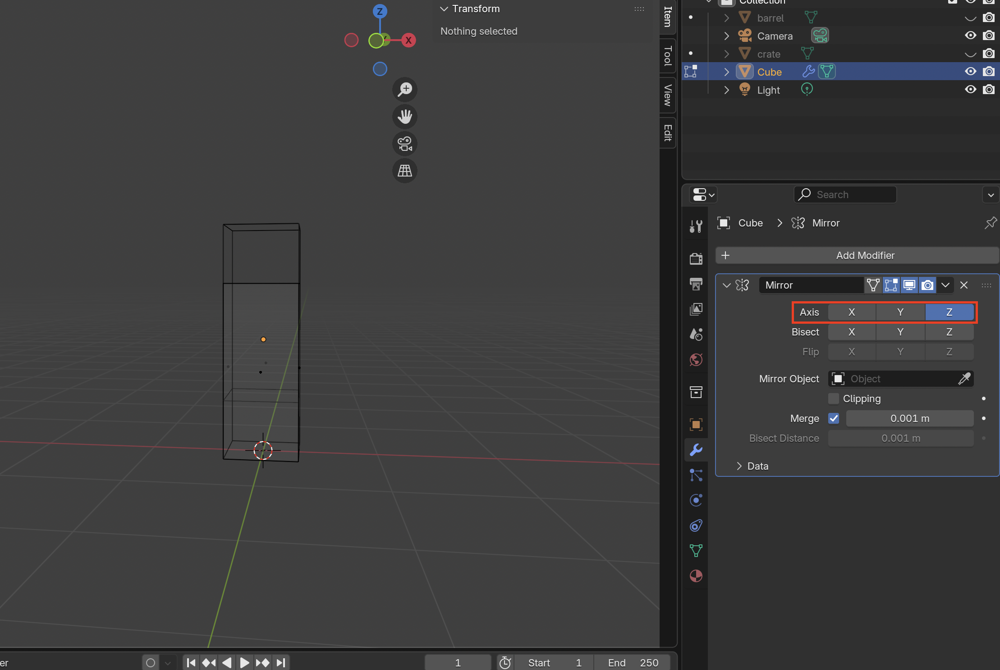
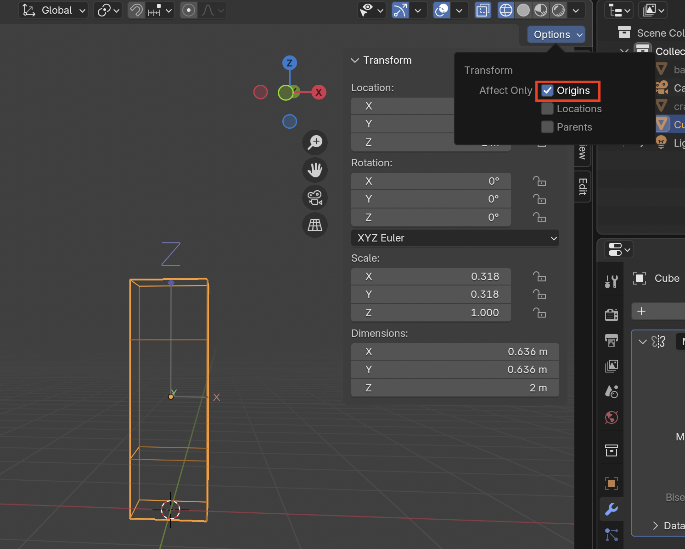

# Blender Modifiers

**Modifiers** are placed on the object and modifying the shape. Modifiers change the shape but are not actually applied to the shape. In order to actually change the shape, you must **Apply** the modifiers.

## Modifiers List

| Description | Image |
| -------------|-------|
| **Decimate Modifier** Reduces the number of polygons in an object |  |
| **Mirror Modifier** Creates a symmetrical mesh along the origin point |  |
| **Solidify Modifier** Adds thickness to mesh object |  |

## Add Modifier

1. First select the **Modifiers** tab

2. Search for desired modifier

3. To apply the modifier go into **Object Mode**

4. Then click on the chevron and select **Apply**

### Tips

#### Mirror Modifier
1. **Loop Cut** (Ctrl + R) along the axis you want to reflect using the Mirror modifier.

2. Highlight half of the mesh and delete faces (press **X**)

3. Add the **Mirror Modifier**

4. Select the correct axis that you want to be mirrored

5. In order to fix the overlap go back into object mode

6. To adjust the object origin, while in object mode select on **Options** and enable **Origins**

7. Use the grab tool (press **G** then the axis you want to move z,x,y) and move the origin in the correct location

8. Now your mirror modifier should be working

9. It can be useful to enable **clipping** to prevent tears in the middle of the mesh
