# Create Walk Cycle

## Walk Cycle frames
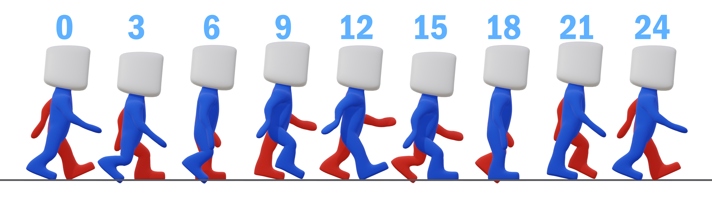

## Example Implementation
1. Add a floor with **Shift + A** add a **Plane** then use **Alt + G** and **Alt + R** to remove any rotation and movement
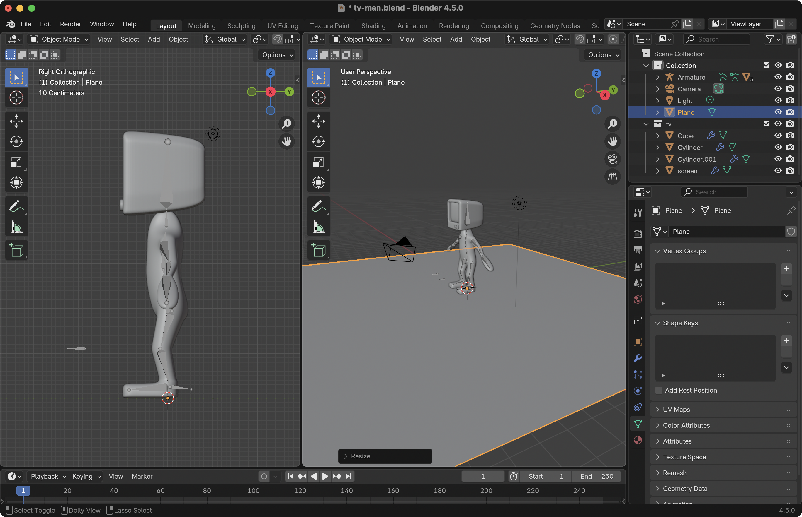

2. Change the **Outliner** to the **Image Editor** and add a walk cycle reference
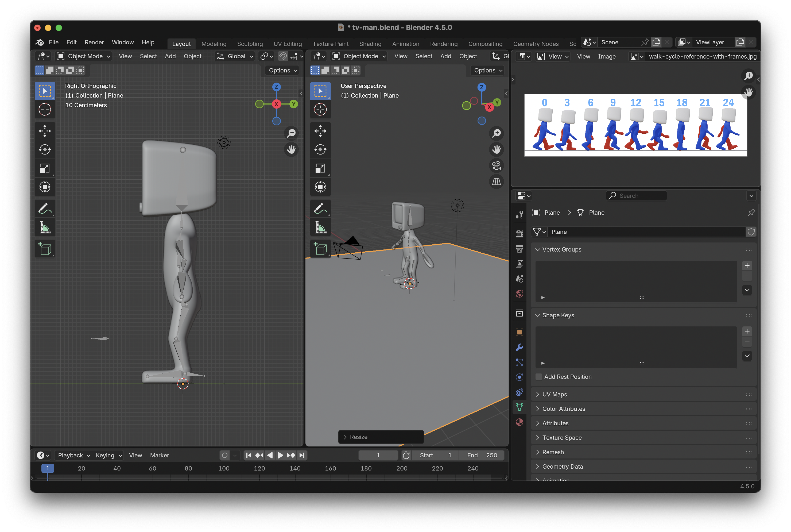

3. Enter **Pose Mode**
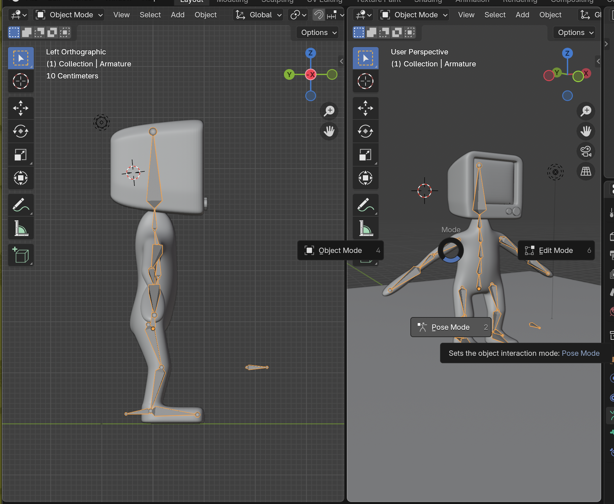

4. Place the arms in position

5. Create the first frame, use the bottom spine bone to move the character up and down, since it is the main bone
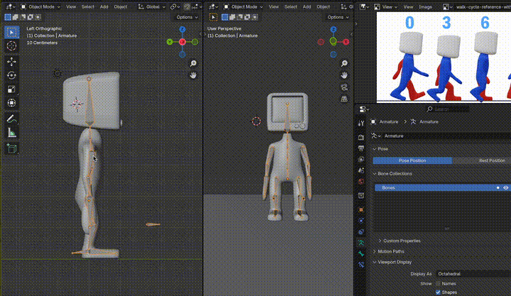

6. Press **K** and **Location & Rotation** to create the first frame. Make sure all the bones are selected
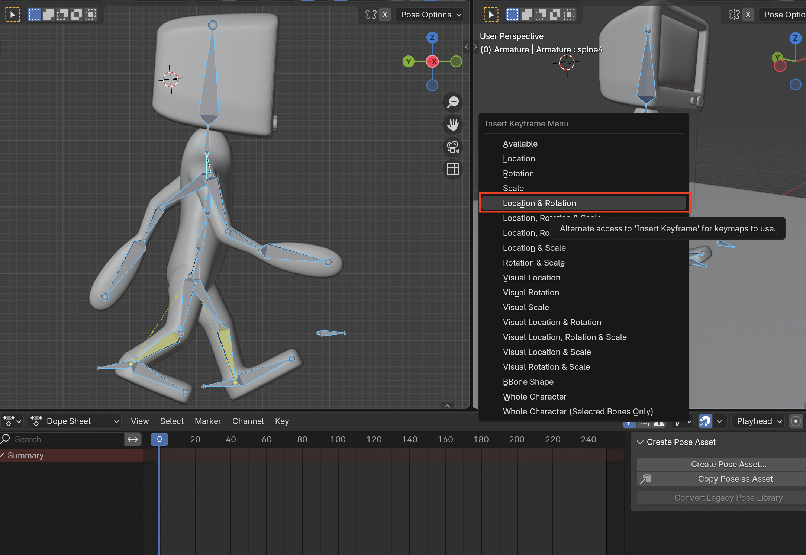

7. Duplicate the keyframes with **Shift + D** and drag it to the end (24th Frame)
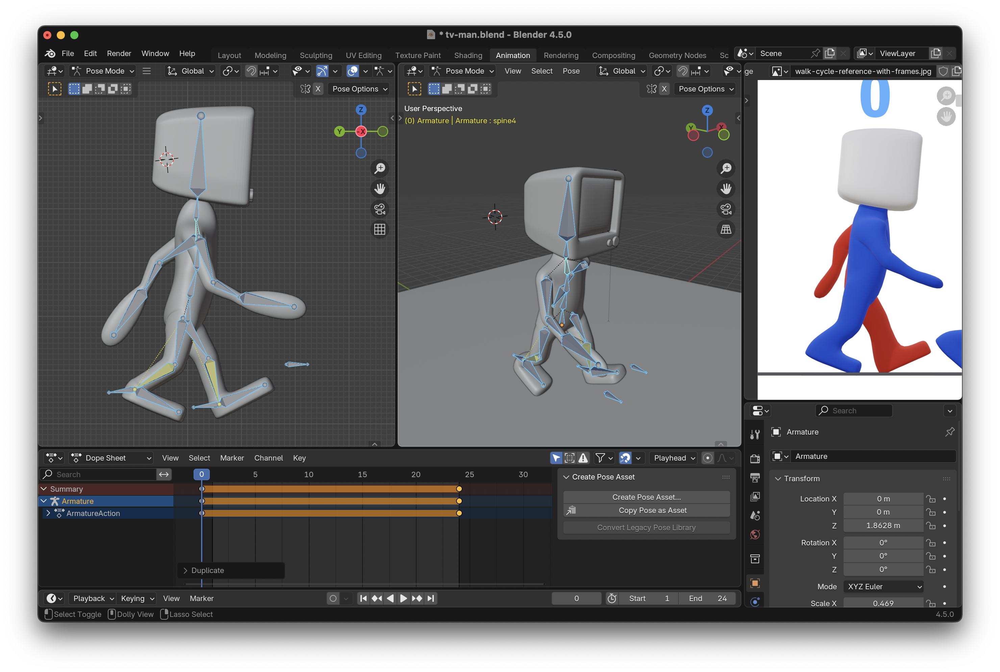

8. Copy the **Frame 0** with **Right Click > Copy Pose** on the **Armature** in the **3D Viewport** so that we can flip it and use it for the middle of the animation
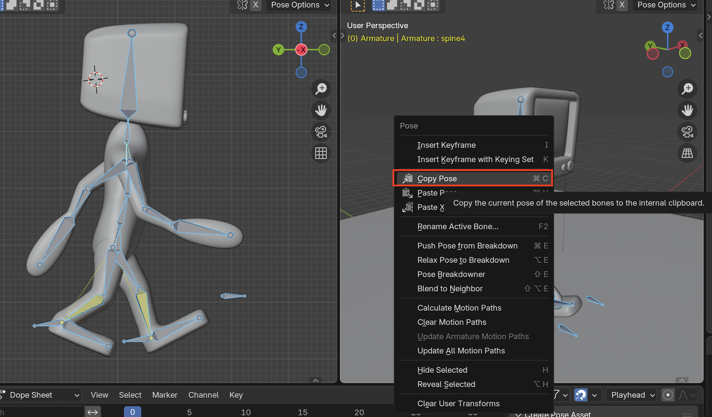

9. **Paste X-Flipped Pose** on the armature, to get the inverse pose. Make sure that you are in the middle frame 
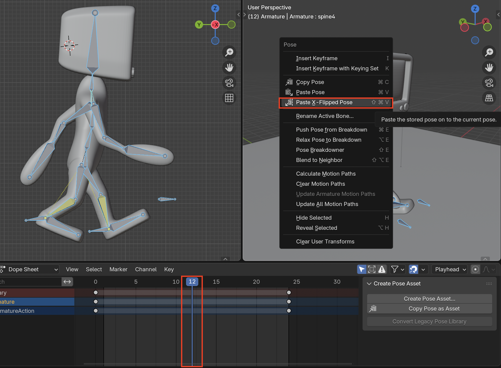

10. Now you have a rudimentary walk cycle
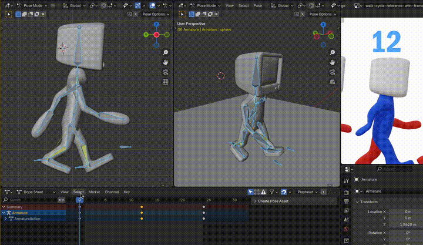

11. Edit the other frames now, make sure that you change the height that the character is standing at
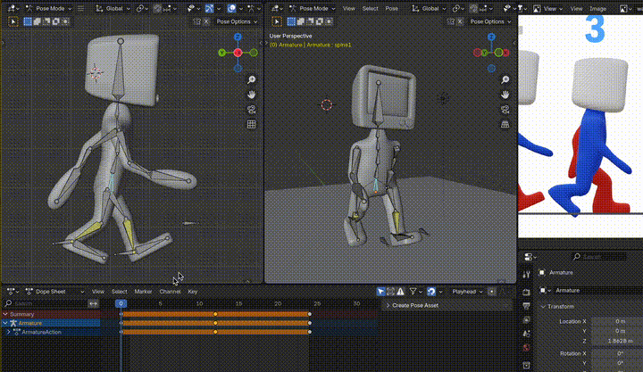
> If you want to enable recording or **Auto Keying**, but do not want to track scale or a specific parameter. You can edit that in **Keying**
> 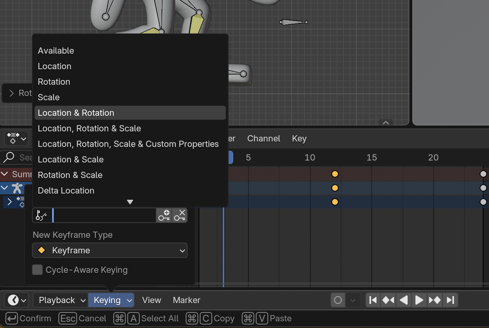

12. Before we copy and flip the walking to the other side, it is a good idea to have all your bones selected with **A** and then press **I** to inset keyframes for all the bones. This is to protect against any unwanted animation glitches
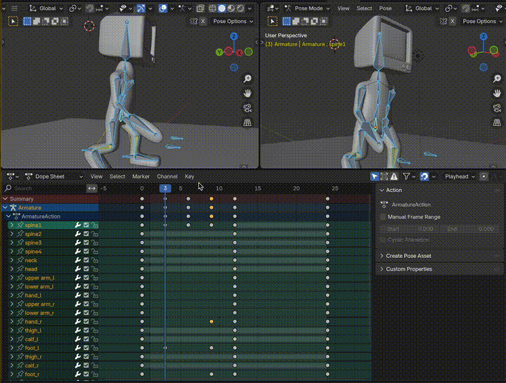

13. Copy the keyframes and flip them to get the other half of the walk cycle. You can copy and paste multiple at a time
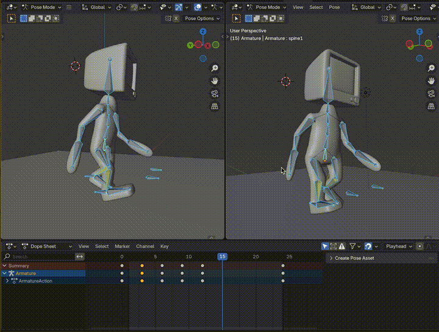