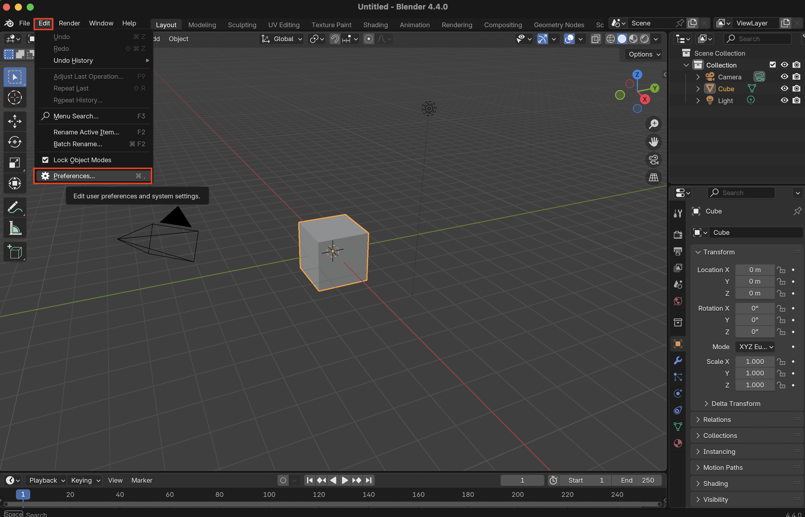
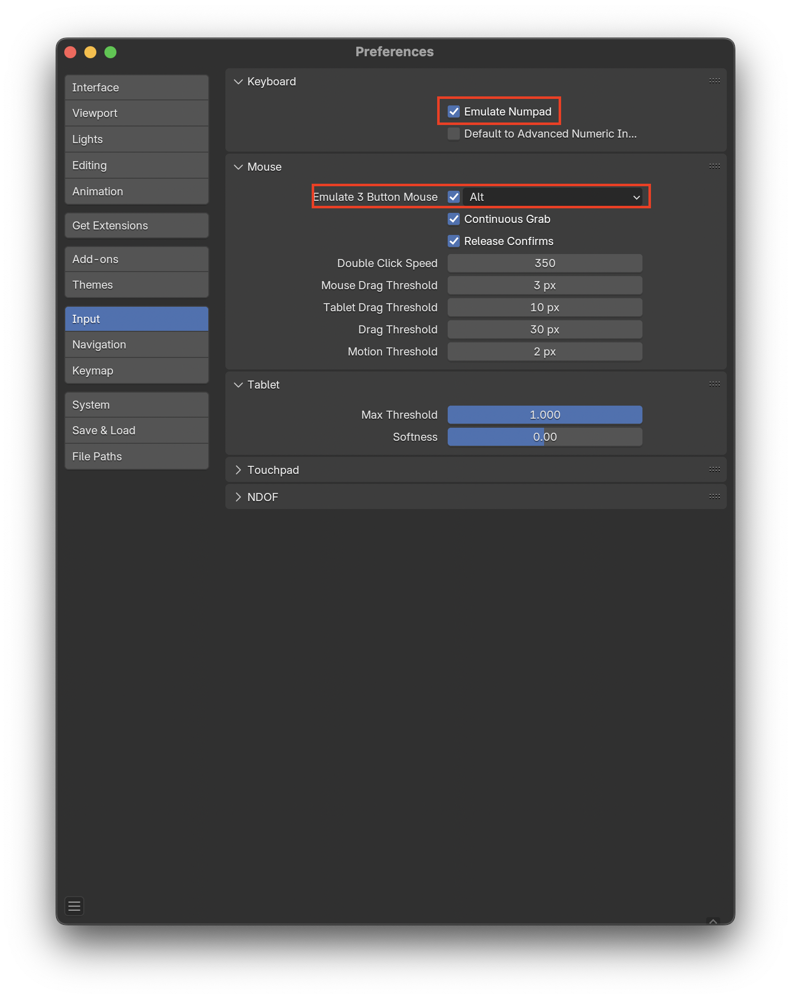
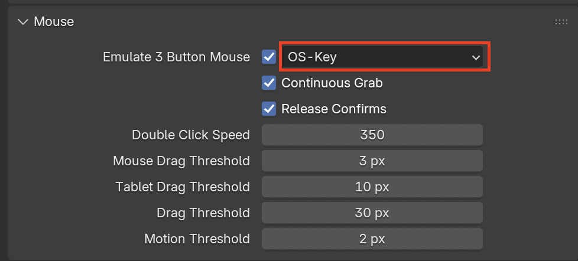

# Emulate Numpad and Middle Mouse Button

1. Go to **Edit** then **Preferences...**

2. Select **Input** here you can enable emulation for the Middle Mouse Button and Numpad buttons

3. It is useful to use `OS-Key` as the modifier to allow for using the alt/option key for other shortcuts, such as the select loop (Alt + Click)

## If you want to use the trackpad
You can use the same movements but with **Two-fingers** on the trackpad

| Control | Description |
|----------|-------------|
|**Two-finger trackpad**| Orbit |
|Ctrl + **Two-finger trackpad**| Zoom |
|Shift + **Two-finger trackpad**| Pan |