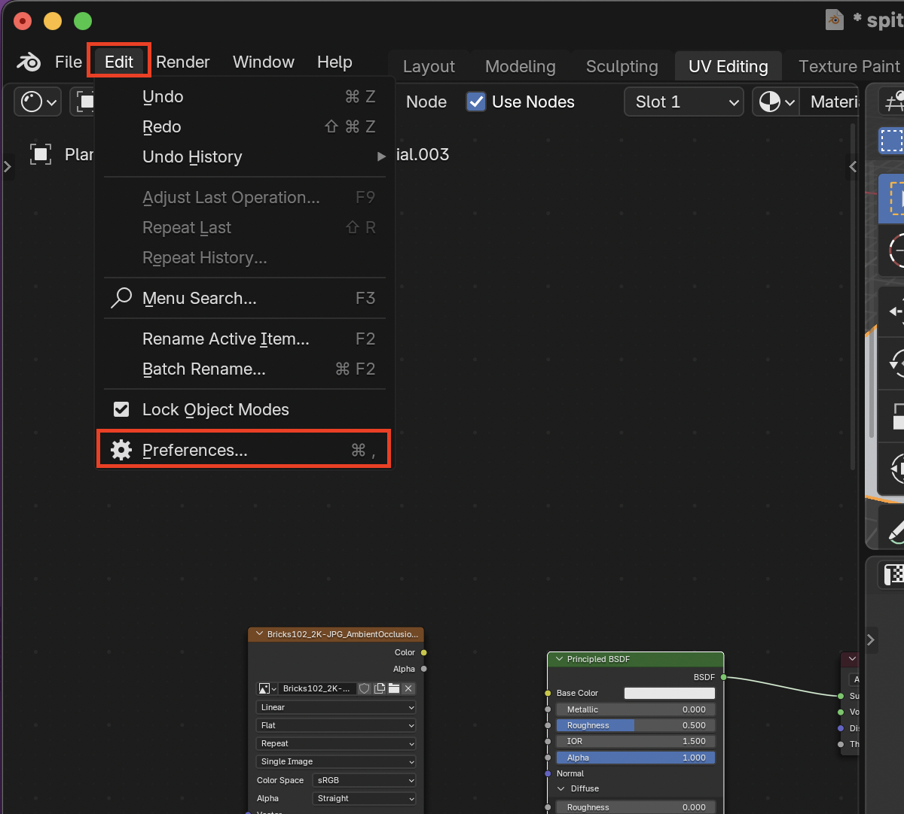
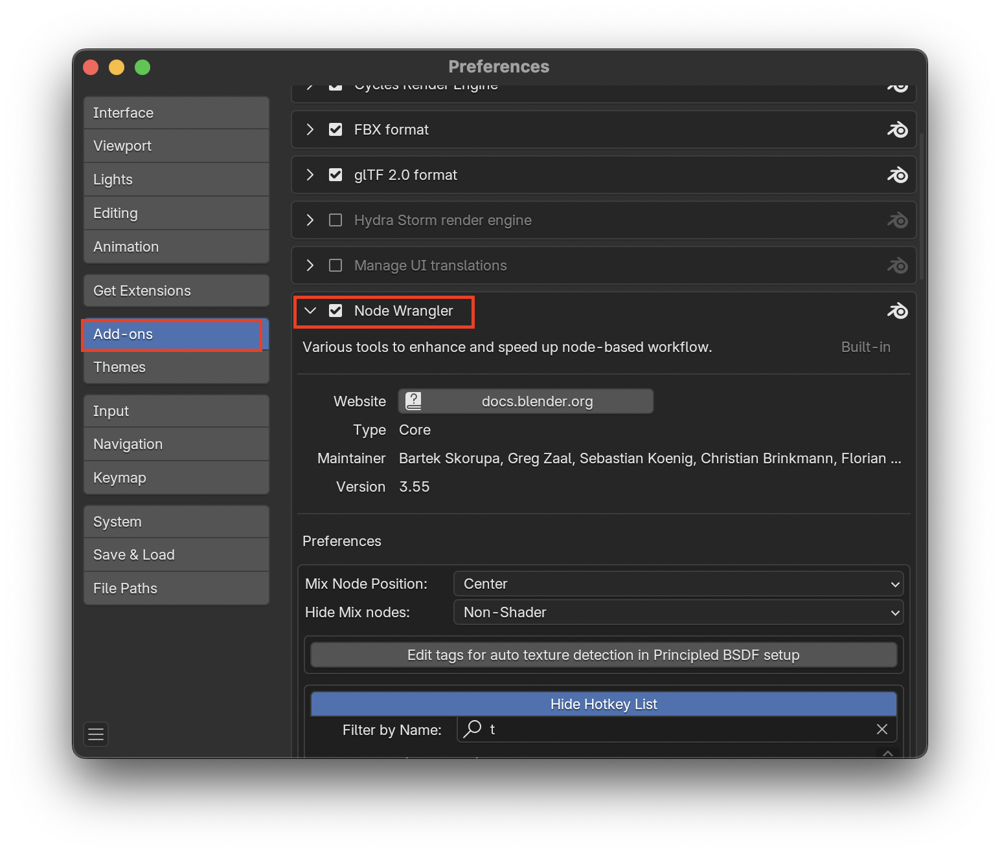
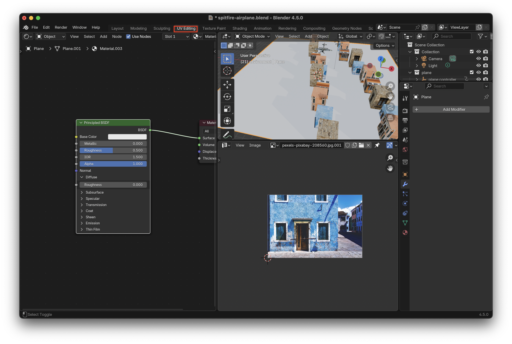
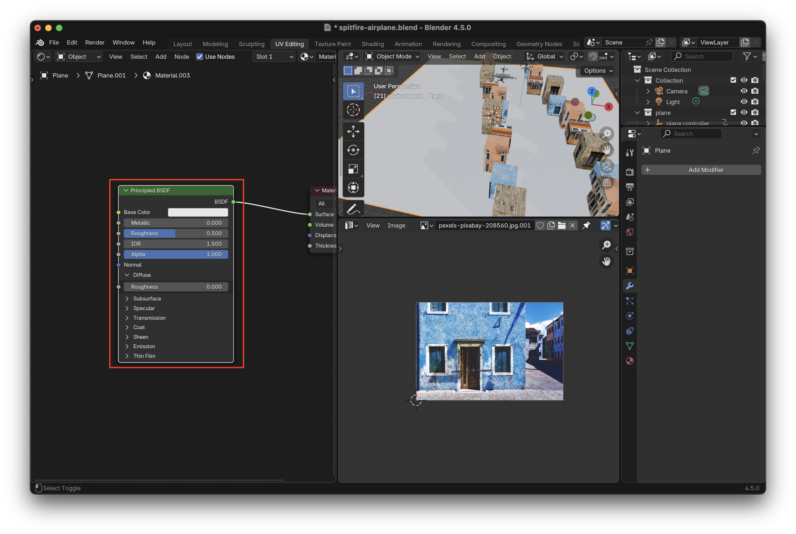
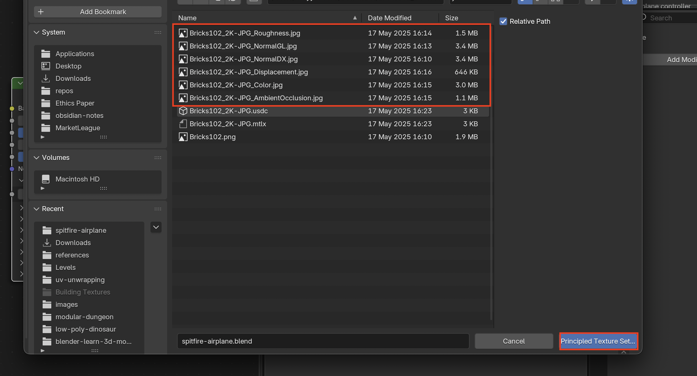
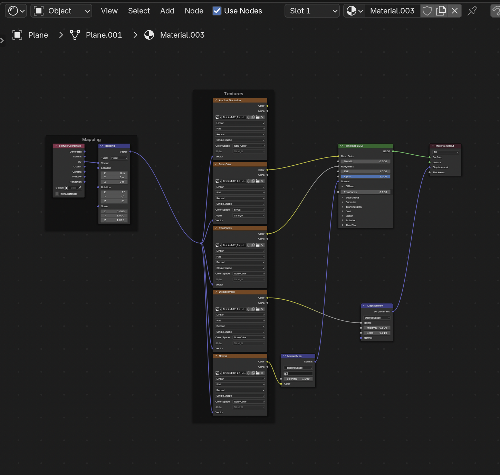
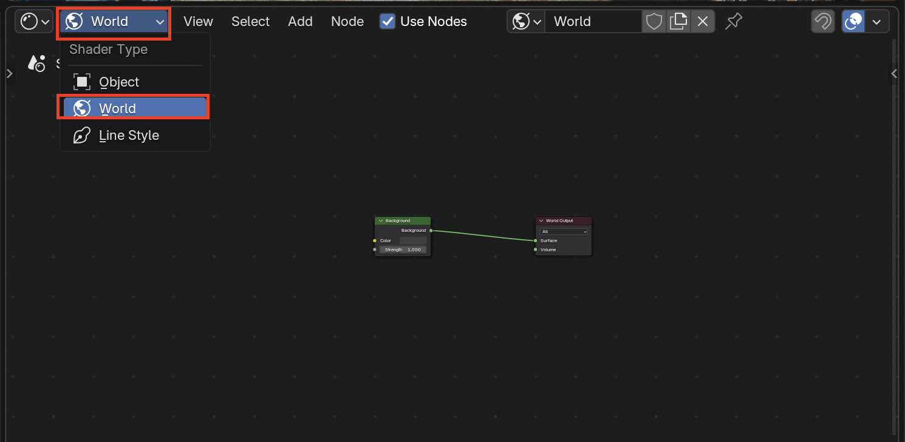
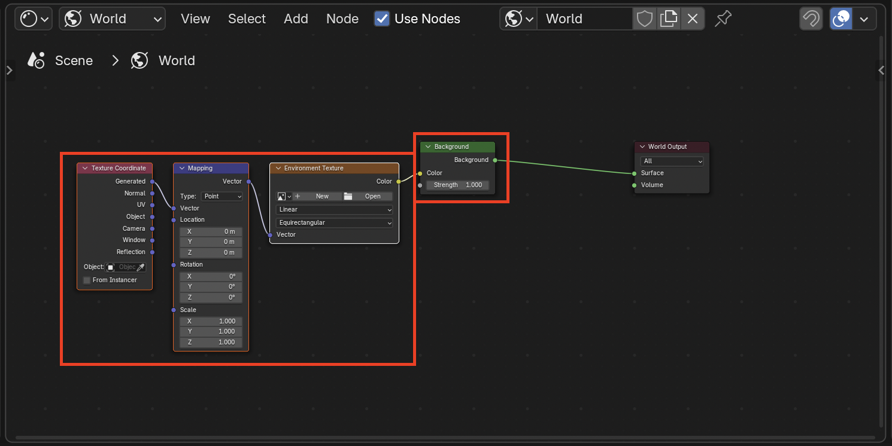
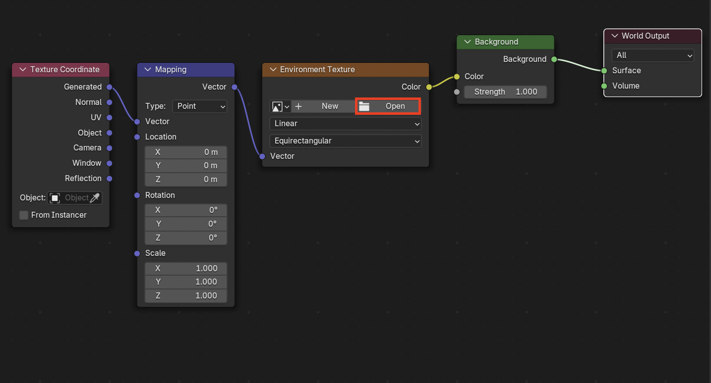

# Node Wrangler Add-On
**Node Wrangler** is a built-in add-on for Blender that speeds up working with nodes, in the **Shader Editor**, **Compositor**, and **Geometry Nodes** editor
## Enable Node Wrangler
1. Go to **Edit > Preferences**

2. Then select **Add-ons > Node Wrangler** and enable it. Node Wrangler is now installed and you can use it's shortcuts

## Add a PBR Texture
1. Go to your **Material** in the **UV Editing** Workspace

2. Make sure that the **Principled BSDF** node is selected

3. Use the Shortcut **Ctrl + Shift + T** while the **Principled BSDF** Node is selected to open up a file explorer. From here select which images you want to be added for the texture

4. The **PBR Texture** will then be added to the object and all the images correctly connected

5. All these images tells the light how to interact with out texture giving it a more realistic feel in the renderer

## Add an HDRI (High Dynamic Range Image)
1. Select **World** under the shader type

2. Select the **Background Node** then use the shortcut **Ctrl + T** to quickly add a **Texture Coordinate** and **Mapping Node**

3. You can find **HDRI's (High Dynamic Range Images)** on Polyhaven: [https://polyhaven.com/hdris](https://polyhaven.com/hdris)

4. Add the **HDRI** by pressing **Open** on the **Environment Texture Node**

5. When it's correctly added, if you are in **Rendered Mode** for the Viewport Shading, the HDRI will appear and contribute to the lighting
