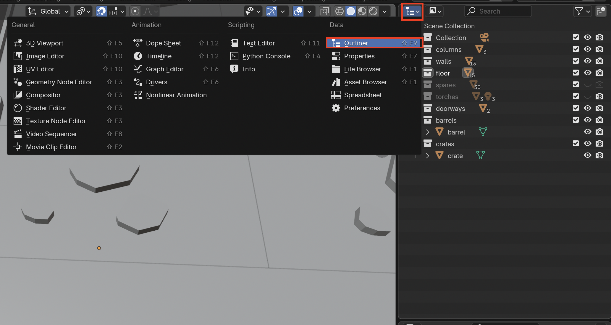
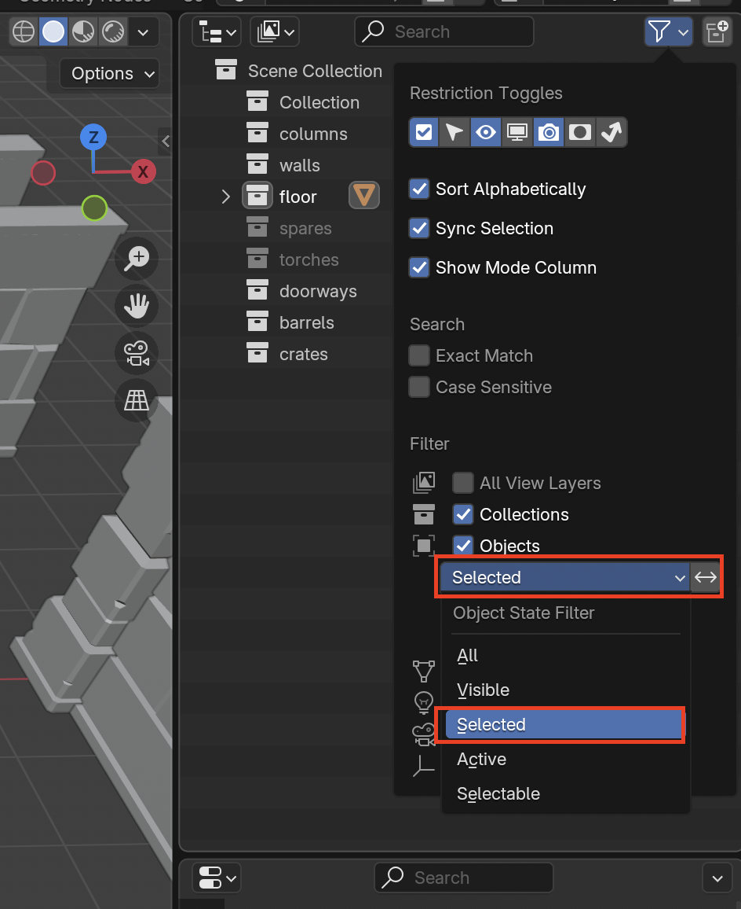
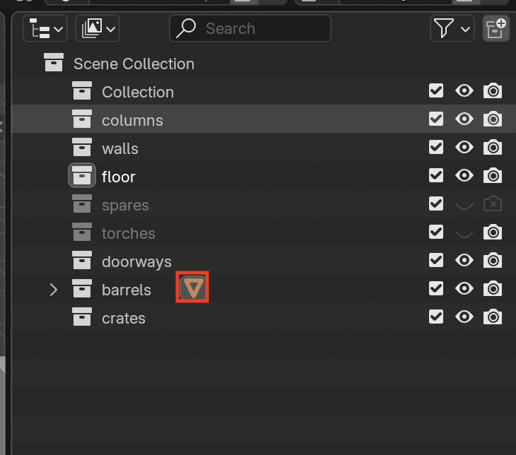
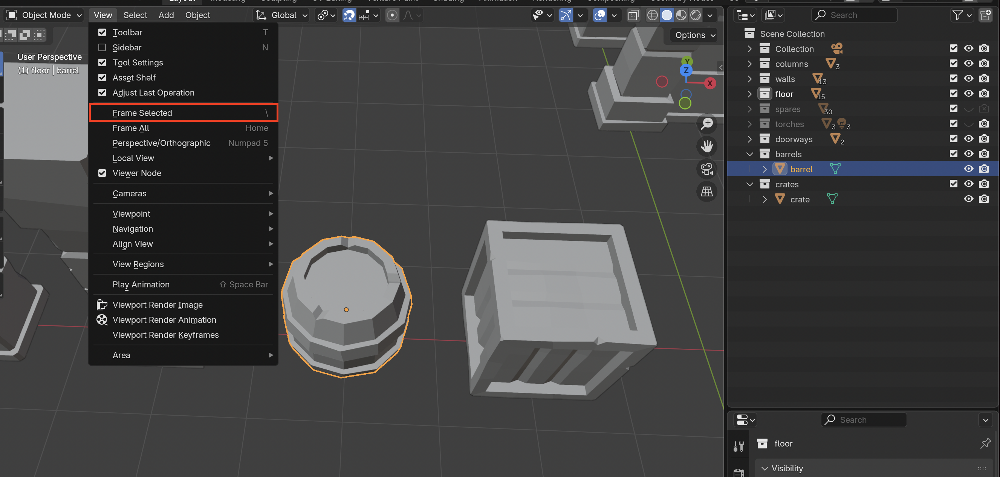

# Outliner

To open the **Outliner** go to the **Editor Type** and select **Outliner**

## View Selected 3D Viewport Object in Outliner
1. Select object in the 3D Viewport

2. Go to **Filters** in the outliner

3. Open the dropdown menu and enable **Selected**

4. The symbol indicates that there is a mesh in the collection. You can return the filters back to **All** now that you know where your mesh is located

## View Selected Outliner Object in the 3D Viewport
1. Select the object

2. Press **Numpad .** or **View > Frame Selected**
