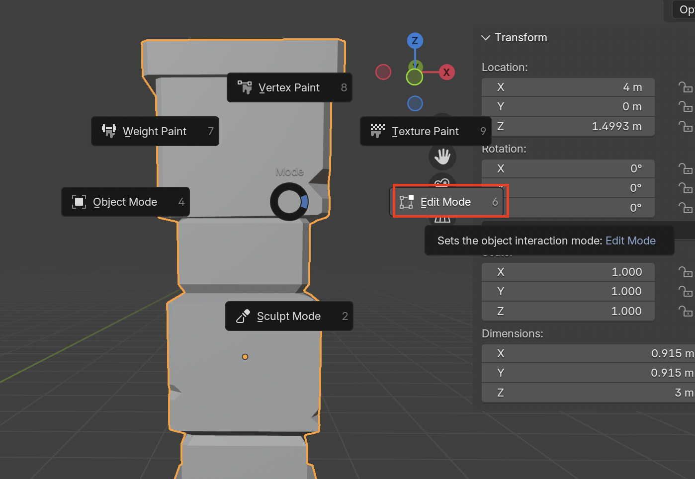
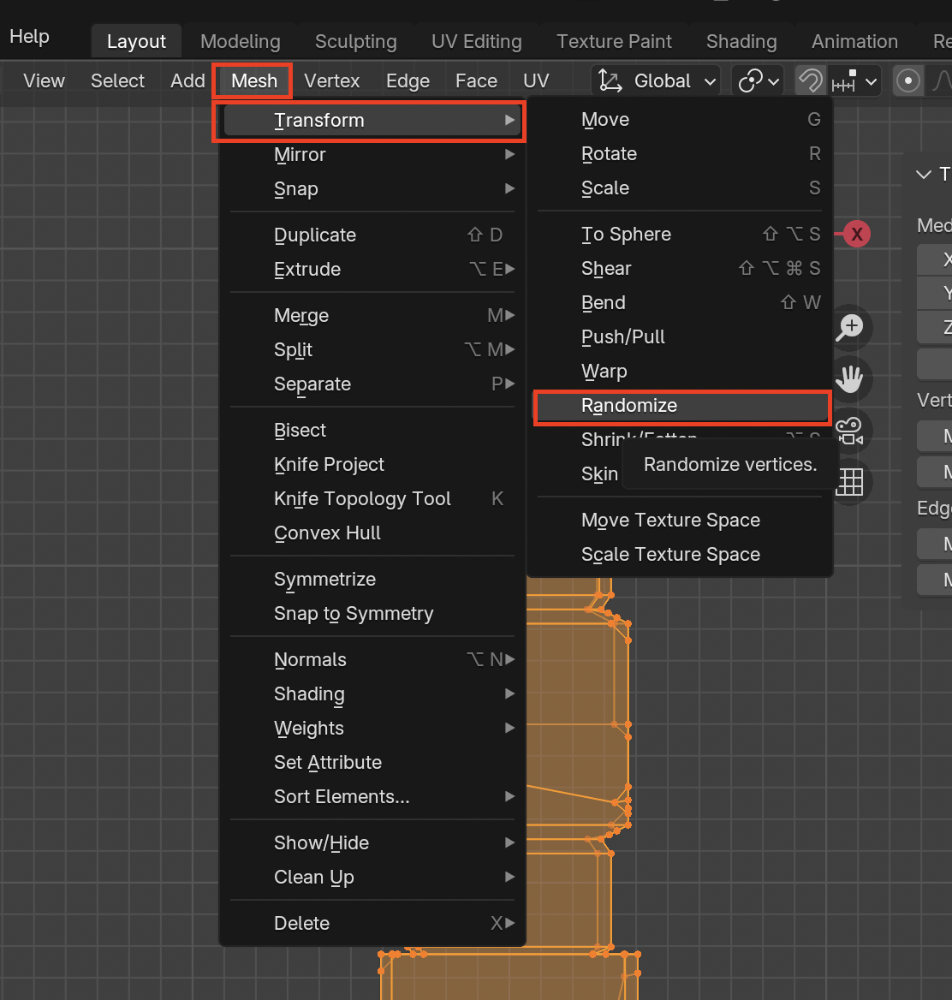
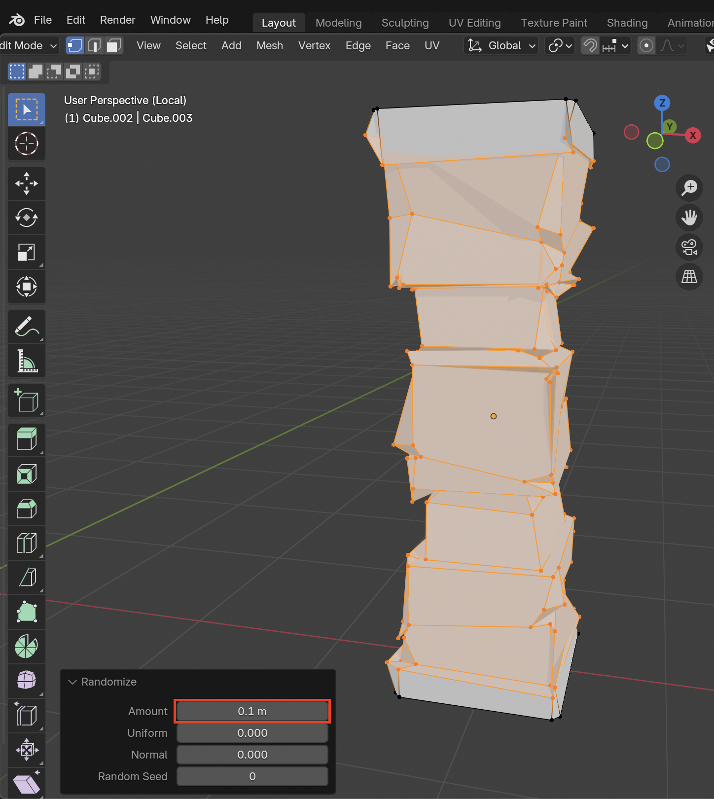
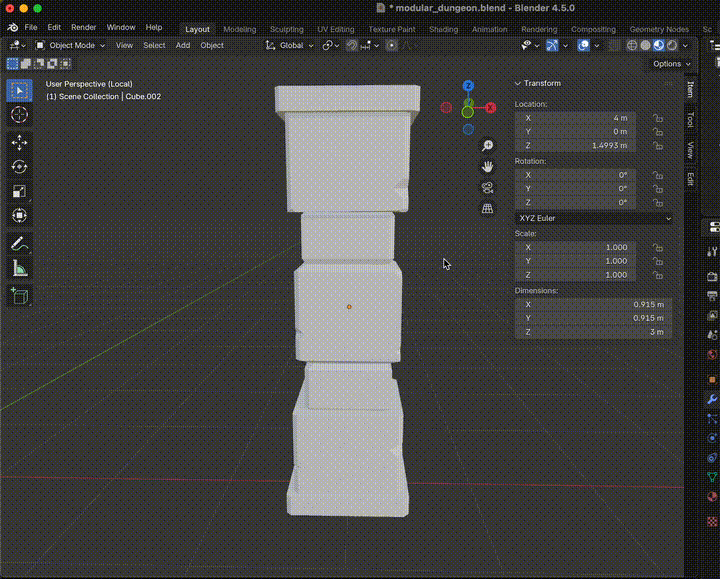

# Randomize Tool

Moves vertices in random direction and can help create distortion and more realistic models as a result.

## How to use the randomize tool
1. Select the object

2. Enter **Edit Mode**

3. Select vertices to change

4. Go to **Mesh > Transform > Randomize** to use the Randomizer

5. Update the **Amount** to adjust how much randomness is applied

6. Final Result
