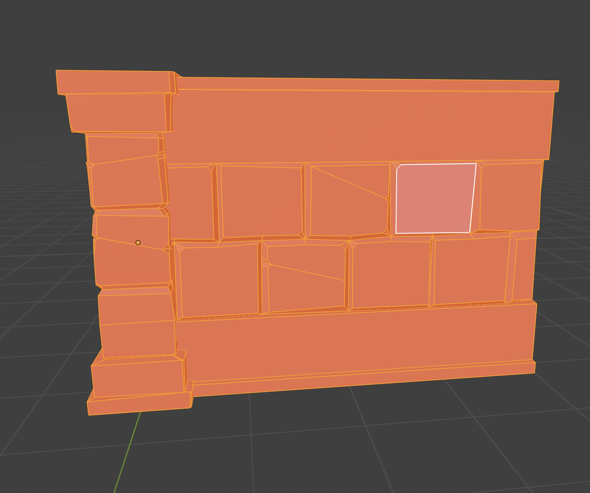
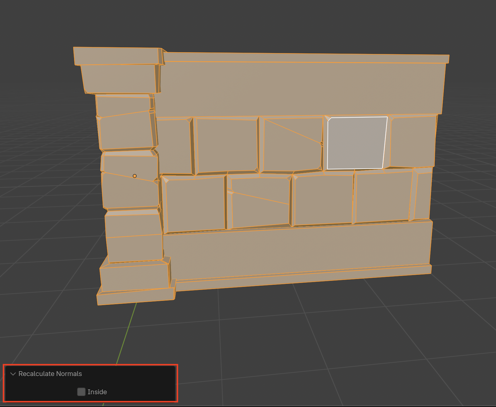

# Recalculate Normals
It is good practice to check face orientation every now and then, just to make sure that your faces have not accidentally been flipped. If the faces are not in the correct orientation Blender has a helpful tool called **Recalculate Normals** that helps orient faces to the correct direction.

## Enable Face Orientation
Open the **Show Overlays** menu and enable **Face Orientation**

> Red indicates that the normals are not oriented correctly

## Fixing Normals
1. Select the affected object

2. Go into **Edit Mode**

3. Select one face then **Press A** to select all

4. Press **Shift + N** to recalculate normals. If they did not calculate correctly you can select **Inside**
