# Rendering

## Align Camera to View

1. Move to where you want your camera to Blender

2. Select **View > Align View > Align Active Camera To View**

3.  To make small adjustments you can press the lock and move accordingly. Just remember to remove the lock when you are done

## Change Camera Settings

1. Select the camera in the **Outliner**

2. Select the **Data** tab under **Properties**. Some useful settings to change are clip end (sometimes objects are not rendered because they are too far) and focal length to change the perspective

## Render Image

1. Go to **Render > Render Image**

2. Once the image is rendered make sure you save with **Image > Save as...**

## Render Animation
1. Go to the **Output** section and adjust the resolution percentage (50% if you are doing a test and want to go quicker), and make sure that the **Frame Range** is correct
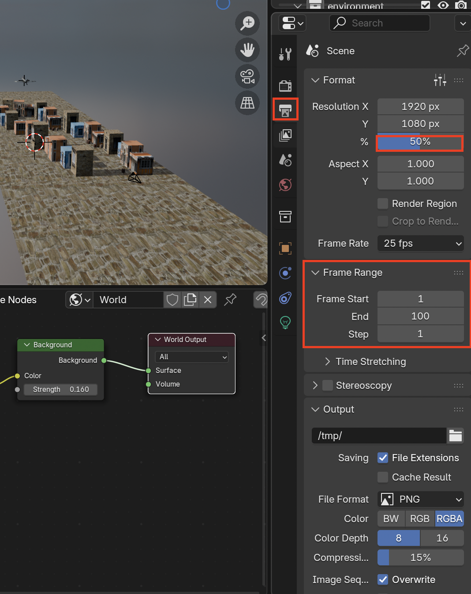

2. Update the output file path to where you want the final render to go. Then change the 
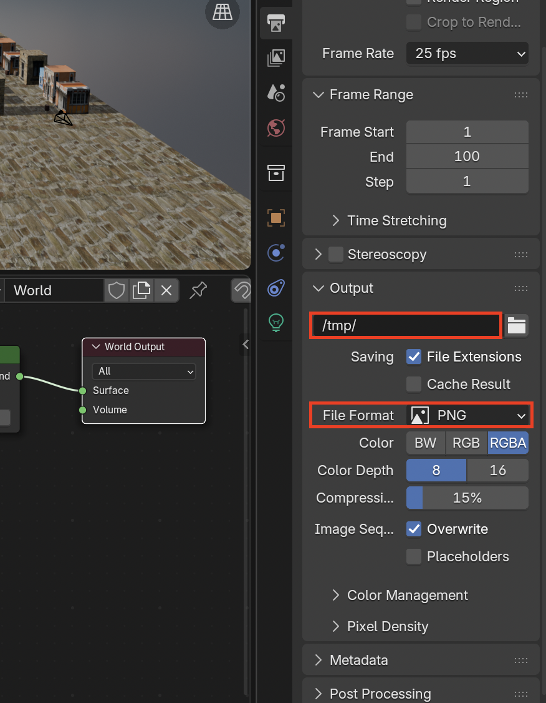
> The PNG file format mixed with RGBA can be used to create cool visual effects you just need to make sure the **Transparent** is enabled in **Render > Film > Transparent**
> 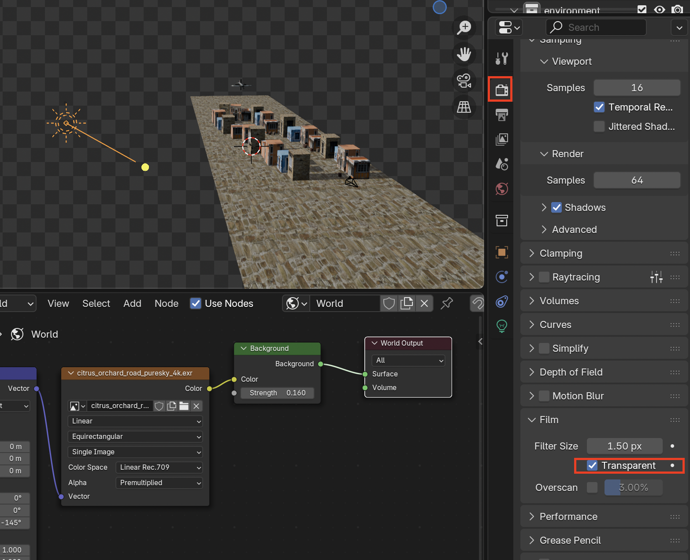

3. In this case we just want a video so change the **File Format** to **FFmpeg Video**
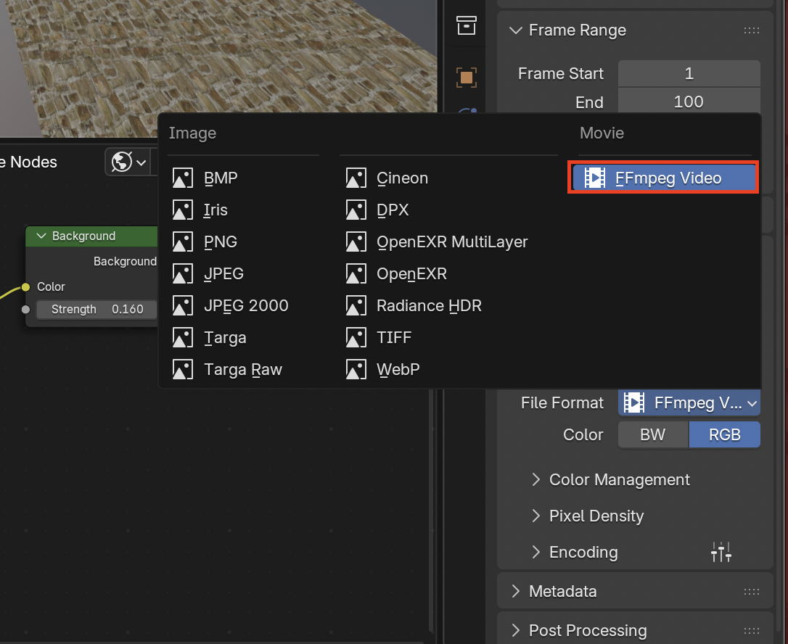

4. **Encoding** default might be Matroska, we can change that to a more universal type like MPEG-4
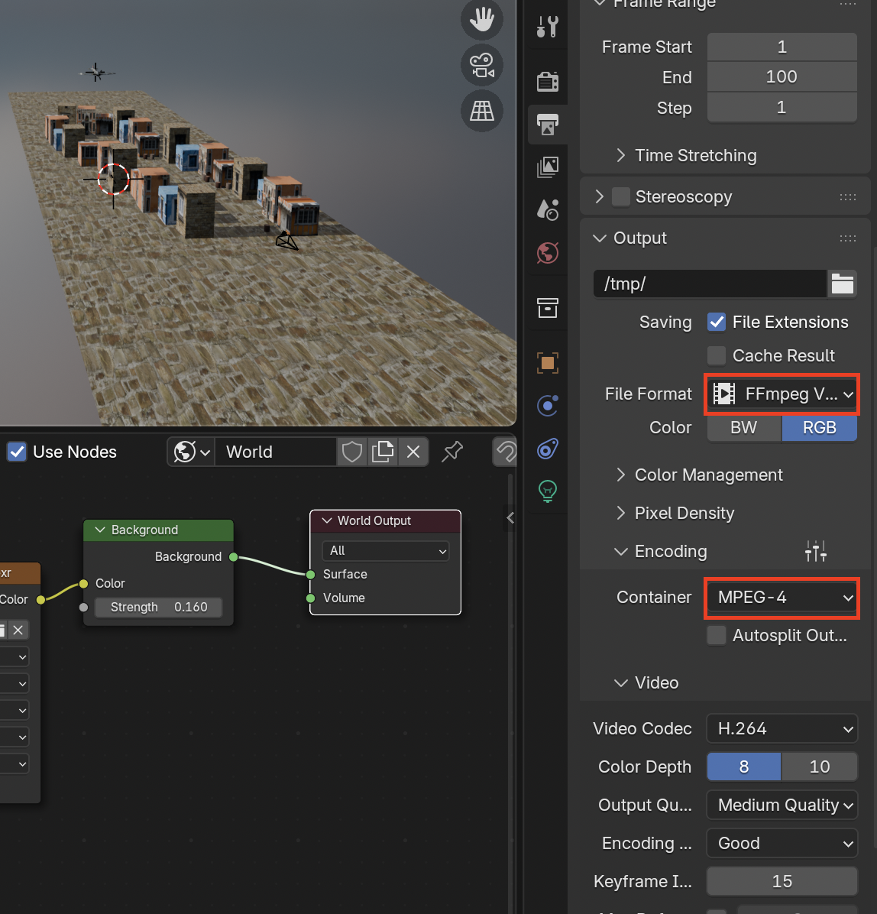

5. **Video Quality** can be set to **Perceptually Lossless** for **Output Quality** and **Slowest** for **Encoding Speed**
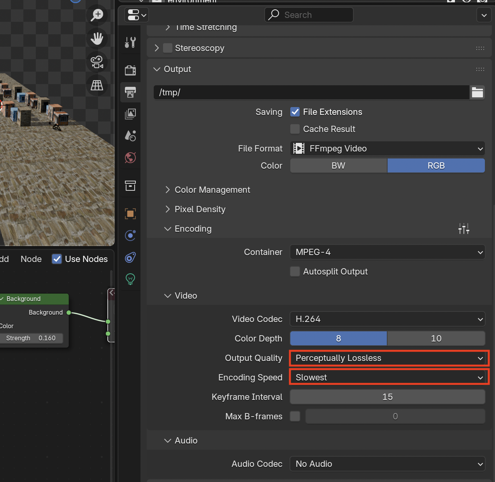

6. To actually render go to **Render > Render Animation** 
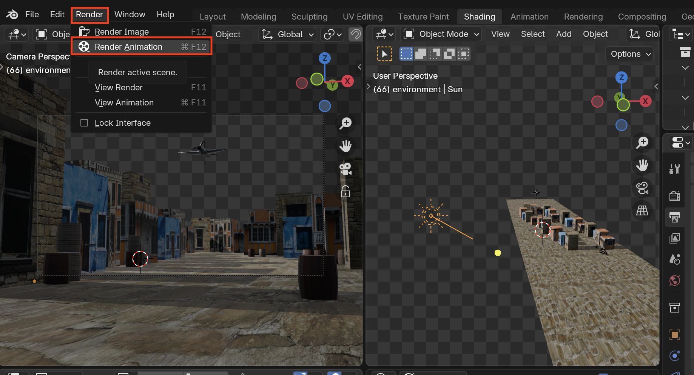

7. To view your animation you can go to **Render > View Animation**
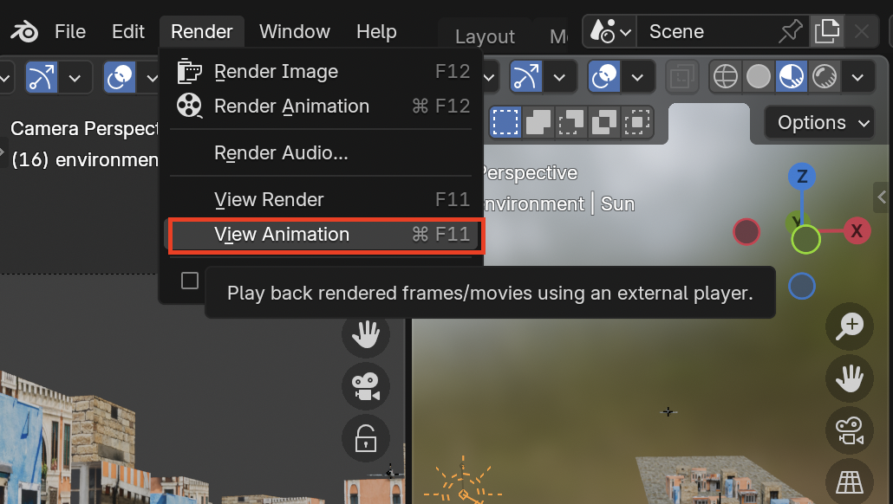

8. The animation will then player on the Blender player
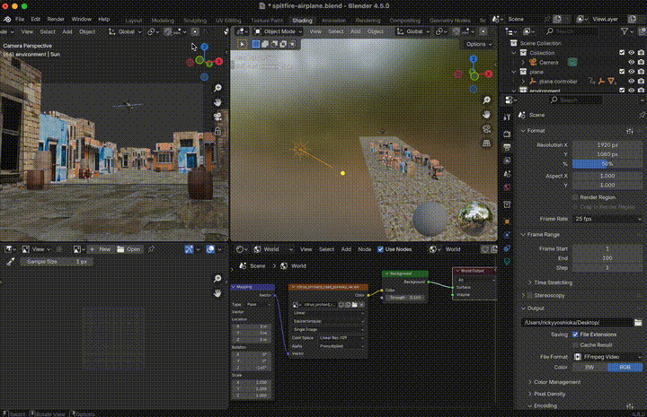

## EEVEE vs. Cycles
1. To change the **Render Engine** select **Render** on the side then you can change the **Render Engine**
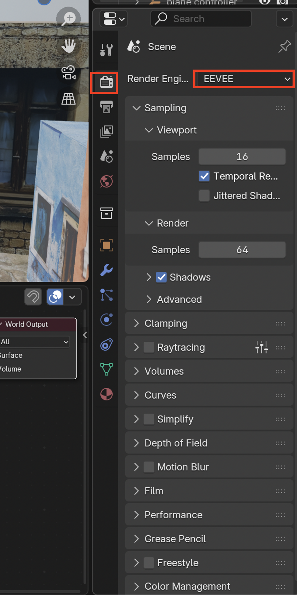

2. EEVEE is quick and is good if you are prototyping before the final image

3. If you want to render nice looking images with more realistic lighting use **Cycles**

4. Enable denoising for less staticy images
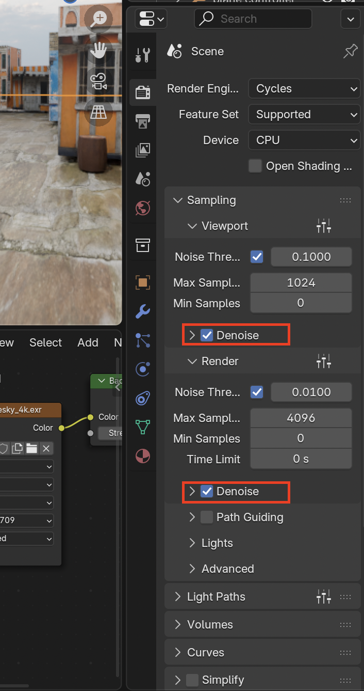

5. It can also help to set a time-limit on how long each image takes to render
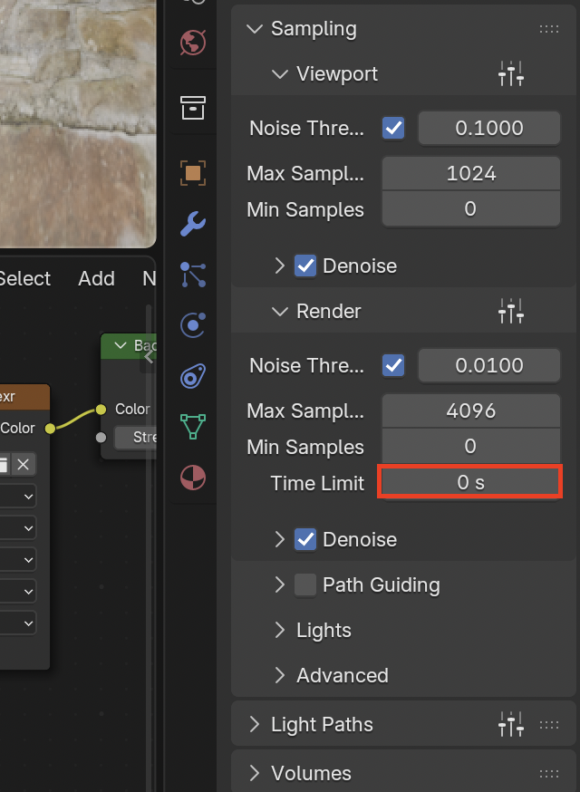