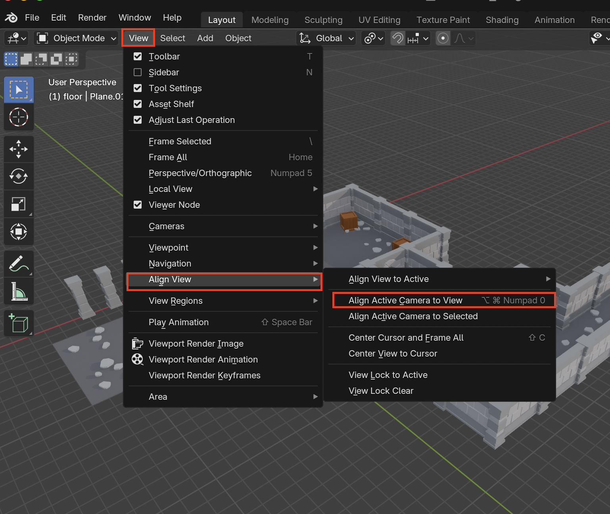
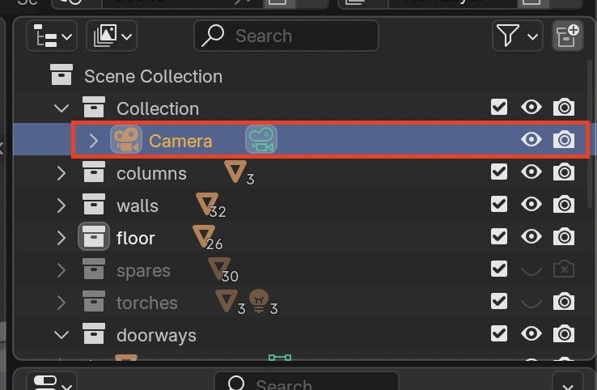
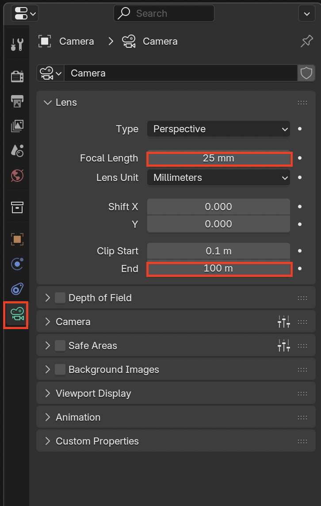

# Rendering

## Align Camera to View

1. Move to where you want your camera to Blender

2. Select **View > Align View > Align Active Camera To View**

3.  To make small adjustments you can press the lock and move accordingly. Just remember to remove the lock when you are done

## Change Camera Settings

1. Select the camera in the **Outliner**

2. Select the **Data** tab under **Properties**. Some useful settings to change are clip end (sometimes objects are not rendered because they are too far) and focal length to change the perspective

## Render Image

1. Go to **Render > Render Image**

2. Once the image is rendered make sure you save with **Image > Save as...**
