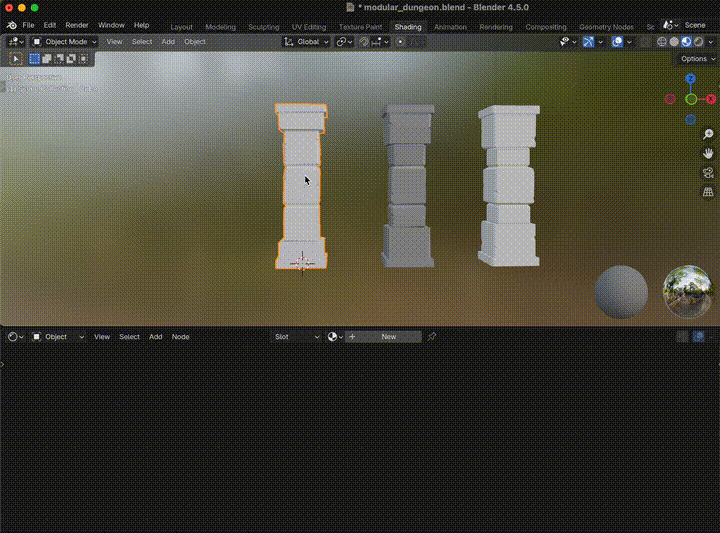
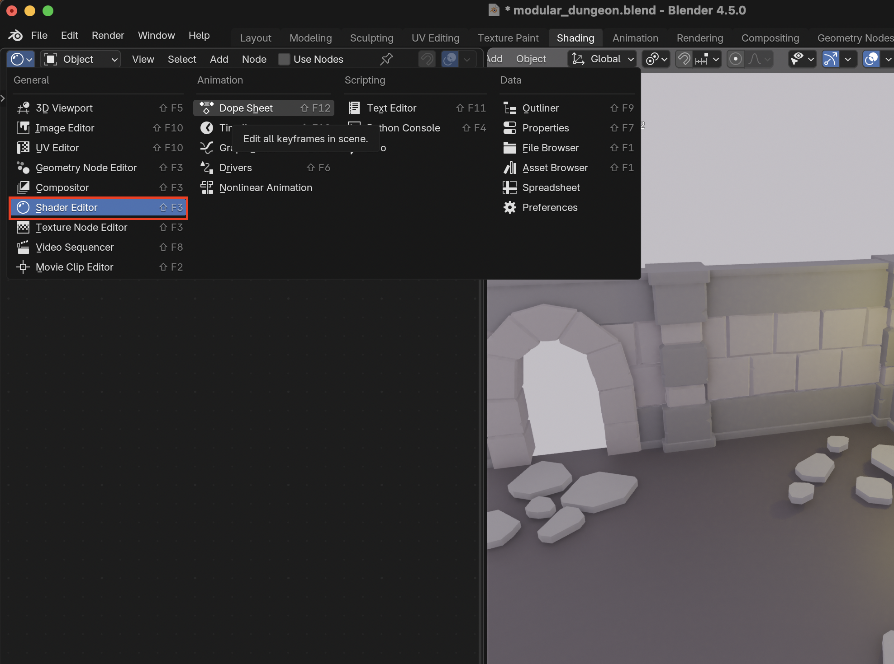
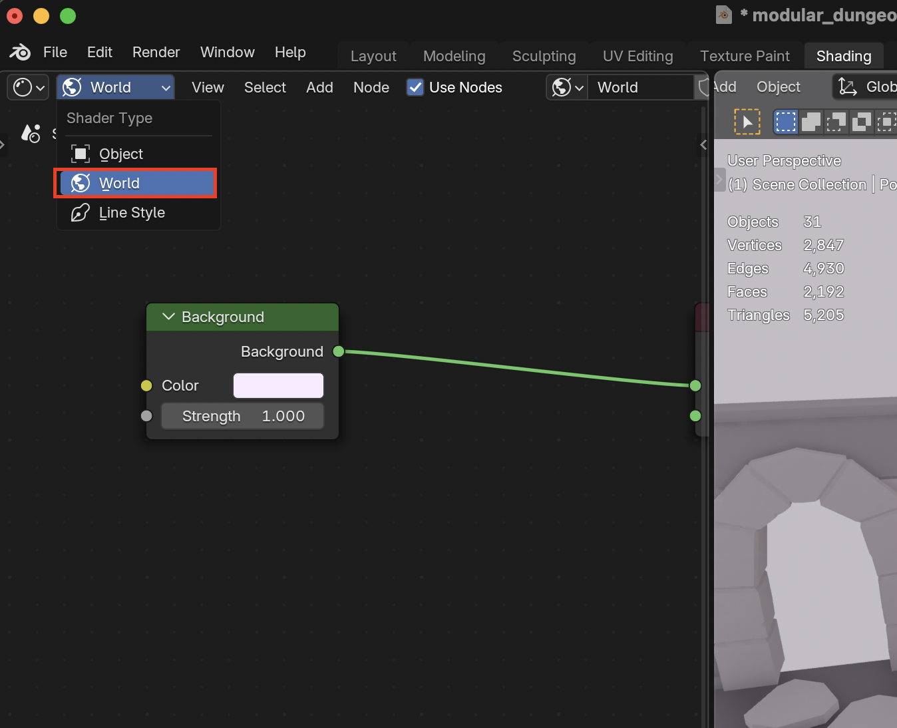
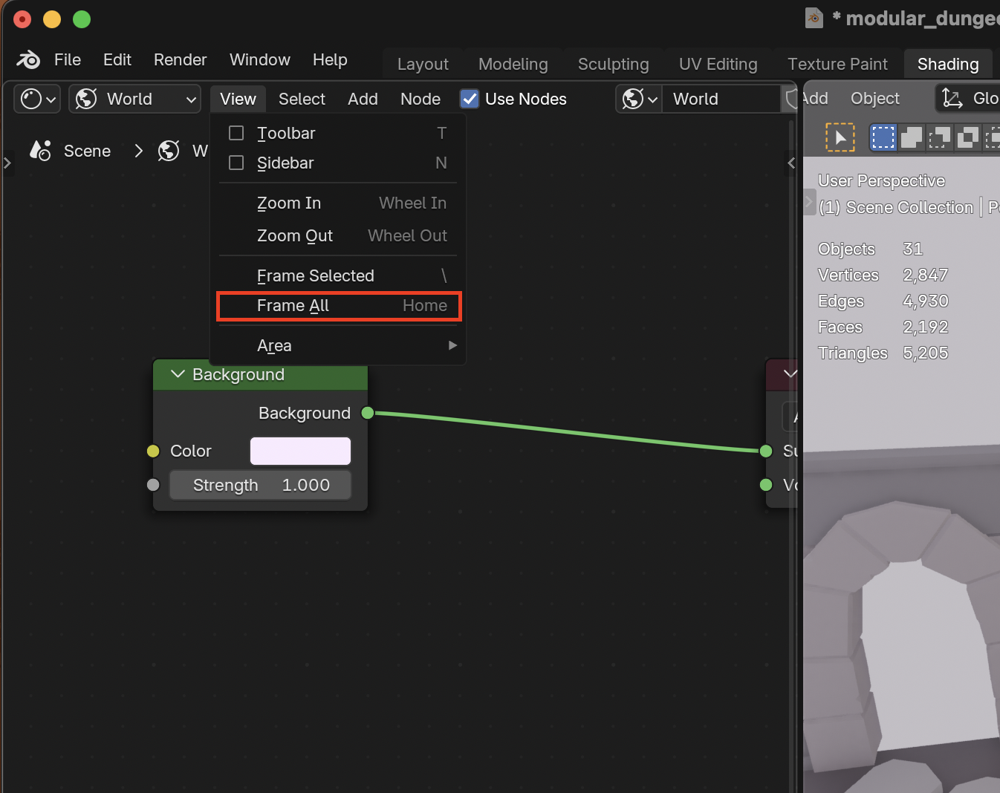

# Shading

## Shortcuts
| Shortcut | Description | Image |
|----------|-------------|-------|
| **Ctrl + L -> Link Materials** | Link materials from selected object |  |

## World Lighting

1. Go to the **Shader Editor**

2. Select the **World** Shader type in the dropdown menu

3. Select **View > Frame All** to see all the nodes

4. Click on the color picker under the **Background** node to change the lighting
