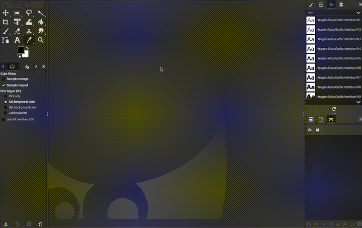
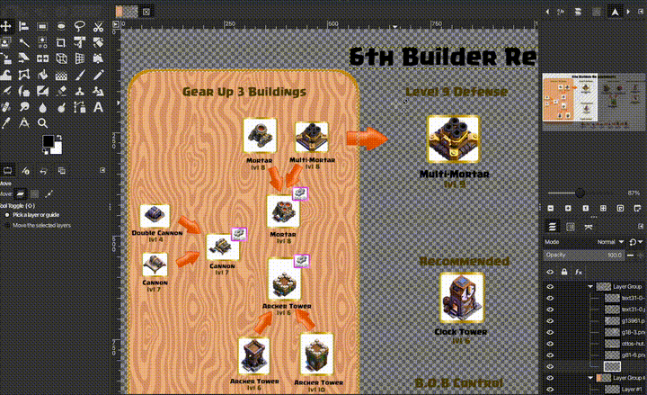
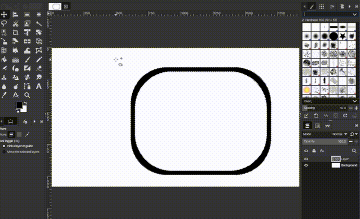
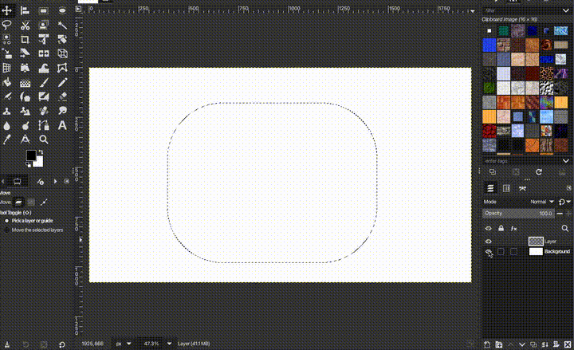
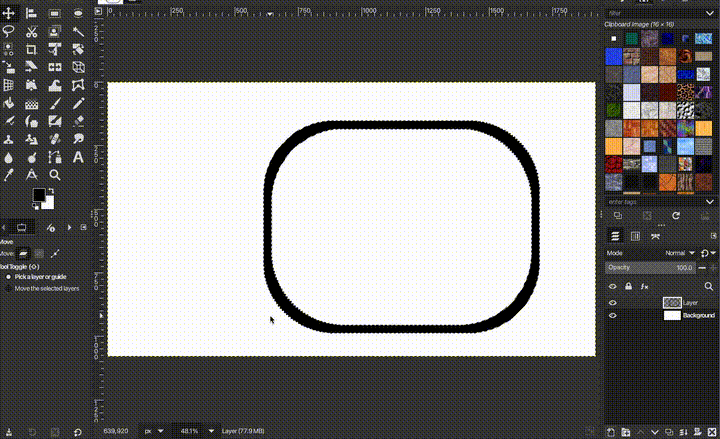
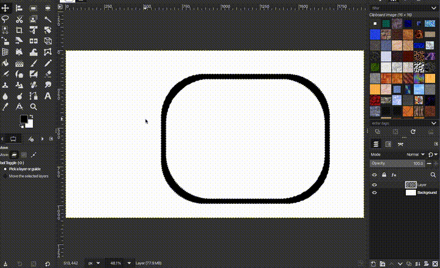

# Gimp Shortcuts

| Action                | Shortcut     | Images |
|-----------------------|--------------|--------|
| Hide Docks            | **Tab** |  |
| Scroll Beyond Image | **Space + Drag | 
| Create New Image   | **Ctrl + N** |  |
| Move Selection | **Ctrl + Alt** |  |
| Reset Rotation | **!** |  |
| Fit Image to Window | **Ctrl + Shift + J** |  |