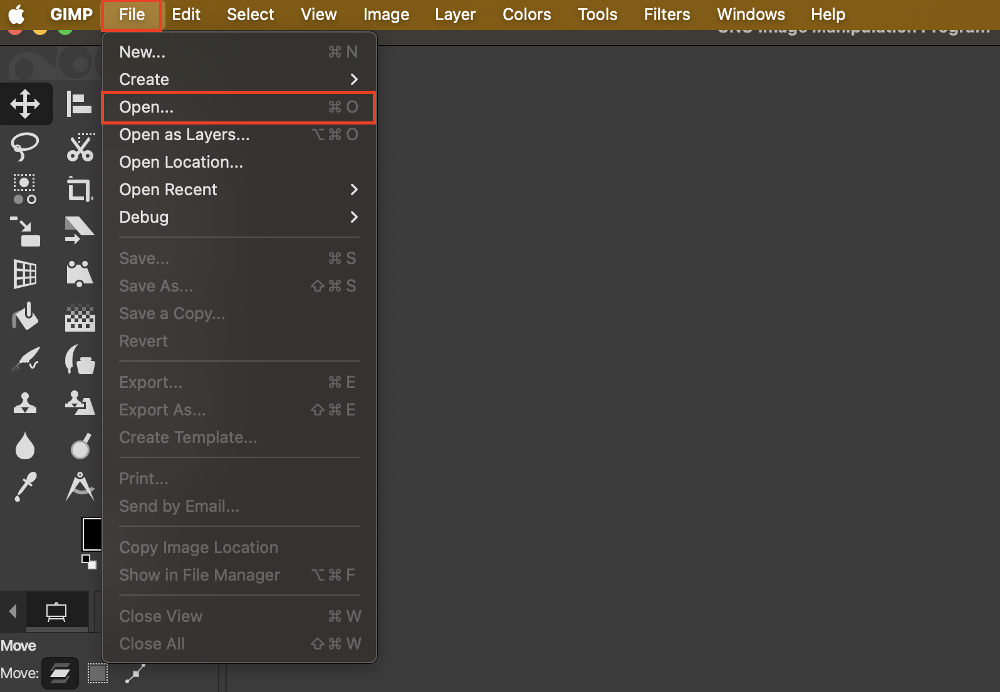
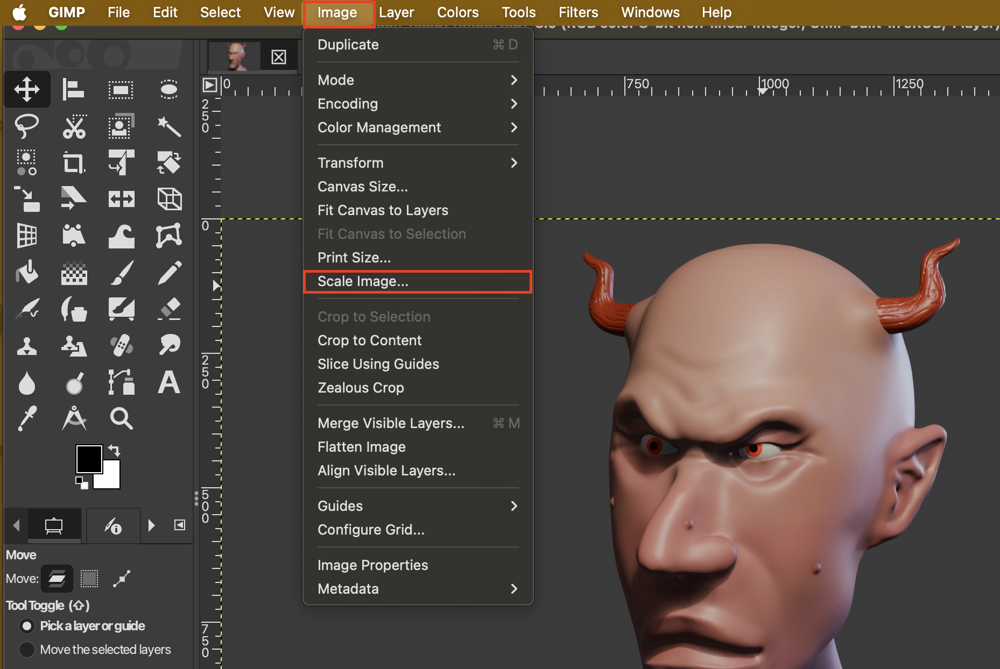
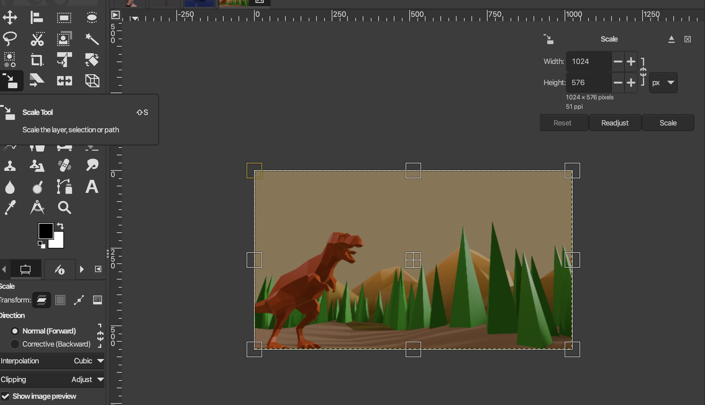
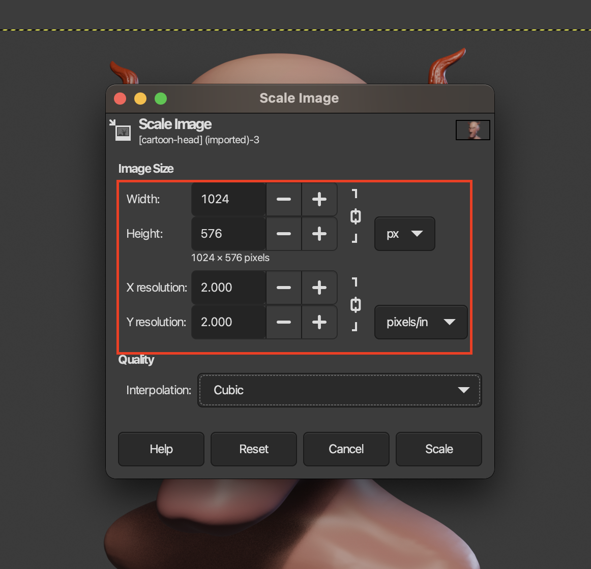
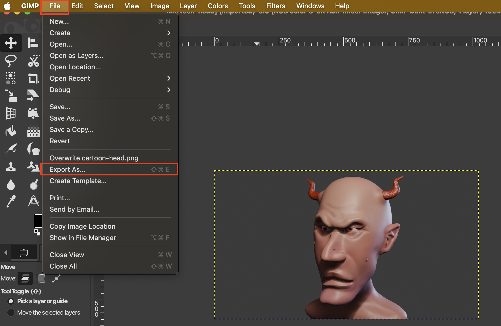
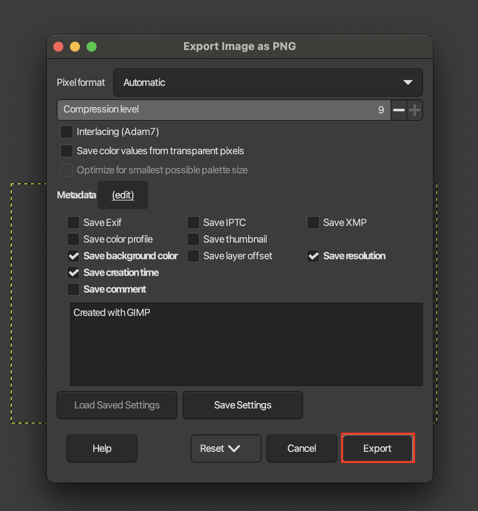

# Reduce Resolution of Image

1. Open image with **File > Open...**

2. Scale image with **Image > Scale Image...**

> The **Scale Tool** only resizes the layer, so best not to use this method
> 

3. Update aspect ratio to new size. Click **Scale** to set the new resolution

| Resolution | Width × Height (px) | Notes                         |
| ---------- | ------------------- | ----------------------------- |
| Full HD    | 1920 × 1080         | HD Image                 |
| 1600 × 900 | 1600 × 900          | Slightly smaller, still sharp |
| HD         | 1280 × 720          | Standard HD, web-friendly     |
| 1024 × 576 | 1024 × 576          | Small HD, good for thumbnails |
| SD         | 854 × 480           | Low-res, small file size      |

> For **pixels/in 72** is fine for screens

4. Make sure you **File > Export As** to save the new image

5. Update Metadata to your needs. You can just click **Export**
