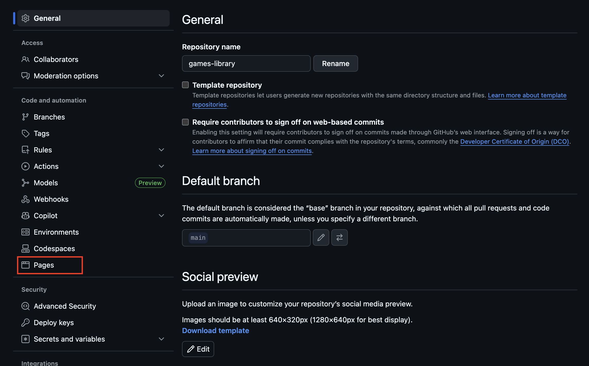
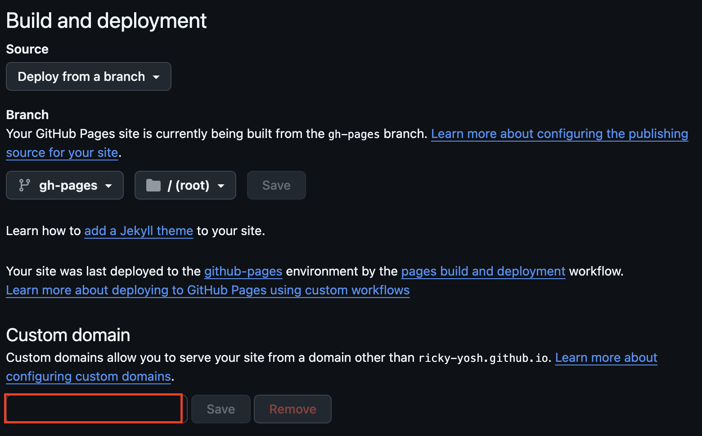

# Adding Custom Domains to Github Pages

Custom domains allow you to host on github pages without it going to `<username>.github.io/<repository-name>`

## Setup
1. Go to your repository **Settings**


2. Select on the **Pages** section


3. Input your custom domain that you purchased


4. If you get a `DNS check unsuccessful` error you will need to go to the [Github Documentation](https://docs.github.com/en/pages/configuring-a-custom-domain-for-your-github-pages-site/managing-a-custom-domain-for-your-github-pages-site) to properly setup the DNS settings.

5. You will need to create Aliases and CNAME's Here is an example:
```
Type: A     Name: @     Content: 185.199.108.153
Type: A     Name: @     Content: 185.199.109.153
Type: A     Name: @     Content: 185.199.110.153
Type: A     Name: @     Content: 185.199.111.153

Type: AAAA  Name: @     Content: 2606:50c0:8000::153
Type: AAAA  Name: @     Content: 2606:50c0:8001::153
Type: AAAA  Name: @     Content: 2606:50c0:8002::153
Type: AAAA  Name: @     Content: 2606:50c0:8003::153

Type: CNAME Name: www  Content: your-github-username.github.io
```

## Test if DNS was configured correctly:

- For `A` records:
```
dig EXAMPLE.COM +noall +answer -t A
```

Expected Output:
```
> EXAMPLE.COM    3600    IN A     185.199.108.153
> EXAMPLE.COM    3600    IN A     185.199.109.153
> EXAMPLE.COM    3600    IN A     185.199.110.153
> EXAMPLE.COM    3600    IN A     185.199.111.153
```

- For `AAAA` records:
```
dig EXAMPLE.COM +noall +answer -t AAAA
```

Expected Output:
```
> EXAMPLE.COM     3600    IN AAAA     2606:50c0:8000::153
> EXAMPLE.COM     3600    IN AAAA     2606:50c0:8001::153
> EXAMPLE.COM     3600    IN AAAA     2606:50c0:8002::153
> EXAMPLE.COM     3600    IN AAAA     2606:50c0:8003::153
```

- Check `CNAME` configuration
```
dig WWW.EXAMPLE.COM +nostats +nocomments +nocmd
```
Expected Output:
```
> ;WWW.EXAMPLE.COM.                    IN      A
> WWW.EXAMPLE.COM.             3592    IN      CNAME   YOUR-USERNAME.github.io.
> YOUR-USERNAME.github.io.      43192   IN      CNAME   GITHUB-PAGES-SERVER .
> GITHUB-PAGES-SERVER .         22      IN      A       192.0.2.1
```