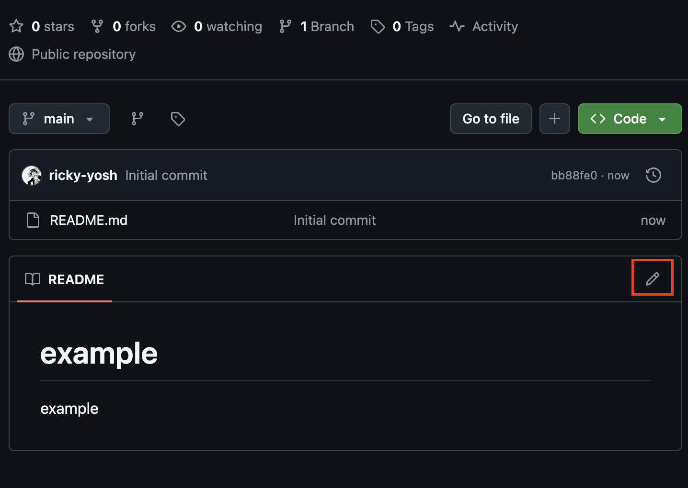

# Creating and Cloning Github Repositories

## Creating a Repository
1. Go to [github.com/new](https://github.com/new)

2. Fill out **Repository name**, add a **Description**, choose whether or not the repository is **Public or Private**, and it is a good idea to **Add README** that explains what the repository is and instructions on how to run it.


3. From the repository page you can directly edit the readme file. It uses **Markdown** which is a Markup language. All that means is that it uses syntax to add styling to a document.


4. Example Markdown
```md
# H1
## H2
### H3

*italic* / _italic_  
**bold** / __bold__  
***bold italic***

- Item
  - Sub-item
1. Item
2. Item

[Link](https://example.com)  


Inline: `` `code` ``
Block:
\```
code block
\```
(without the \)

> Quote  
--- (or ***, ___)

| A | B |
|---|---|
| 1 | 2 |

- [ ] To do  
- [x] Done

~~strikethrough~~  
\*escape\*  
[^1]: Footnote
```
Rendered version:


## Cloning a Repository
1. In your repository select **Code**


2. Go to the **SSH** tab


> Note you will need to have ssh setup in order to complete the next steps.

3. Copy the link


4. In your terminal enter `git clone [link]`

Example output:
```
> git clone git@github.com:ricky-yosh/example.git

Cloning into 'example'...
remote: Enumerating objects: 6, done.
remote: Counting objects: 100% (6/6), done.
remote: Compressing objects: 100% (3/3), done.
remote: Total 6 (delta 0), reused 0 (delta 0), pack-reused 0 (from 0)
Receiving objects: 100% (6/6), done.
```

5. A folder will now be created with all the contents of the repository inside of it.