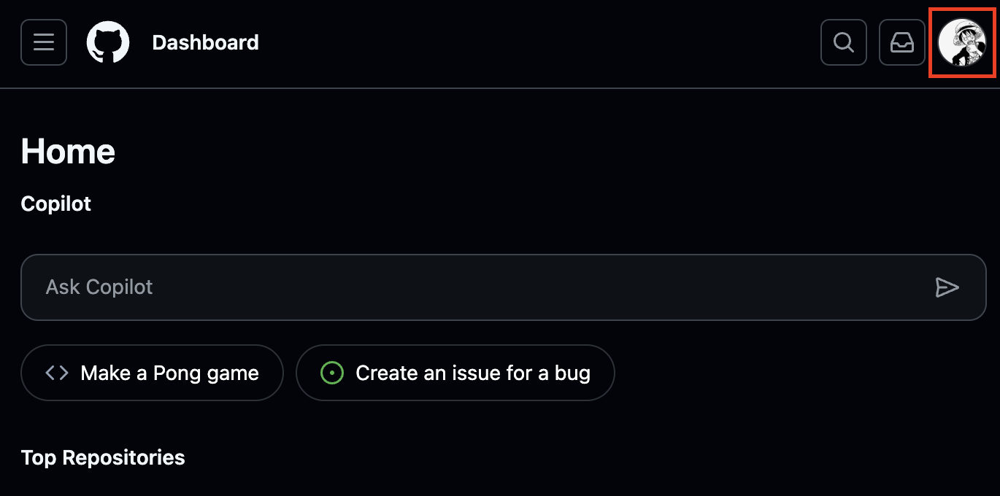
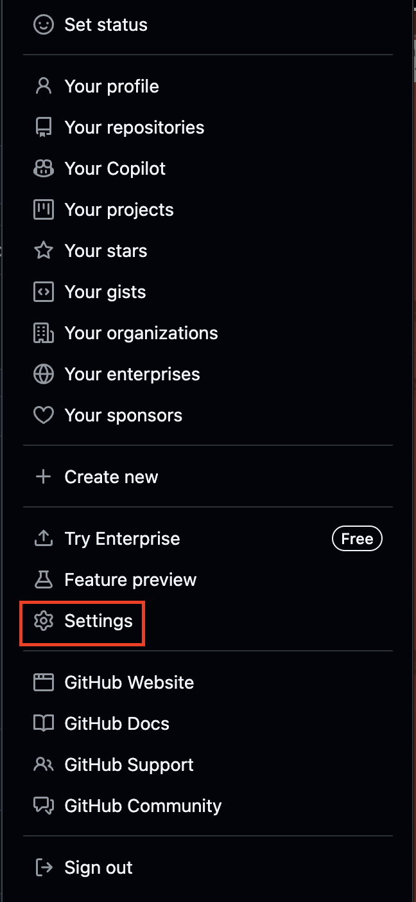
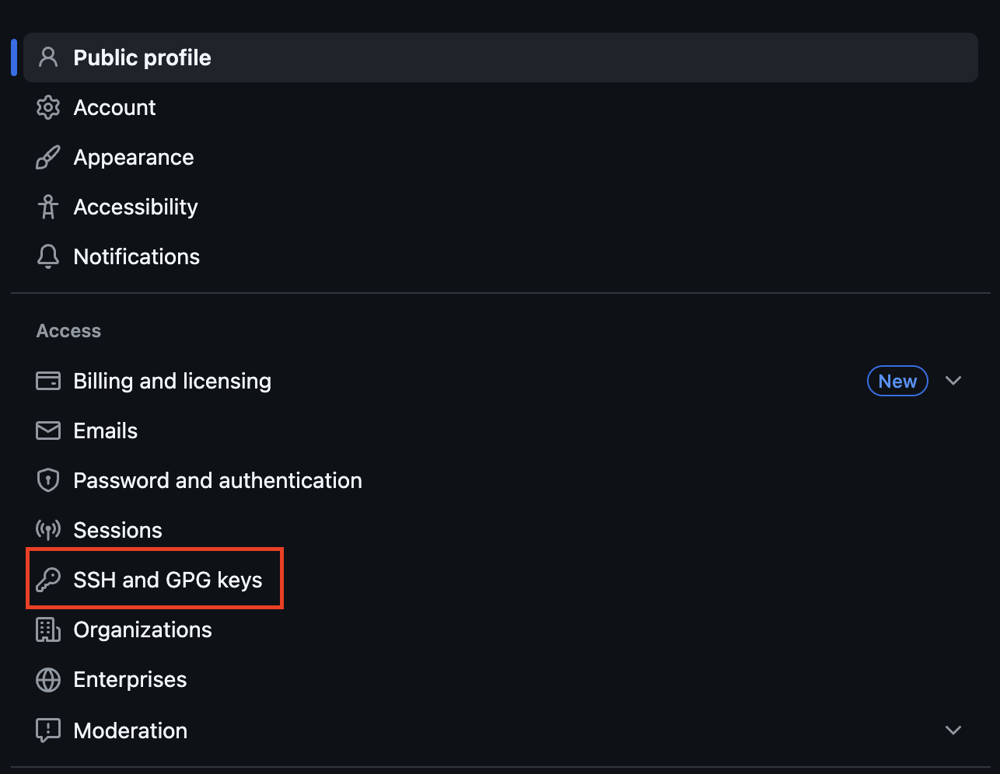
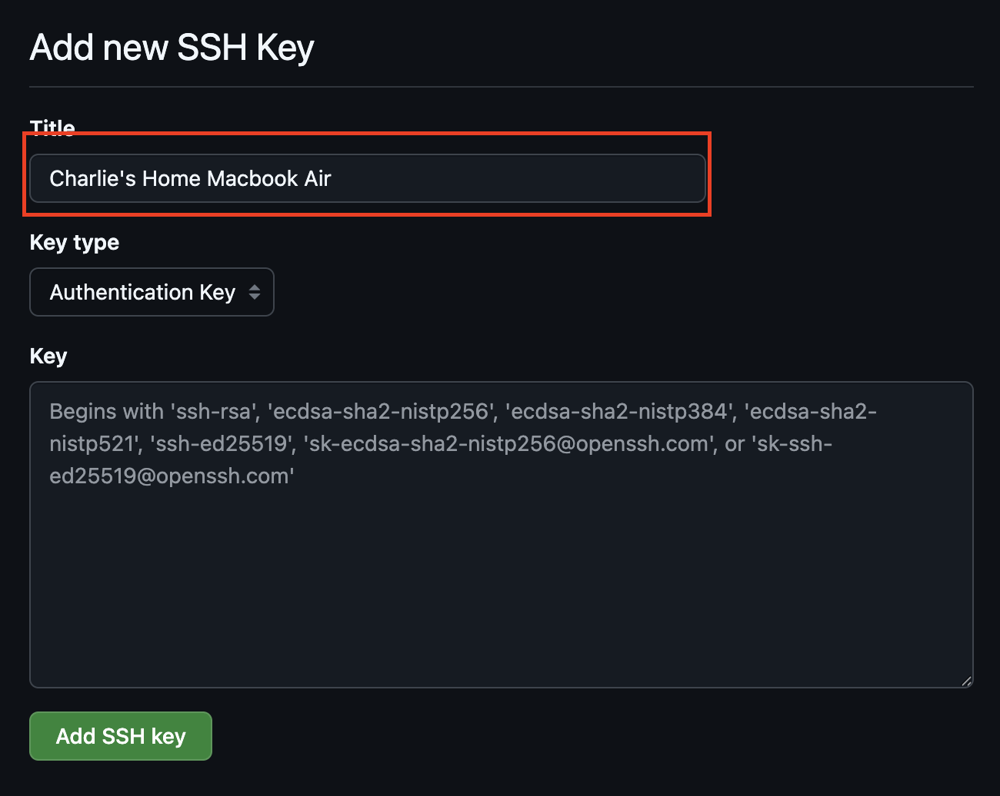
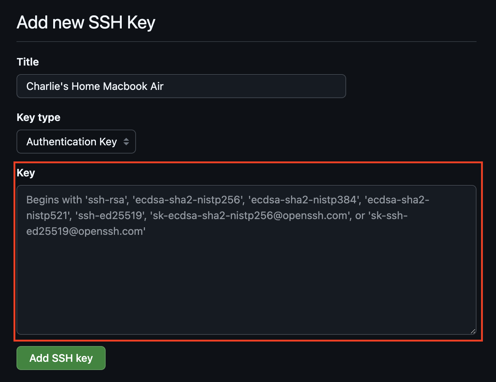
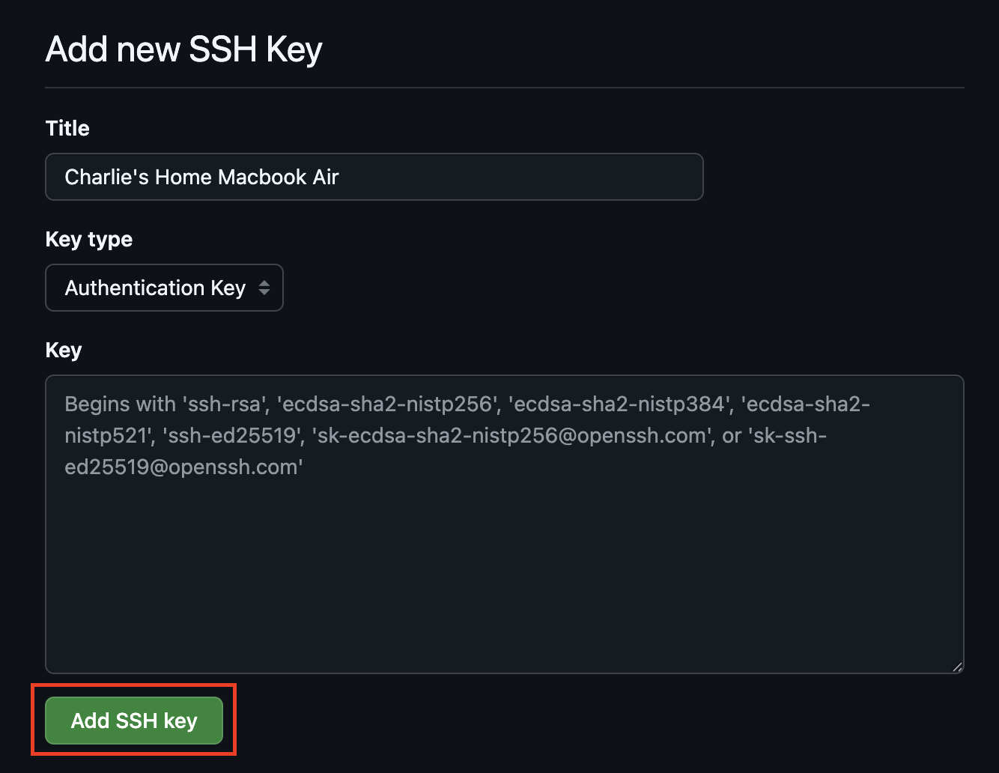

# SSH Key Setup Guide for GitHub

This guide will walk you through creating an SSH key and connecting it to GitHub for secure authentication.

## MacOS Instructions

### Step 1: Check for Existing SSH Keys
Open Terminal and run:
```bash
ls -al ~/.ssh
```

Look for files named `id_rsa.pub`, `id_ecdsa.pub`, `id_ed25519.pub`, or similar. If you see these, you may already have an SSH key.

### Step 2: Generate a New SSH Key
If you don't have an existing key or want to create a new one:
```bash
ssh-keygen -t ed25519 -C "your_email@example.com"
```

> **Note:** If your system doesn't support Ed25519, use RSA instead:

```bash
ssh-keygen -t rsa -b 4096 -C "your_email@example.com"
```

#### What you will see:
```sh
Generating public/private ed25519 key pair.
Enter file in which to save the key (/Users/user/.ssh/id_ed25519):
> Enter passphrase (empty for no passphrase):
> Enter same passphrase again:
```
You can press `return` for all of these

### Step 3: Add SSH Key to ssh-agent
Start the ssh-agent in the background:
```bash
eval "$(ssh-agent -s)"
```

Add your SSH private key to the ssh-agent:
```bash
ssh-add ~/.ssh/id_ed25519
```

If you used RSA, replace `id_ed25519` with `id_rsa`.

### Step 4: Copy the SSH Key
Copy your public key to the clipboard:
```bash
pbcopy < ~/.ssh/id_ed25519.pub
```

For RSA keys:
```bash
pbcopy < ~/.ssh/id_rsa.pub
```

## Windows Instructions

### Step 1: Check for Existing SSH Keys
Open Command Prompt or PowerShell and run:
```cmd
dir %USERPROFILE%\.ssh
```

Look for files named `id_rsa.pub`, `id_ecdsa.pub`, `id_ed25519.pub`, or similar.

### Step 2: Generate a New SSH Key
Open Command Prompt or PowerShell and run:
```cmd
ssh-keygen -t ed25519 -C "your_email@example.com"
```

**Note:** If your system doesn't support Ed25519, use RSA instead:
```cmd
ssh-keygen -t rsa -b 4096 -C "your_email@example.com"
```

When prompted:
- Press Enter to accept the default file location
- Enter a secure passphrase (recommended) or press Enter for no passphrase

### Step 3: Add SSH Key to ssh-agent

Check if OpenSSH Client is installed
```sh
Get-WindowsCapability -Online | Where-Object Name -like 'OpenSSH*'
```

Install OpenSSH Client if not present
```sh
Add-WindowsCapability -Online -Name OpenSSH.Client~~~~0.0.1.0
```

Start the ssh-agent service, and in powershell as administrator
```cmd
Get-Service -Name ssh-agent | Set-Service -StartupType Manual
Start-Service ssh-agent
```

Add your SSH private key to the ssh-agent:
```cmd
ssh-add %USERPROFILE%\.ssh\id_ed25519
```

If you used RSA, replace `id_ed25519` with `id_rsa`.

### Step 4: Copy the SSH Key
Copy your public key to the clipboard:
```cmd
clip < %USERPROFILE%\.ssh\id_ed25519.pub
```

For RSA keys:
```cmd
clip < %USERPROFILE%\.ssh\id_rsa.pub
```

Alternatively, you can open the file in a text editor and copy the contents:
```cmd
notepad %USERPROFILE%\.ssh\id_ed25519.pub
```

## Adding SSH Key to GitHub

### Step 1: Access GitHub Settings


1. Sign in to your GitHub account



2. Click your profile picture in the top-right corner


3. Select **Settings** from the dropdown menu

### Step 2: Navigate to SSH Keys

1. In the left sidebar, click **SSH and GPG keys**

2. Click the **New SSH key** button

### Step 3: Add Your SSH Key



1. In the **Title** field, add a descriptive label for the new key (e.g., "Personal MacBook" or "Work Laptop")



2. In the **Key** field, paste your public key that you copied earlier



3. Click **Add SSH key**

### Step 4: Test Your SSH Connection
Open Terminal (macOS) or Command Prompt/PowerShell (Windows) and run:
```bash
ssh -T git@github.com
```

You should see a message like:
```
Hi username! You've successfully authenticated, but GitHub does not provide shell access.
```

### Using SSH URLs
When cloning repositories, use SSH URLs instead of HTTPS:
```bash
git clone git@github.com:username/repository.git
```

Instead of:
```bash
git clone https://github.com/username/repository.git
```