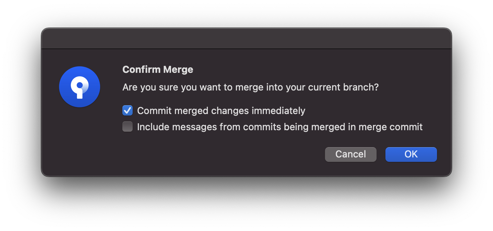
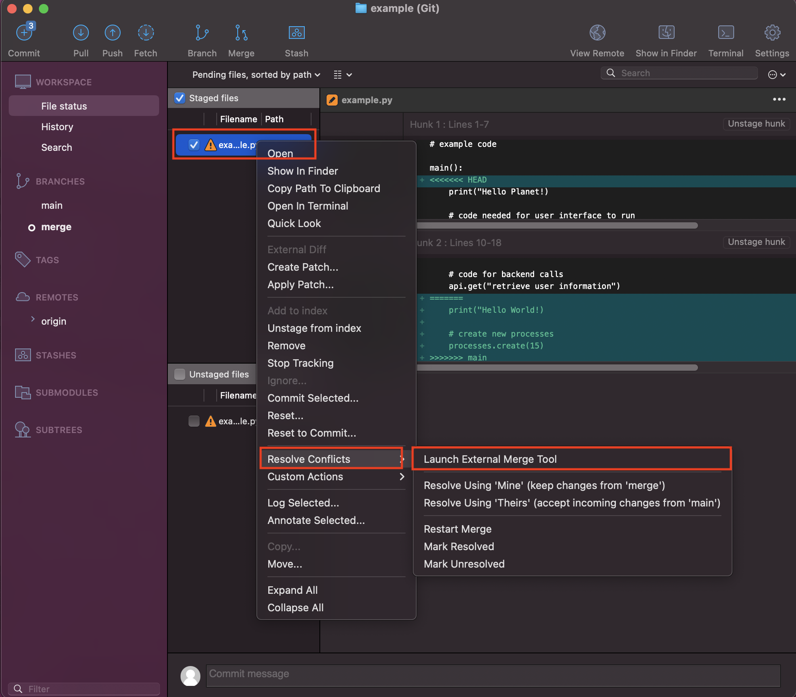
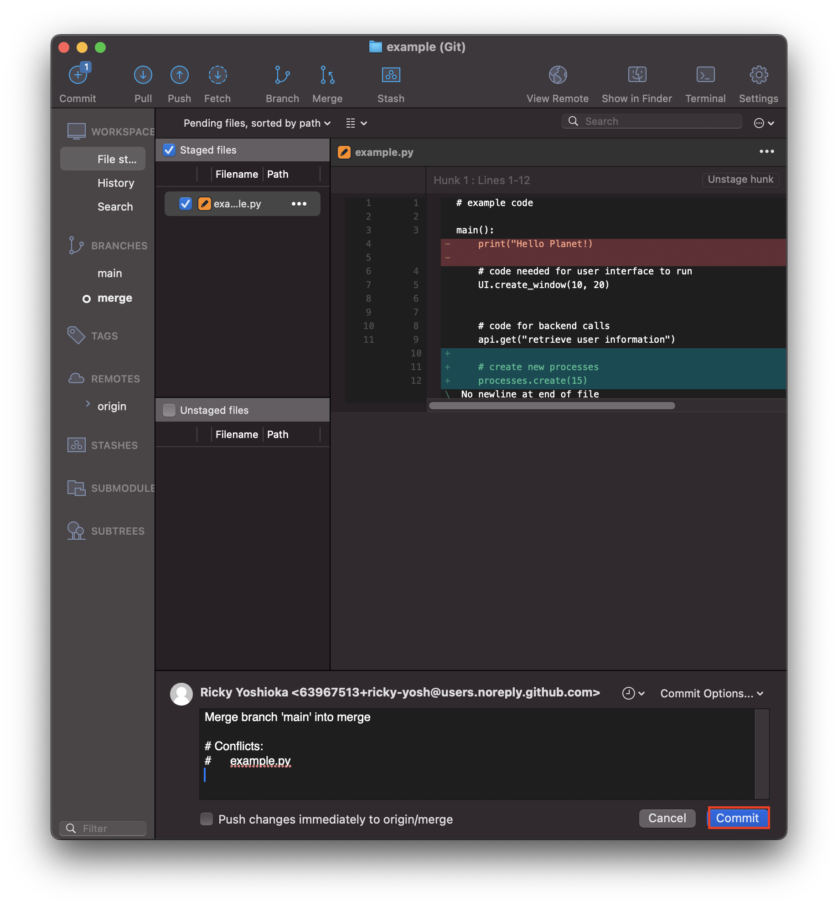
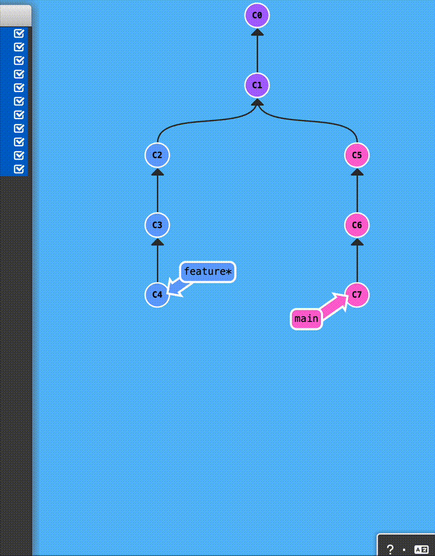
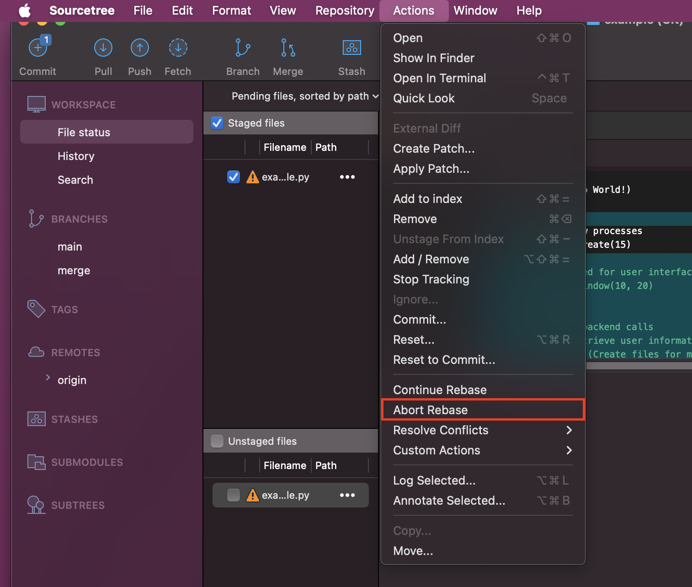
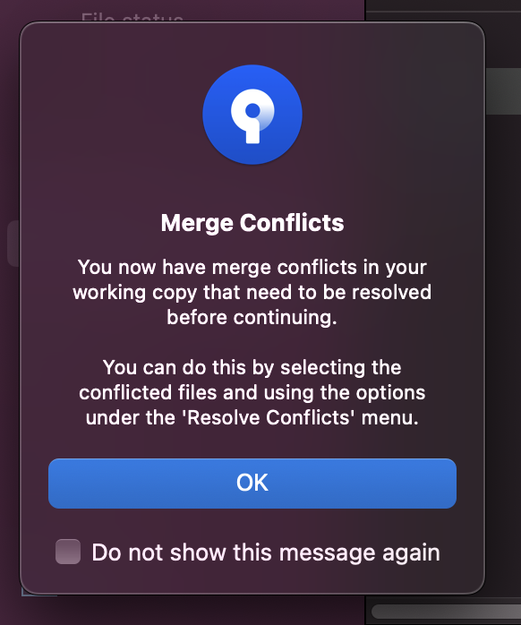
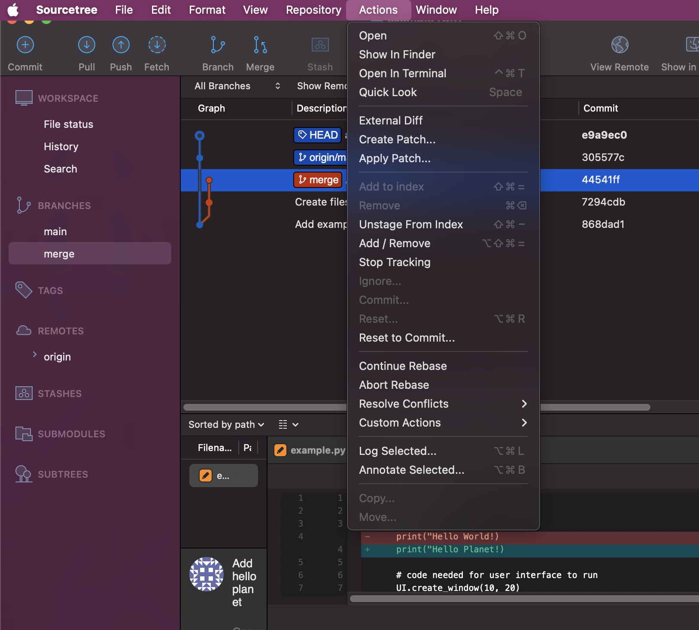

# Merge Conflicts

## Solving Merge Conflicts

### Using Command Line
1. After attempting a merge you will get this error:
```
Auto-merging <file-name>.py
CONFLICT (content): Merge conflict in example.py
Automatic merge failed; fix conflicts and then commit the result.
```

> If you want to cancel the merge you can `git merge --abort`

2. Run `git status` to see which files are affected
```
git status
```
Example output:
```
On branch merge
You have unmerged paths.
  (fix conflicts and run "git commit")
  (use "git merge --abort" to abort the merge)

Unmerged paths:
  (use "git add <file>..." to mark resolution)
        both modified:   example.py

no changes added to commit (use "git add" and/or "git commit -a")
```

3. In this case open the file in your prefered text editor (e.g. VSCode)
```
code example.py
```

4. You will see new added text `<<<<< HEAD` `=====` `>>>> main` you should delete those and manually solve the problem
```
main():
<<<<<<< HEAD
	print("Hello Planet!)

	# code needed for user interface to run
	UI.create_window(10, 20)

	
	# code for backend calls
	api.get("retrieve user information")
=======
	print("Hello World!)

	# create new processes
	processes.create(15)
>>>>>>> main
```

5. After deleting, the code is more readable. In this case the `print("Hello Planet!")` line is not necessary so I will delete it, but I want to keep everything else.
```
main():
	# code needed for user interface to run
	UI.create_window(10, 20)

	
	# code for backend calls
	api.get("retrieve user information")
	print("Hello World!)

	# create new processes
	processes.create(15)
```

6. Check and rerun the code to ensure that nothing has broken.
```
main():

	# code needed for user interface to run
	UI.create_window(10, 20)

	
	# code for backend calls
	api.get("retrieve user information")
	print("Hello World!)

	# create new processes
	processes.create(15)
```

7. Now once you fix a file you should add it to the commit again
```
git commit example.py
```

8. Once all the merge conflicts are solved create another commit
```
git commit -m "Resolve merge conflict"
```

9. You have successfully resolved a merge conflict

### Using Sourcetree
> ⚠️ Warning: The Sourcetree method is not as simple as doing the Command Line method. It is highly recommended that you follow the Command Line Method.

1. Merge the branch that you want to merge into your branch


2. Confirm the settings


3. If you run into a merge conflict you will get this message

> If you want to cancel the merge you can `git merge --abort`. There is no way to cancel a merge within Sourcetree you will have to use the command line.

4. There are two ways to solve the merge conflicts. One is by opening up the affected files in a text editor (See **Using Command Line** instructions above). Two is by using an external merge tool
- Open External Merge Tool:


5. The External Merge Tool is tricky and I recommend just combining it with **Choose Both** under the **Actions** dropdown then manually making edits


6. Once you are satisfied with the file make sure to save exiting the External Merge Tool. You will see the file Sourcetree now


7. The other file seems to be a save file generate from External Merge Tool. I recommend just removing it.


8. Sourcetree generates a commit message and you can just commit once you solved the issue in all the affected files


9. You have successfully resolved a merge conflict

## Conflicts from Rebasing

### Using Command Line

1. After rebasing and merge conflicts exist you will get this message
```
Auto-merging example.py
CONFLICT (content): Merge conflict in example.py
error: could not apply ffdd877... Add breaking commit
hint: Resolve all conflicts manually, mark them as resolved with
hint: "git add/rm <conflicted_files>", then run "git rebase --continue".
hint: You can instead skip this commit: run "git rebase --skip".
hint: To abort and get back to the state before "git rebase", run "git rebase --abort".
hint: Disable this message with "git config set advice.mergeConflict false"
Could not apply ffdd877... # Add breaking commit
```	

2. Run `git status` to see the affected files
```
interactive rebase in progress; onto 14d5dbb
Last command done (1 command done):
   pick ffdd877 # Add breaking commit
Next command to do (1 remaining command):
   pick 59c3cfa # Add another breaking commmit
  (use "git rebase --edit-todo" to view and edit)
You are currently rebasing branch 'merge2' on '14d5dbb'.
  (fix conflicts and then run "git rebase --continue")
  (use "git rebase --skip" to skip this patch)
  (use "git rebase --abort" to check out the original branch)

Unmerged paths:
  (use "git restore --staged <file>..." to unstage)
  (use "git add <file>..." to mark resolution)
        both modified:   example.py

no changes added to commit (use "git add" and/or "git commit -a")
```

3. For **each** commit that has a conflict follow the **Solving Merge Conflicts** steps above.

4. Rebase takes each commit on your branch then places it on top of the new branch. [Git Rebase Demonstration Source](https://learngitbranching.js.org/)


5. Once you complete resolving conflicts for 1 commit, you will need to move on to the next
```
git rebase --continue
```

6. You will know when it is completed because you will get this message:
```
Successfully rebased and updated refs/heads/<branch-name>
```

### Using Sourcetree

- To abort rebase go to **Actions > Abort Rebase**


1. Create a rebase


2. Confirm rebase


3. Receive merge conflict message


4. In the file status you will see the affected files for a specific commit


5. Rebase takes each commit on your branch then places it on top of the new branch. [Git Rebase Demonstration Source](https://learngitbranching.js.org/)


6. For **each** commit that has a conflict follow the **Solving Merge Conflicts** steps above.

7. Once you complete resolving conflicts for 1 commit, you will need to select **Actions > Continue Rebase** to move on to the next


8. Continue until all conflicts are solved 
