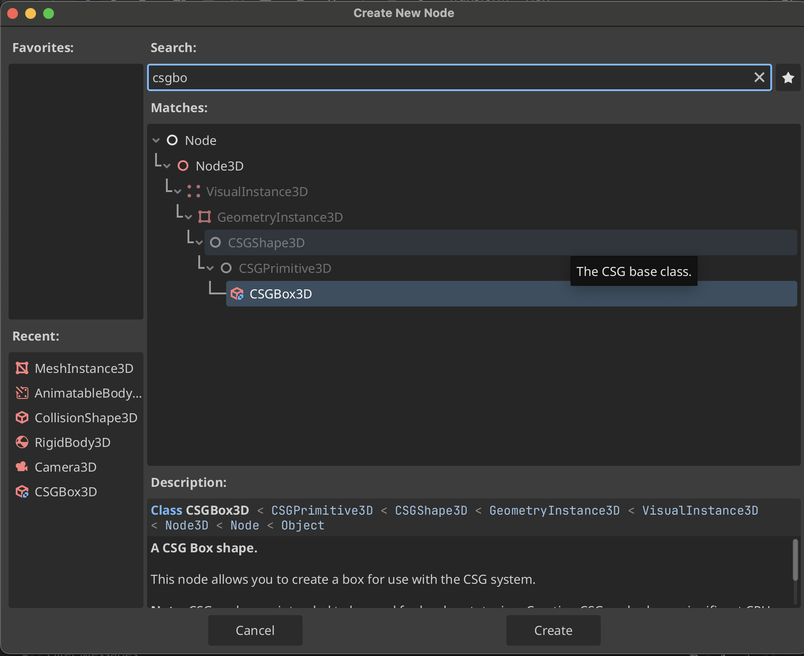

# Blocking Out the Level
You can create a CSG (Constructive Solid Geometry) Node, e.g. **CSGBox3D**, to help with prototyping. It allows you to create various shapes dynamically to later be exported as a mesh to Blender to add more fidelity.

`CMD+A` to create a **CSGBox3D** node

## Export Box Objects to Blender
