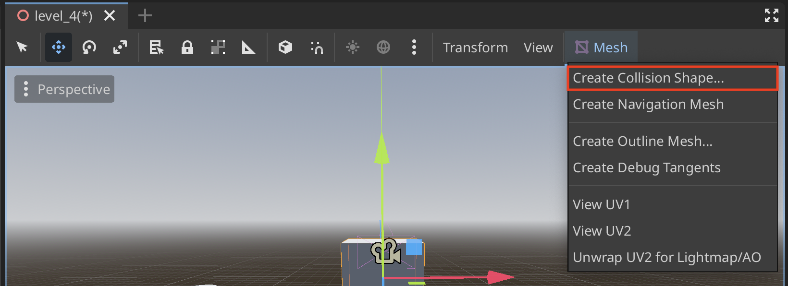
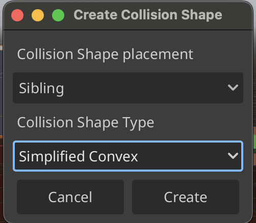

# Collision Shape 3D

## Easily Create CollisionShape3D from MeshInstance3D

1. Select **MeshInstance3D** then the **Mesh** Button in the toolbar

2. Select **Create Collision Shape...**

3. Adjust settings

4. The collision is now created as a sibling to the **MeshInstance3D**
