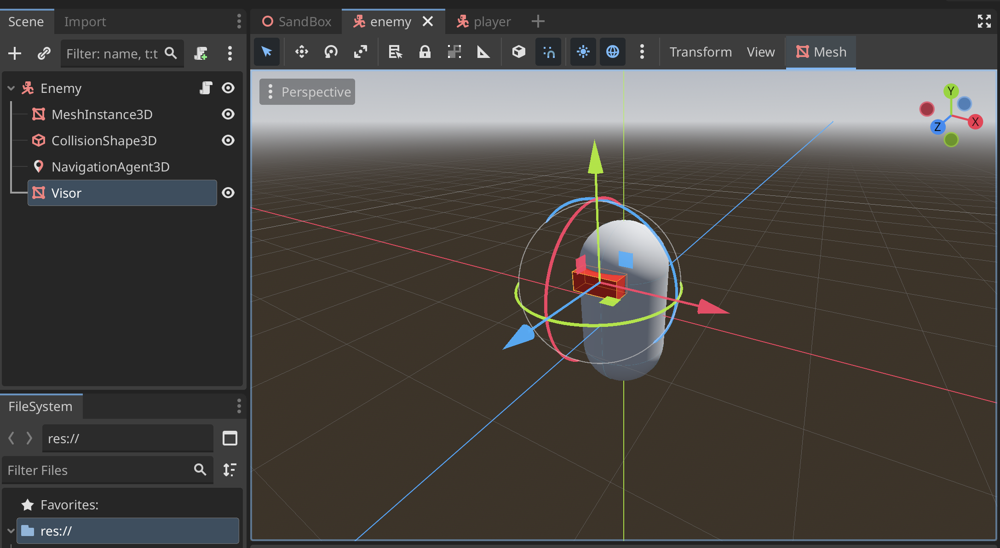
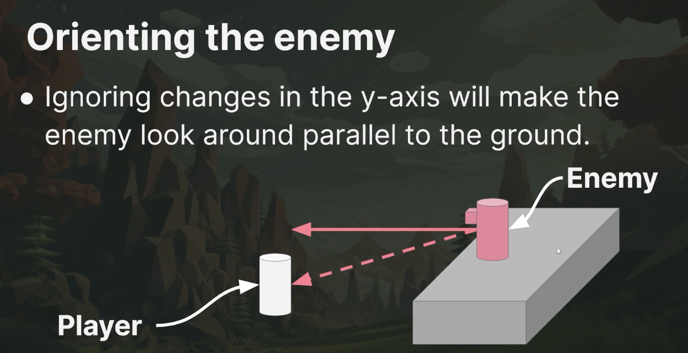
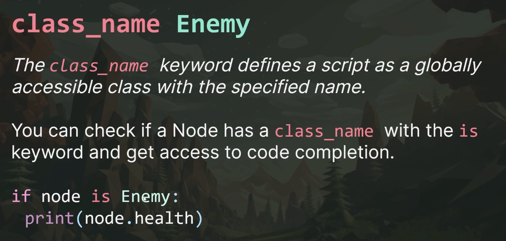

# Creating Enemies

# Have Agent Face Player
1. First create a visor so we can see where the agent is looking. Have the visor face the z-axis



1. Sample look at direction code
```
func look_at_target(direction: Vector3) -> void:
	var adjusted_direction = direction
	adjusted_direction.y = 0
	look_at(global_position + adjusted_direction, Vector3.UP, true)
```
> In this code we ignore the y-axis
> 

## Agent Attacks
Take a look at **Godot Animation** Documentation on how to use the animator to call an `attack()` function

## Damage Systems

1. In the **Enemy script** add an Enemy class
```
class_name Enemy
```

2. Add a **hitpoints** variable
```
var hitpoints: int = max_hitpoints:
	set(value):
		hitpoints = value
		if hitpoints <= 0:
			queue_free()
		provoked = true
```

3. We can use that **enemy class** in other functions for code completion
```
func shoot() -> void:
	cooldown_timer.start(1.0 / fire_rate)
	var collider = ray_cast_3d.get_collider()
	printt("weapon fired! ", collider)
	weapon_mesh.position.z += recoil
	if collider is Enemy:
		collider.hitpoints -= weapon_damage
```

4. You can use this basic format for the player node and any entity that has a health system

