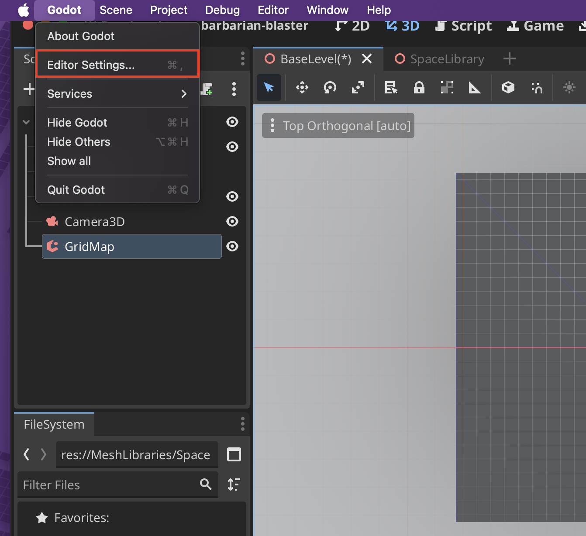
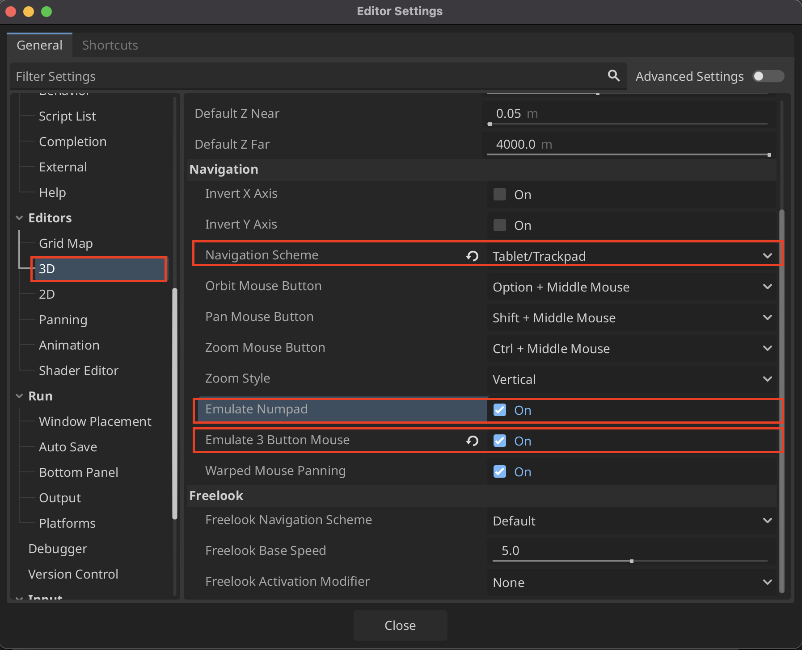

# Emulate Middle Mouse Button and Numpad

## Settings Adjustments
1. Go into **Godot > Editor Settings...**

2. Go to **Editors > 3D** and change Navigation Scheme to **Tablet/Trackpad** and enable **Emulate Numpad** and **Emulate 3 Button Mouse**

## New Navigation Shortcuts with Emulation
| Shortcut | Description |
|----------|------------|
| **Shift + Move Mouse** | Pan |
| **Ctrl + Move Mouse** | Zoom |
| **Alt + Move Mouse** | Orbit |