# Godot Particles
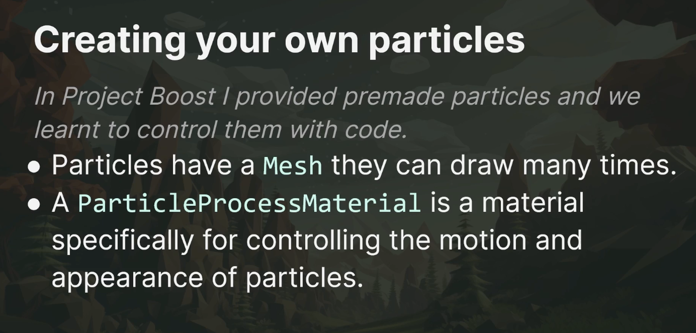

## Particles3D
1. Add **GPUParticles3D** to your scene
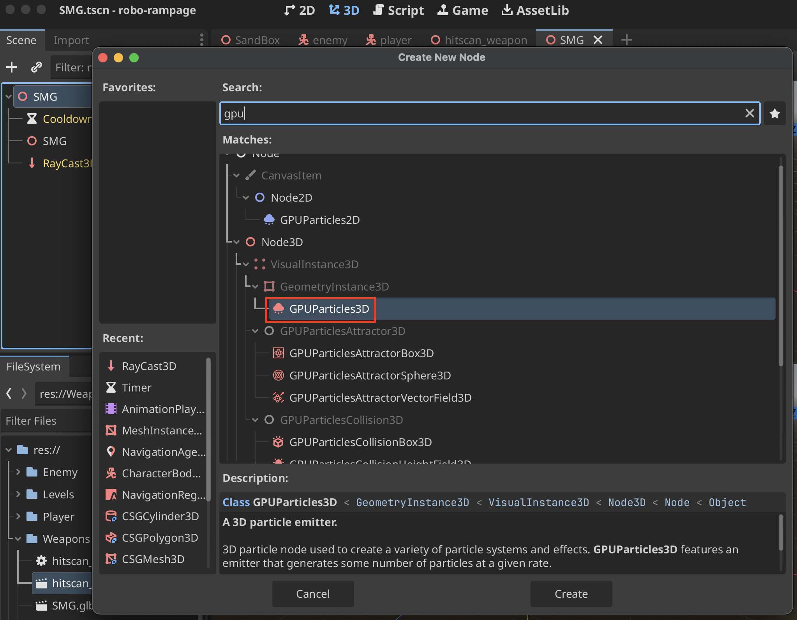

2. A yellow bounding box appears which is the distance that the particles can be seen from
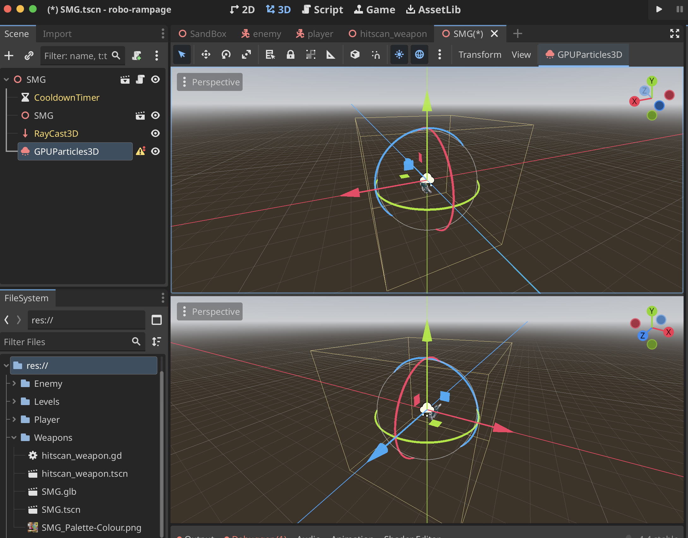

3. Move the **GPUParticles3D** to where you want the particles to emerge from
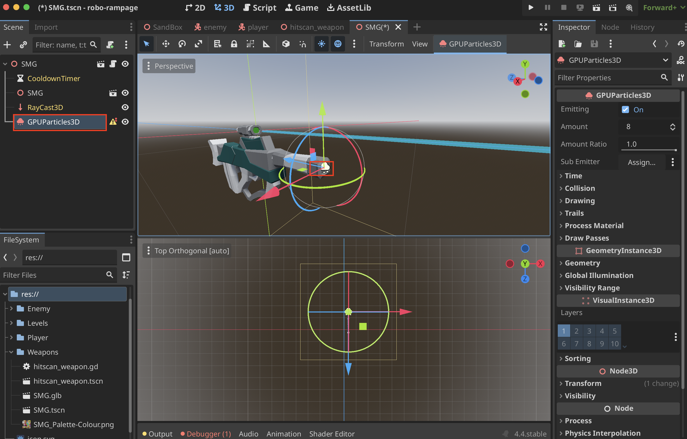

4. Add a mesh for the particles under **Draw Passes** in **Pass 1**
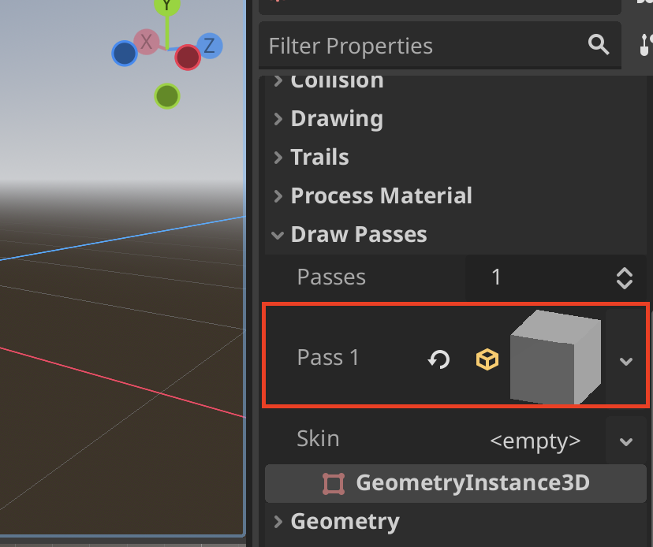

5. Create a **New ParticleProcessMaterial** under **Process Material**
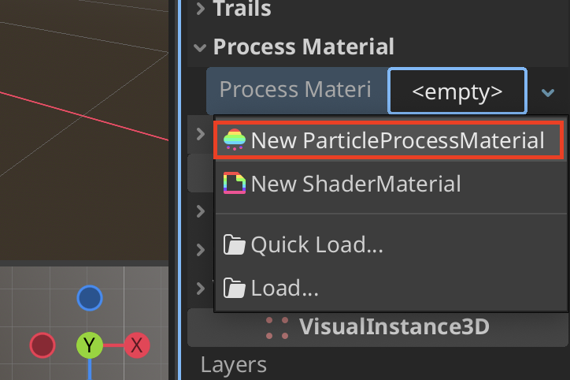

6. Particles will begin to emerge, make sure you resize the mesh so that you can see how the particles react
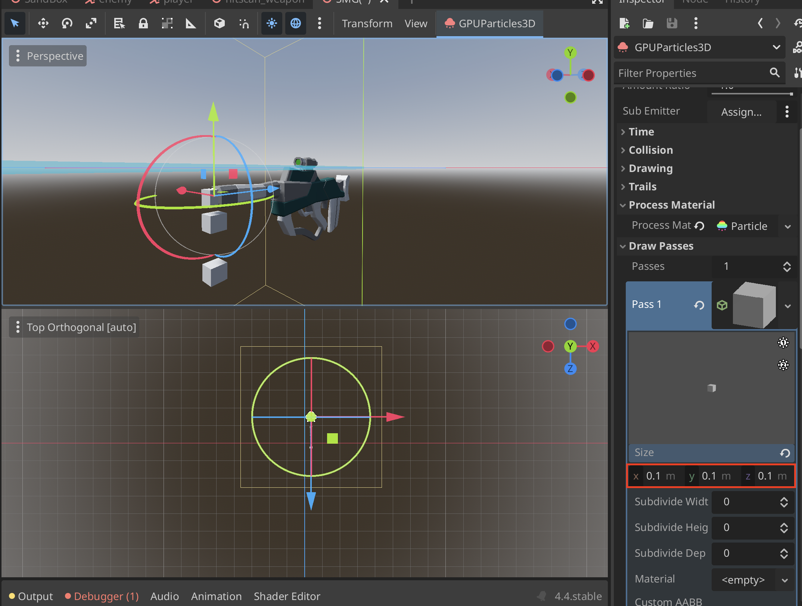

### Instantiating GPUParticles3D Programmatically
1. Export variable
```
@export var muzzle_flash: GPUParticles3D
```

### Particles3D Settings
| Name | Description | Images |
|------|-------------|--------|
| **Time > Lifetime** | How long the particles last | 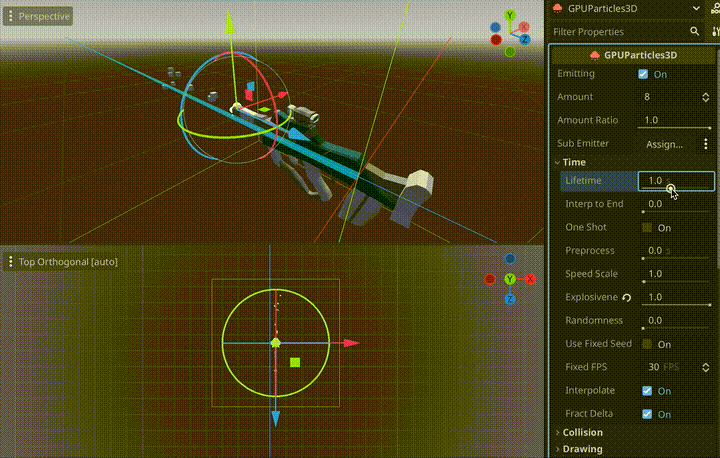 |
| **Time > One Shot** | Particles only emitted one time | 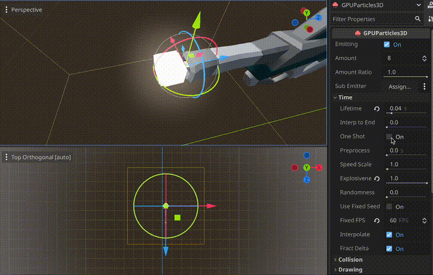 |
| **Time > Explosiveness** | How close the particles spawn apart | 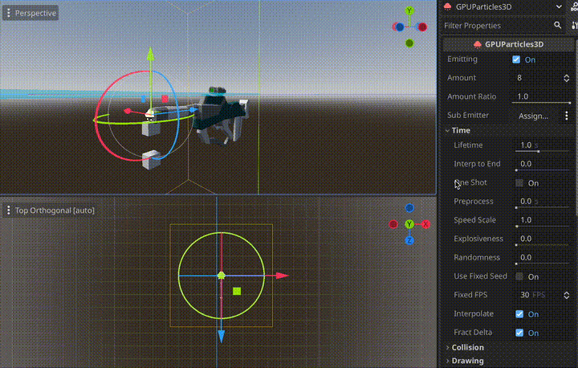 |
| **Drawing > Local Coords** | Particles move with the spawn origin | |
| **Drawing > Local Coords** |  | |

## Particles2D

# ParticleProcessMaterial Settings
| Name | Description | Images |
|------|-------------|--------|
| **Accelerations > Gravity** | Gravity effect on the particles | 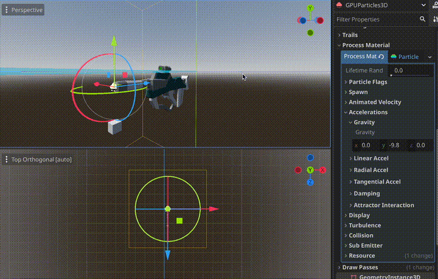 |
| **Spawn > Velocity > Initial Velocity** | How quick or slow particles shoot out at spawn | 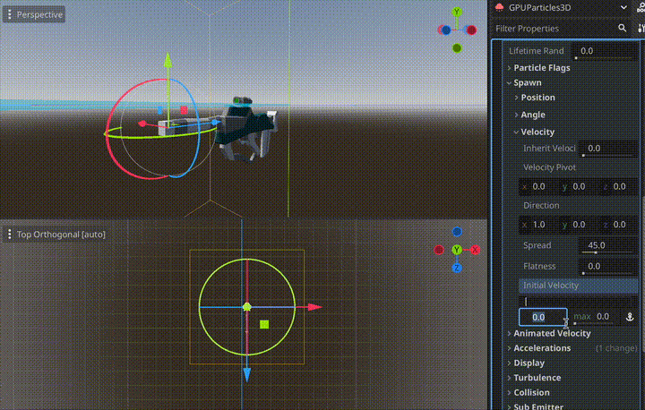 |
| **Spawn > Velocity > Direction** | Direction which particles go. Range between -1 and 1 | 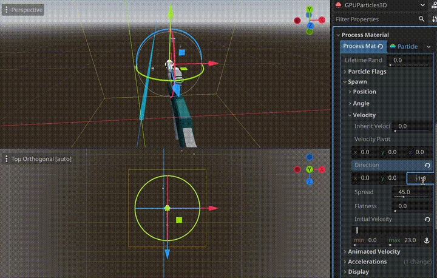 |
| **Spawn > Velocity > Spread** | How wide of a cone the particles travel. Range between 0° and 180° | 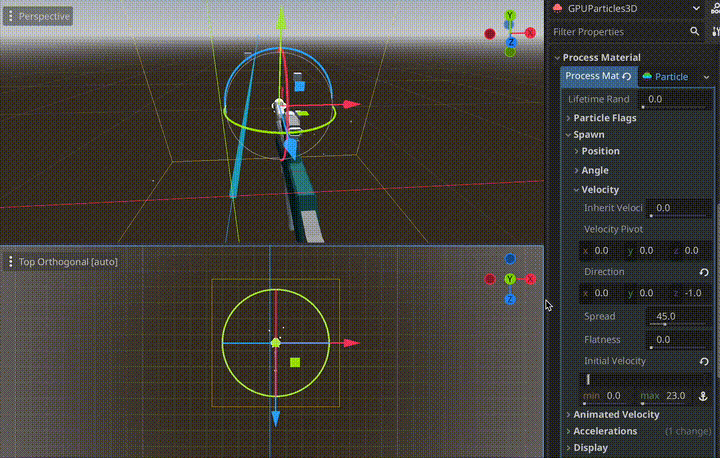 |
| **Display > Scale > Scale Curve** | Create a curve that represents scale over time | 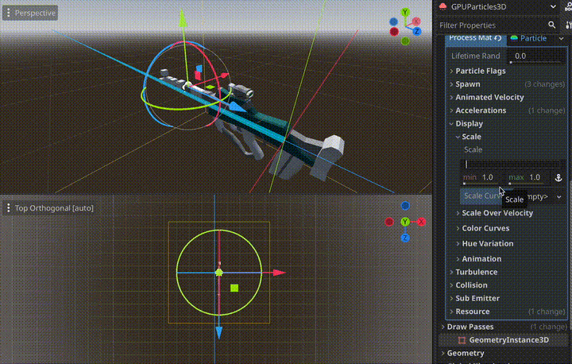 |