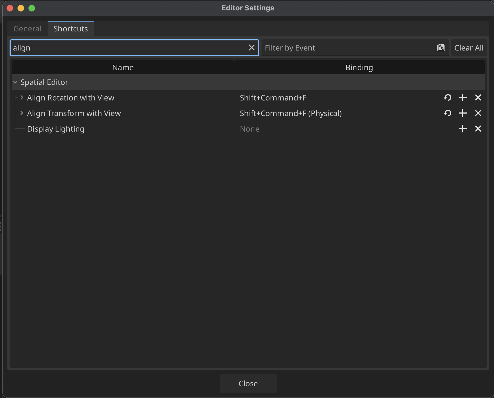

# Godot Shortcuts
> \*\* Requires keybinds to be setup
# Godot Shortcuts Reference

## Editor Navigation
| Shortcut | Action |
|----------|---------|
| **CMD+P** | Quick Open (find any file/scene quickly) |
| **CMD+Shift+P** | Command Palette |
| **CMD+Shift+O** | Open Scene (find any scene quickly) |

## Scene/Node Management
| Shortcut | Action |
|----------|---------|
| **CMD+A** | Add Node |
| **CMD+D** | Duplicate Node |
| **CMD+Del** | Delete Node |
| **CMD+G** | Group Selected Nodes |
| **CMD+Shift+G** | Ungroup Nodes |
| **CMD+Shift+F**\*\* | Move Camera to View |
| **CMD+Y**\*\* | Change Node Type |

## Viewport Controls
| Shortcut | Action |
|----------|---------|
| **Middle Mouse** | Pan viewport |
| **Mouse Wheel** | Zoom in/out |
| **Shift+Middle Mouse** | Zoom |
| **F** | Frame selected node |
| **Shift+G** | Toggle grid snap |
| **Shift+S** | Toggle smart snap |

## Script Editor
| Shortcut | Action |
|----------|---------|
| **CMD+B** | Run project |
| **CMD+R** | Run current scene |
| **F7** | Step into (debugging) |
| **F8** | Step over (debugging) |
| **F9** | Toggle breakpoint |
| **Ctrl+/** | Toggle comment |
| **Ctrl+Shift+/** | Block comment |
| **Ctrl+I** | Auto-indent |
| **Ctrl+J** | Join lines |

## File Management
| Shortcut | Action |
|----------|---------|
| **Ctrl+Shift+S** | Save all open scenes |
| **Ctrl+Alt+S** | Save scene as |
| **Ctrl+Tab** | Switch between open scripts |
| **Alt+Left/Right** | Navigate script history |
| **Ctrl+H** | Replace in script |
| **Ctrl+Shift+H** | Replace in files |

## Transform Tools (2D/3D)
| Shortcut | Action |
|----------|---------|
| **Q** | Select tool |
| **W** | Move tool |
| **E** | Rotate tool |
| **R** | Scale tool |
| **T** | Transform tool (2D only) |

---

## Setup Shortcuts: *Move Camera to View* as example

1. Open up **Editor Settings...** with `Command+,`

2. View the **Shortcuts** to change keybinds

3. Create `Shift+Command+F` as the shortcut for both: **Align Rotation with View** and **Align Transform with View**