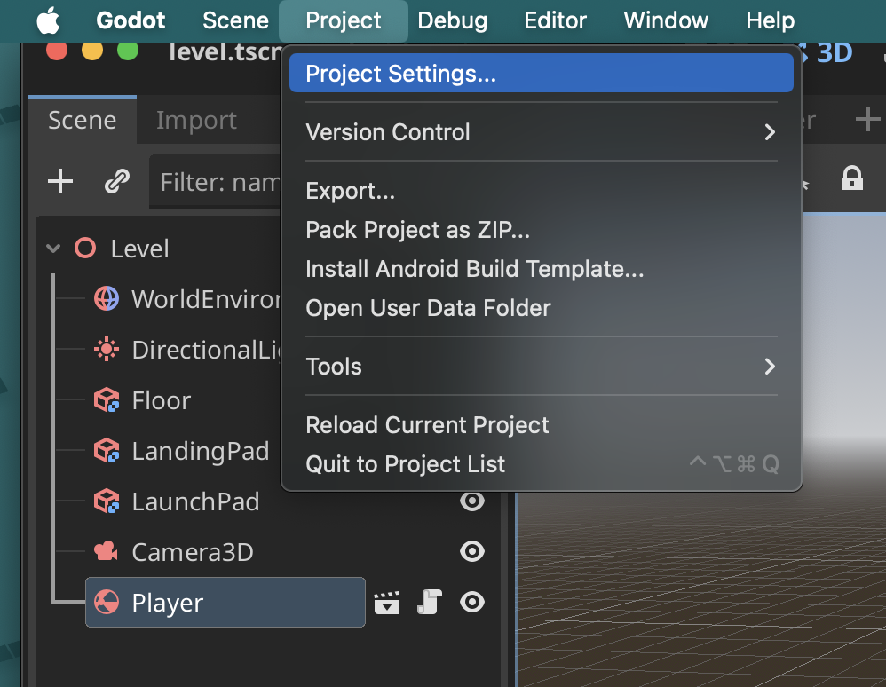
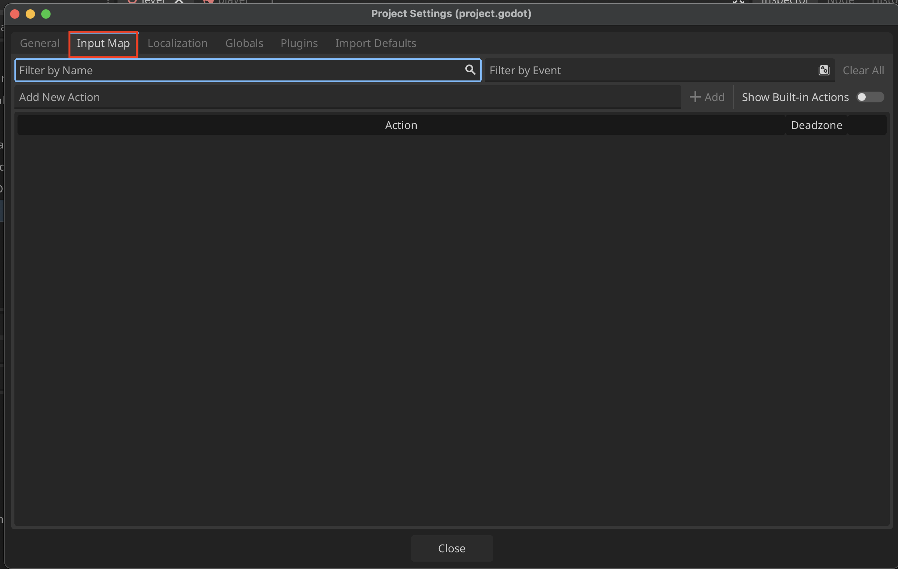

# Input Mapping
**Input Mapping** allows devs to create custom control schemes that allows players to interact with the game on different systems (i.e. keyboard, controller, etc.)

## Setting up custom input mappings

1. Go to the **Project Settings...**

2. Select the **Input Map** tab

3. To view the existing actions select the **Select Built-In Actions**

4. Here is an example setup for a custom action
