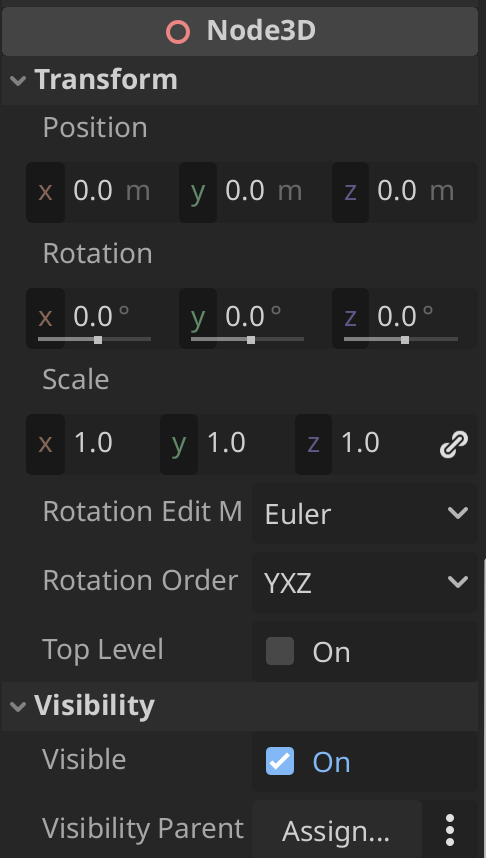

# Node3D

## Transform
| Property | Description |
|----------|-------------|
| **Position** | X, Y, Z coordinates of where the object is positioned in the world space |
| **Rotation** | Rotation angles in degrees around the X, Y, and Z axes |
| **Scale** | Size multiplier for the object along each axis (1.0 = normal size) |
| **Top Level** | Allows Node3D to move independently from its parent's transform |

## Visibility
| Property | Description |
|----------|-------------|
| **Visible** | Toggle to show/hide the node and all its children |
| **Visibility Parent** | Specifies which node controls this node's visibility inheritance |
