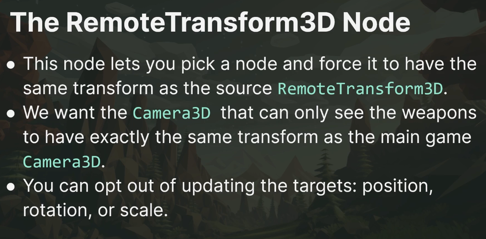
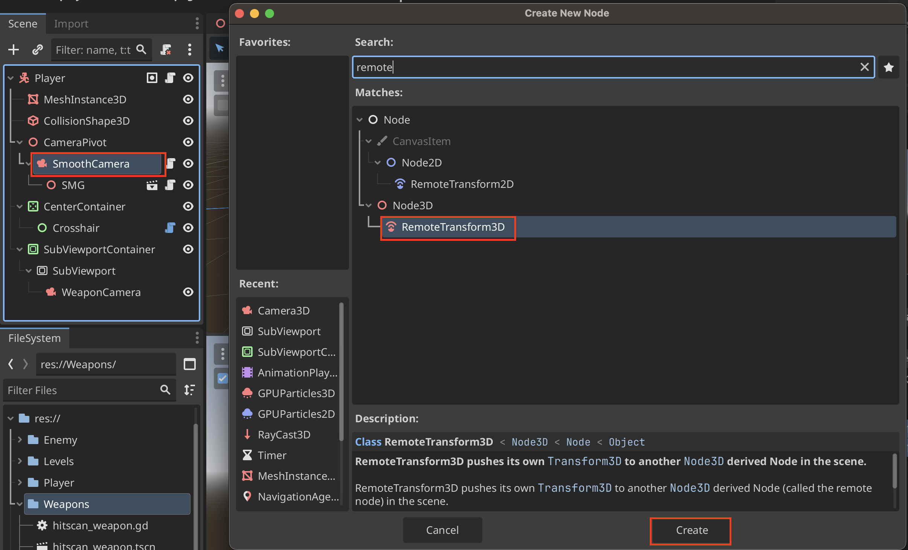
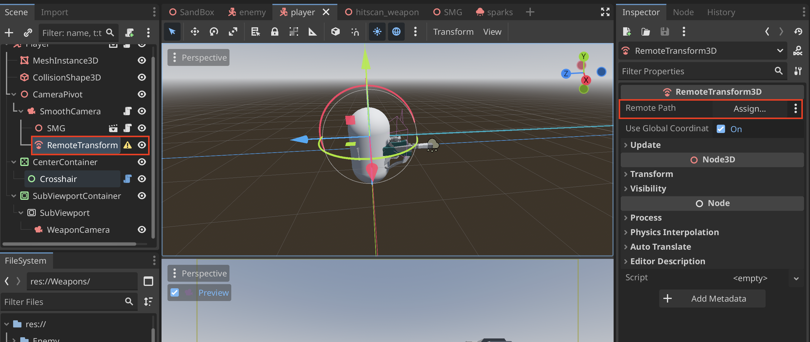
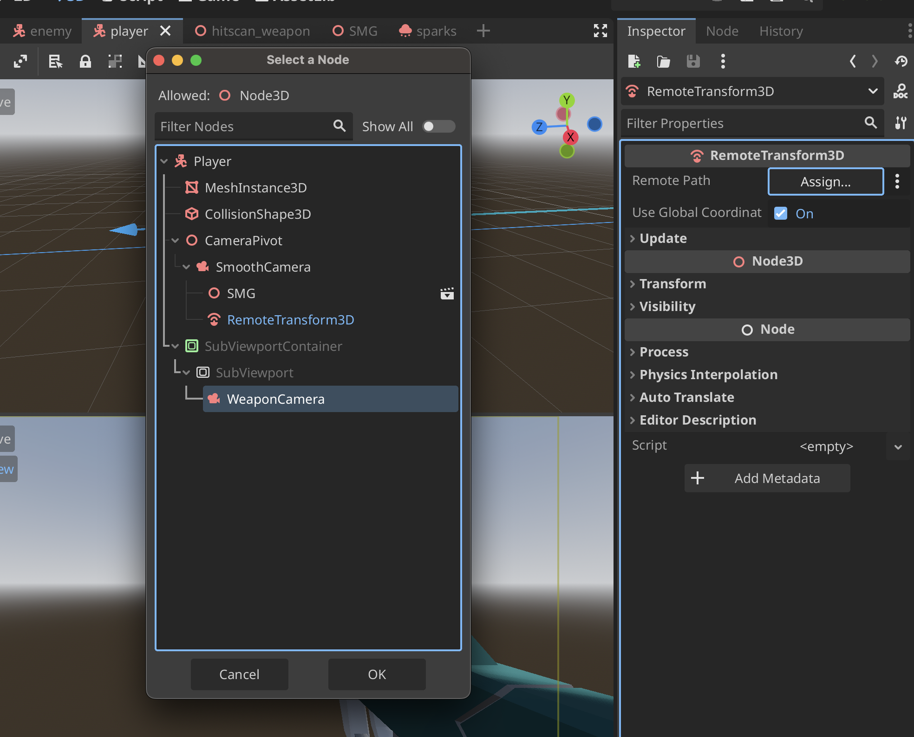
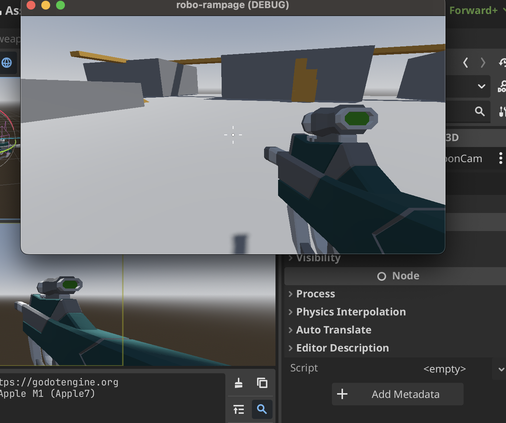

# Remote Transform3D

## Add a RemoteTransform3D
1. Add a **Remote Transform3D**

2. Update the **Remote Path** to include the camera that you want to match the transform with

3. That's all you need to do

4. Playtest and make sure there are no duplicates
