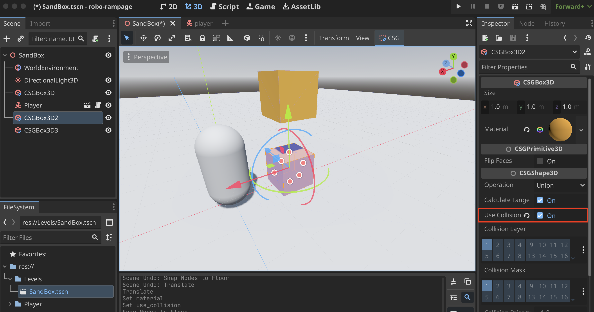
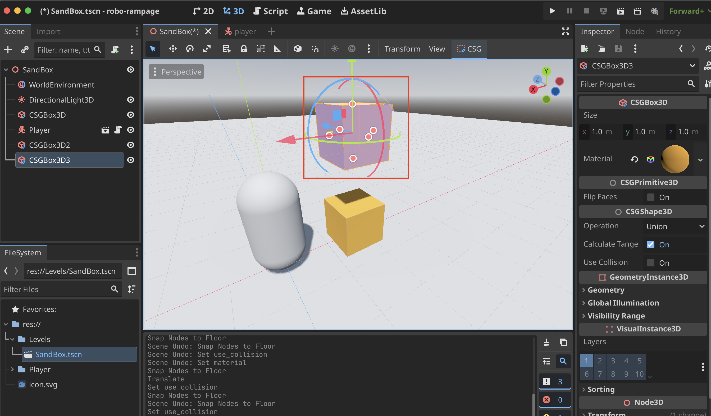
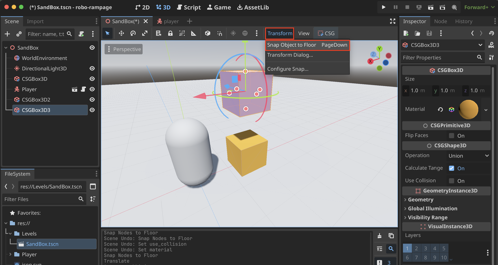
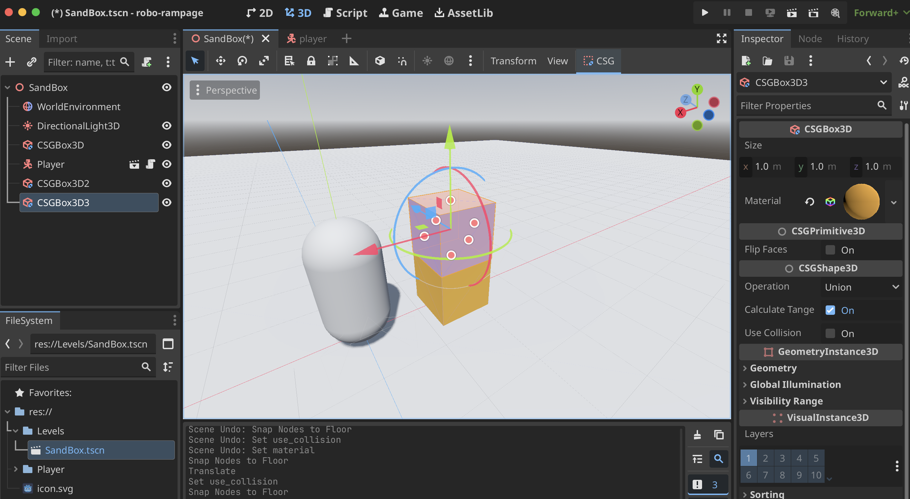
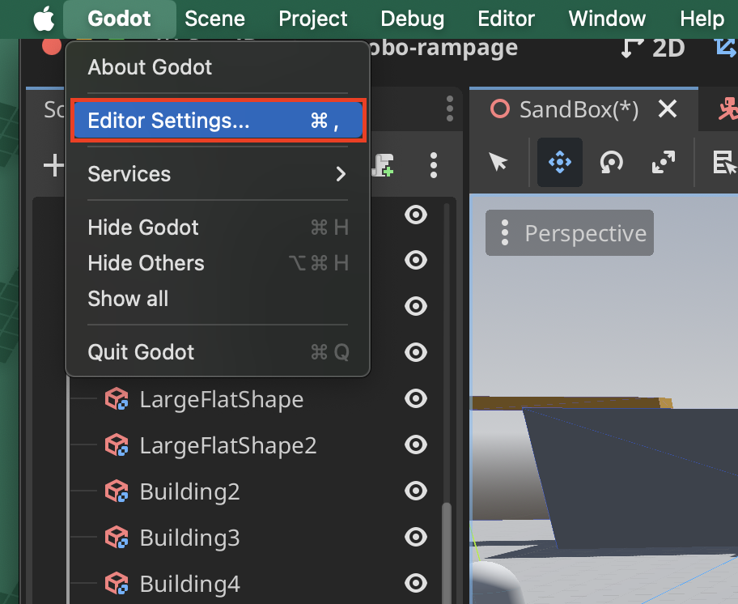
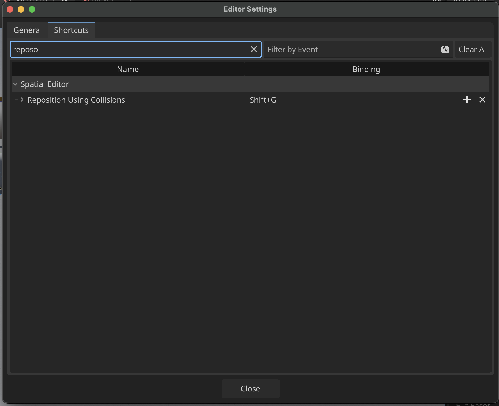
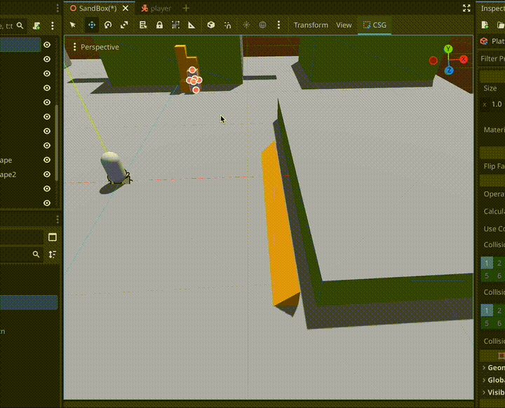

# Snapping

## Snap Objects to Floor
1. Ensure that your floor has **Use Collision** On for your "floor"

2. Select the object you want to move (it does not need Use Collision on)

3. Go to the **Transform** Menu and select **Snap Object to Floor**

4. Your object should be snapped to the floor under it

## Reposition Using Collisions
1. Select **Editor Settings...**

2. Look for **Reposition Using Collisions** and set the shortcut or just use the default **Shift+G**

3. If you use the shortcut (**Shift+G**)
