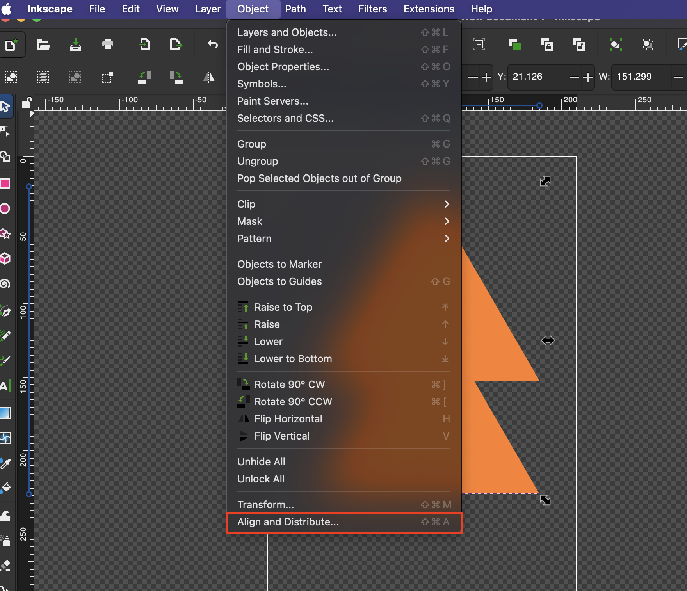
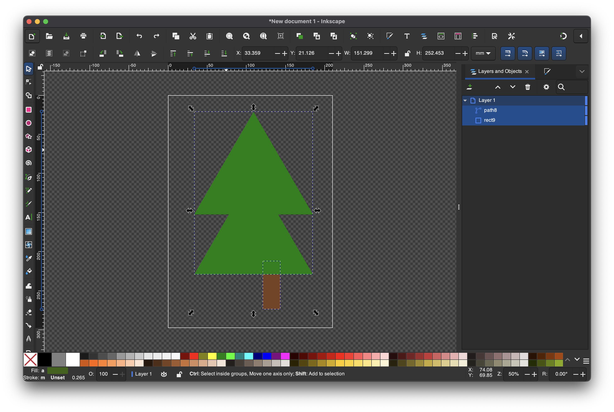
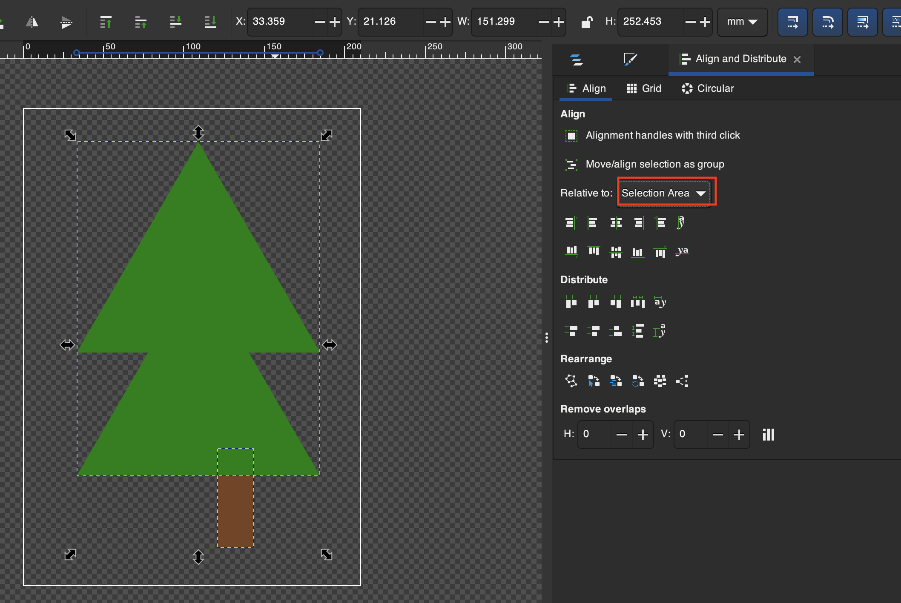
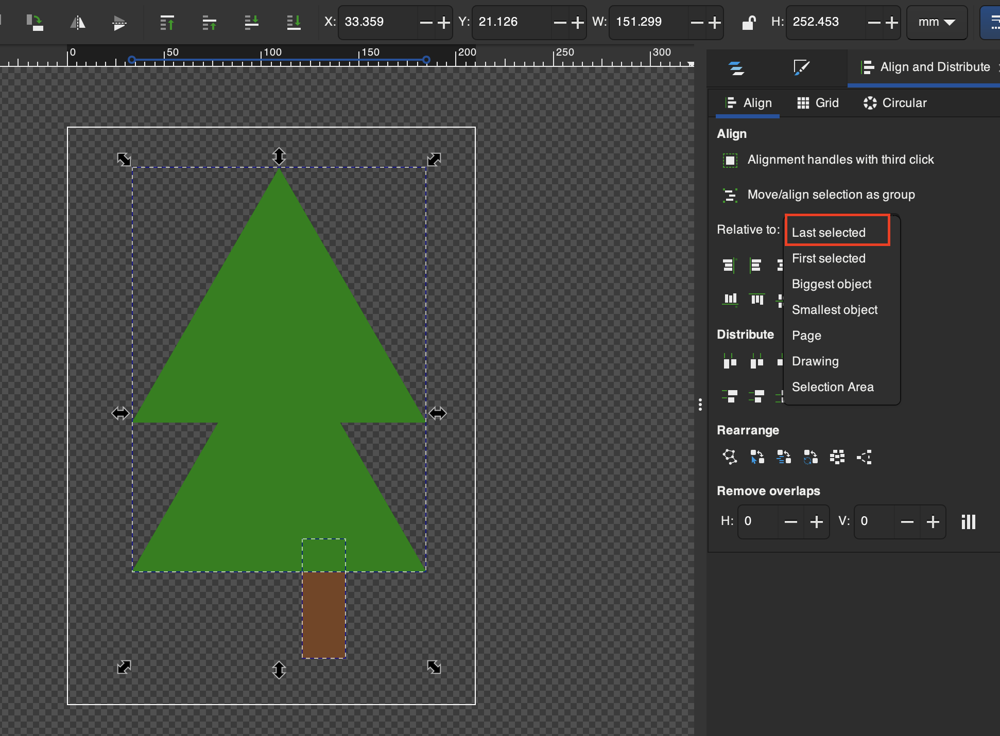
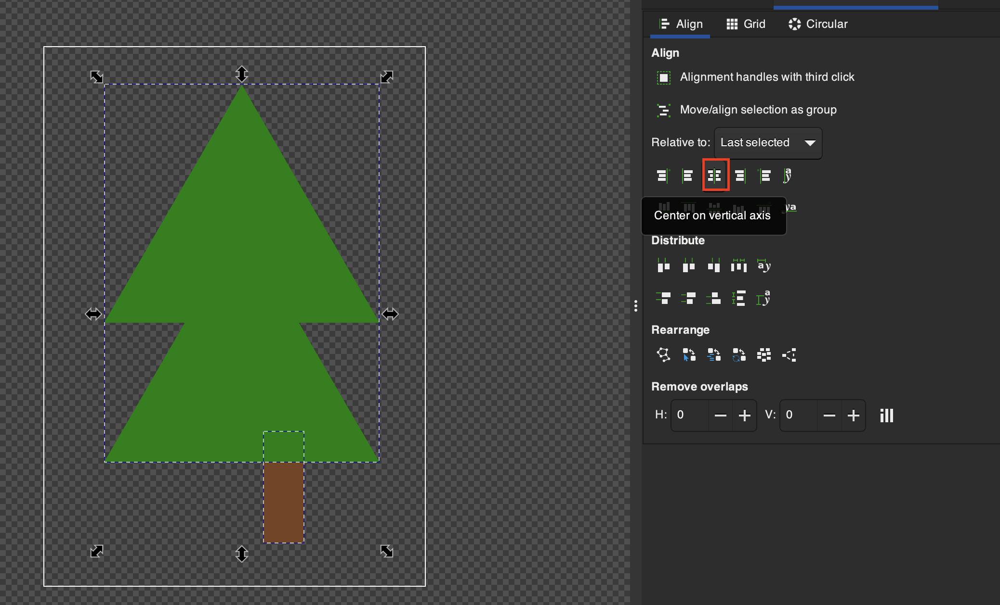
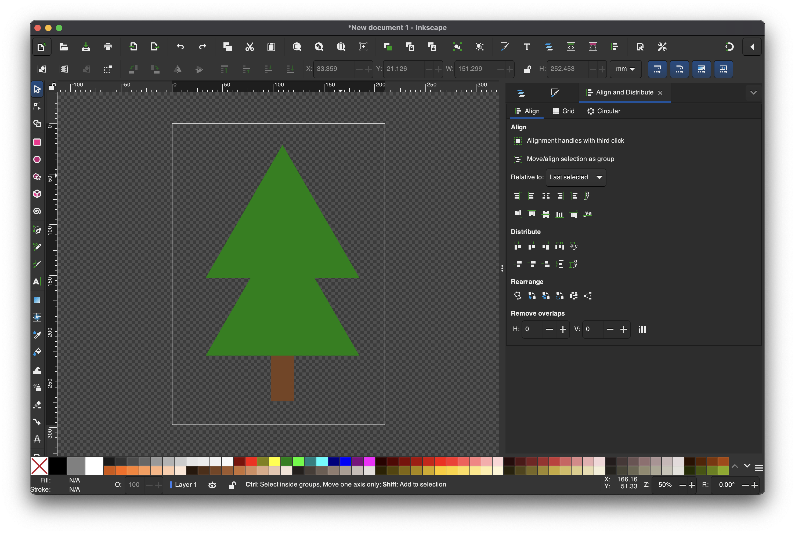

# Align and Distribute

## Example use of Align and Distribute

1. Go to **Object > Align and Distribute** to open the menu

2. Select both objects by **Shift + Click**ing 

3. To align the trunk to the leaves look at the **Align and Distribute** tab on the side

4. Since I want to align it to the leaves and I selected the leaves last I will choose **Last Selected**

5. We can center it using **Center on Vertical** Axis

6. Complete!
