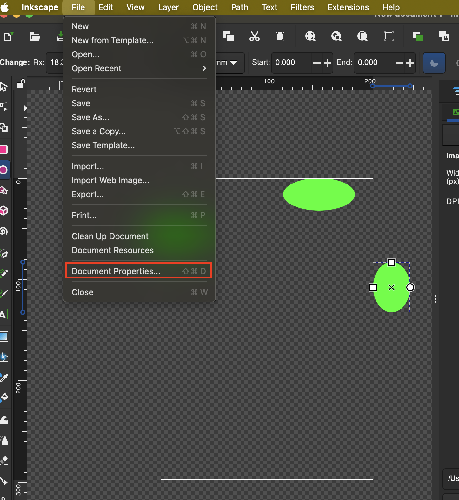
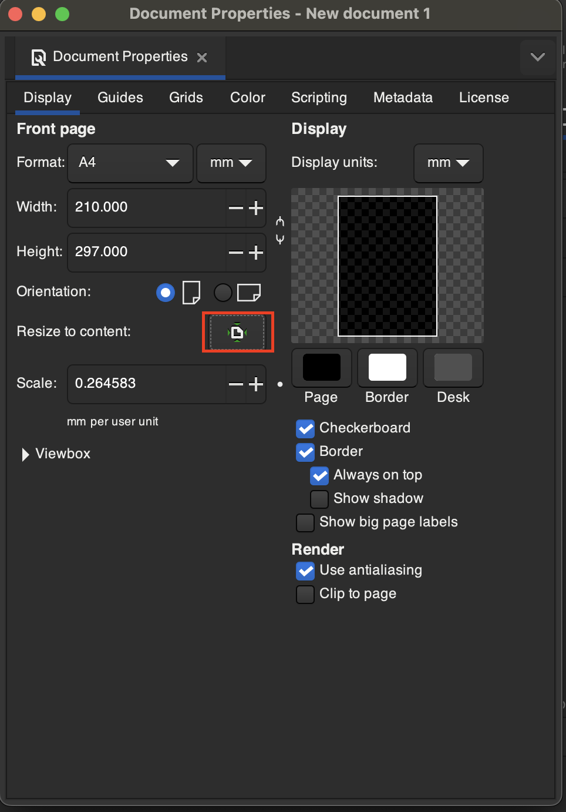
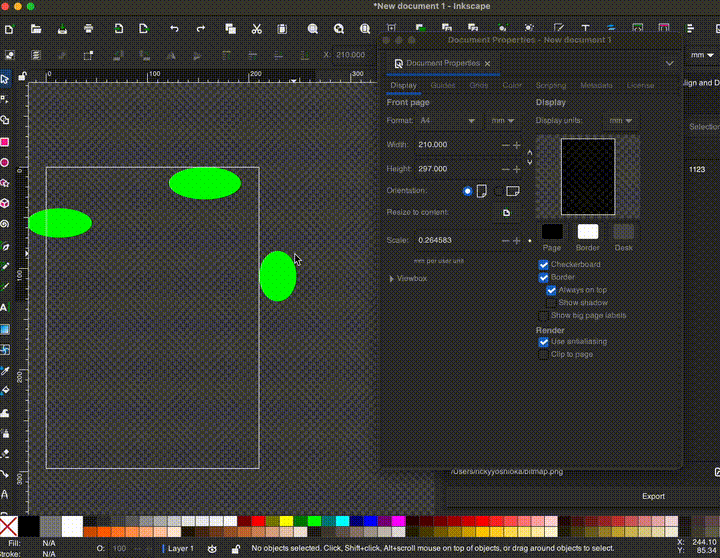

# Resize Document to Fit Content
1. Open **File > Document Properties...**

2. Click the resize button next to **Resize to content**

3. You can either 1. Resize to fit all objects by not selecting anything or 2. Resize to a specific object by selecting it
