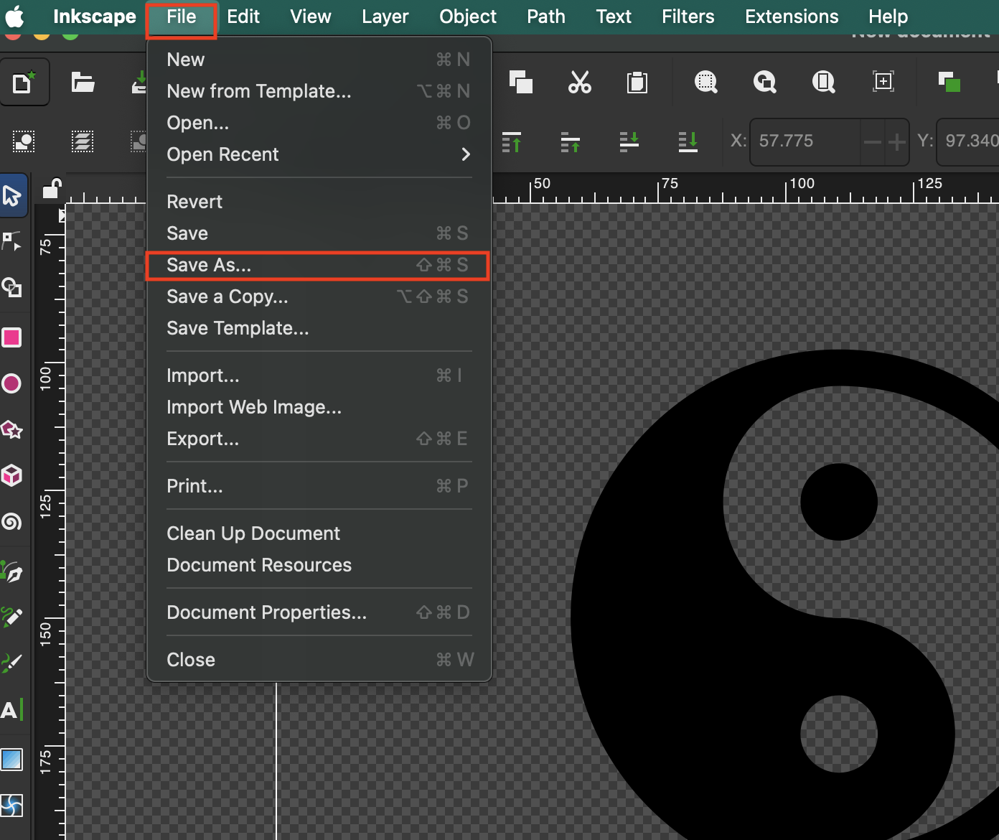
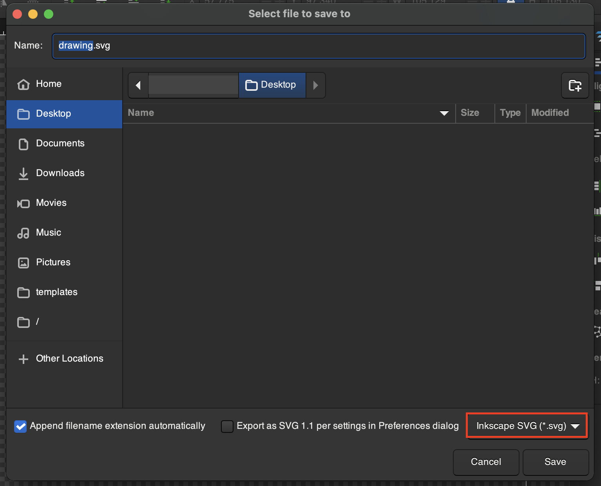
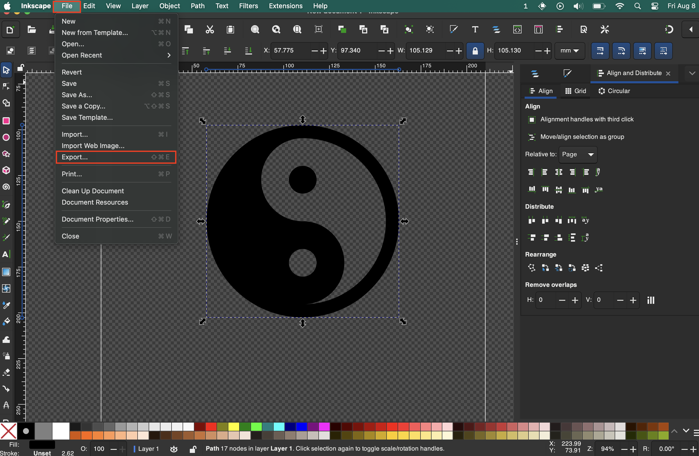
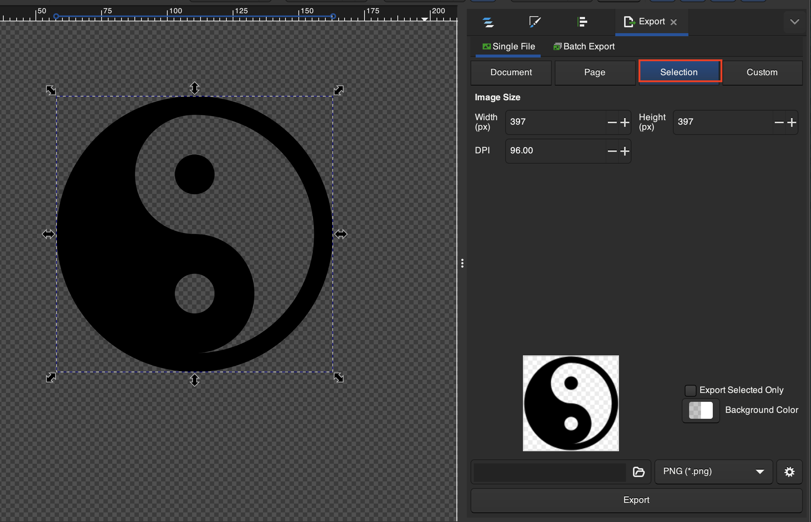
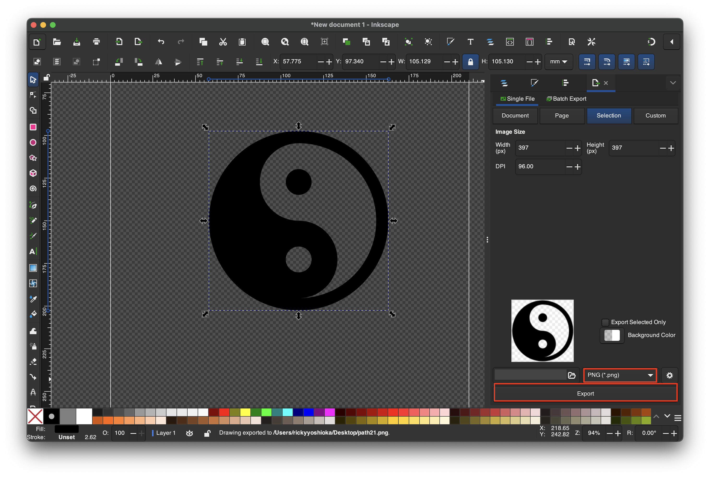

# Save and Export

## Save and Work On It Later
1. Go to **File > Save As..**

2. Make sure to save as a **Inkscape SVG** so all progress is saved

## Export Specific Grpahic as PNG
1. Select your shape then go to **File > Export...**

2. If you want to export just the selection select **Selection**

| Export Types          | Description     |
|-----------------------|--------------|
| Export only what you selected | **Selection** |
| Export everything on page   | **Page** |
| Export everything in file  | **Document** |
| Specific area of canvas using x and y coordinates | **Custom** |

3. Make sure to export as a **PNG** file
