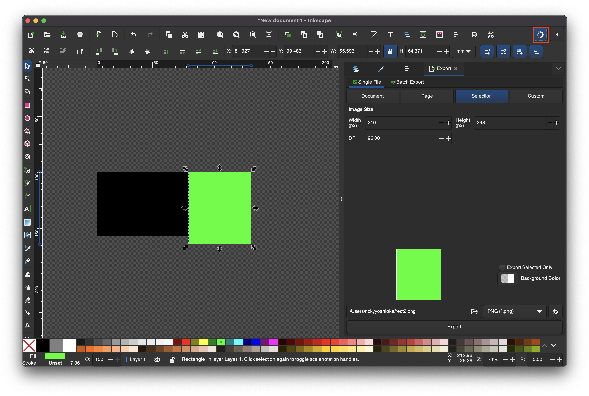
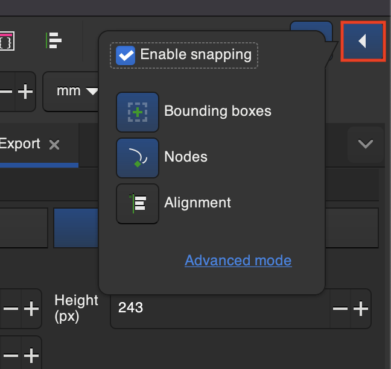
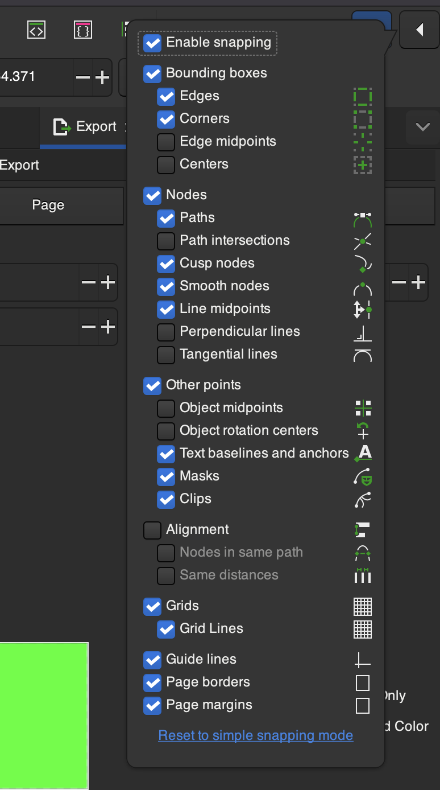

# Snapping

1. Press **Shift + 5** to enable snapping or you can select the snap icon on the top right of Inkscape

2. Click the **Chevron** next to snapping to see snapping options

3. You can enable **Advanced mode** with additional snapping customization

