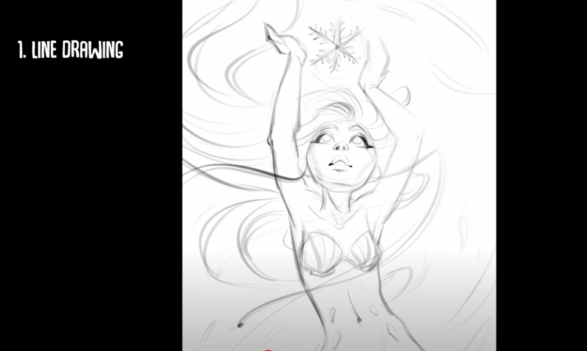
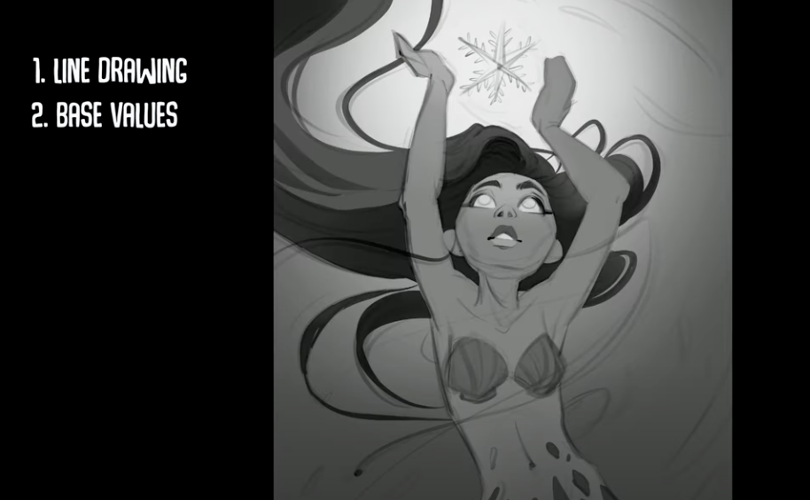
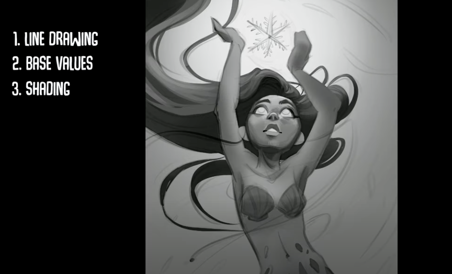
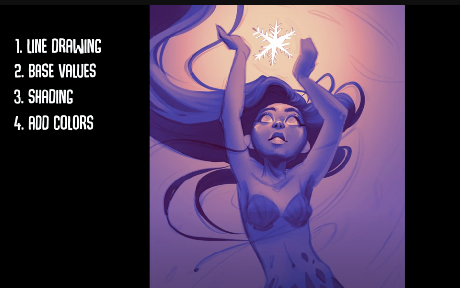
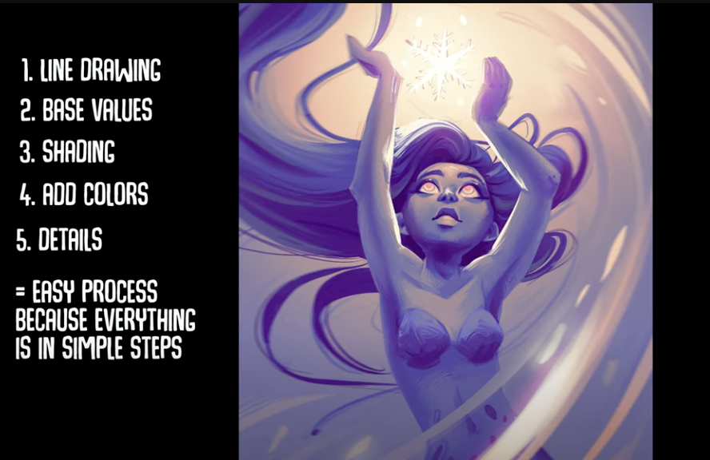

# Concept Art Steps

### 🎯 **Concept Art Tips**
- **Communicate first**: Clarity over complexity
- **Save iterations**: Keep major steps as separate files
- **Think in shapes**: Large, medium, small for visual hierarchy
- **Know when to stop**: Perfect is the enemy of done

---

## 💭 **1. Ideation & Research**
> *Explore possibilities*

- 🧠 Brainstorm and mind mapping
- 📚 Research references and inspiration
- 📝 Define art direction and mood
- 🎯 Clarify the concept's purpose (character, environment, prop)

---

## ✏️ **2. Thumbnails & Exploration**
> *Find the best idea*

- ⚡ Quick, small sketches (lots of them!)
- 🔄 Explore different compositions and angles
- ⏱️ Spend 5-15 minutes max per thumbnail
- 🎯 **Focus on silhouette and overall flow**

---

## 📐 **3. Rough Sketch**
> *Develop the chosen idea*

- 🖊️ Refine the best thumbnail at larger size
- 📏 Establish basic proportions and perspective
- 🔍 Add primary shapes and major elements
- 🎨 Block in basic value structure (light/dark)

---

## 🖌️ **4. Clean Line Art**
> *Define the forms*

- ✨ Create clean, confident lines
- 📐 Refine proportions and details
- 🔍 Add secondary and tertiary details
- 🎯 **Lines should communicate form and weight**

---

## 🌫️ **5. Value & Lighting**
> *Establish mood and form*

- ⚫ Block in major shadow shapes
- ☀️ Establish light source and lighting setup
- 🎭 Create strong value contrast for focal points
- 📊 Work in grayscale first for clarity

---

## 🎨 **6. Color & Rendering**
> *Bring it to life*

- 🎨 Apply color palette and temperature shifts
- 🖌️ Render forms with light and shadow
- ✨ Add highlights, reflections, and atmospheric effects
- 🔍 Refine details and textures

---

## ✨ **7. Final Polish**
> *Make it presentation ready*

- 🔍 Final detail pass and cleanup
- 🎯 Enhance focal points and storytelling
- 🖼️ Adjust overall composition and balance
- 📝 Add any necessary callouts or annotations

---

## Example of Concept Art Steps
| Step | Image |
|---------|-------|
| **1. Line Drawing** |  |
| **2. Base Values** |  |
| **3. Shading** |  |
| **4. Add Colors** |  |
| **5. Details** |  |

> Art from [Ariabba](https://www.youtube.com/watch?v=wmpzOHVqBQI&ab_channel=Ariabba)
