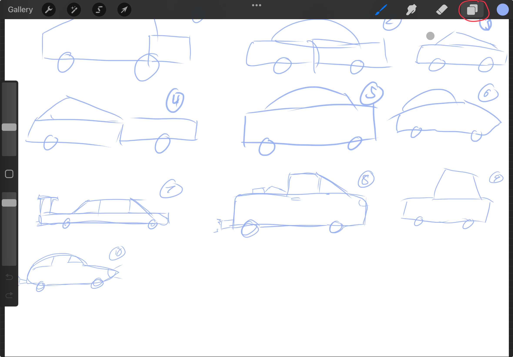
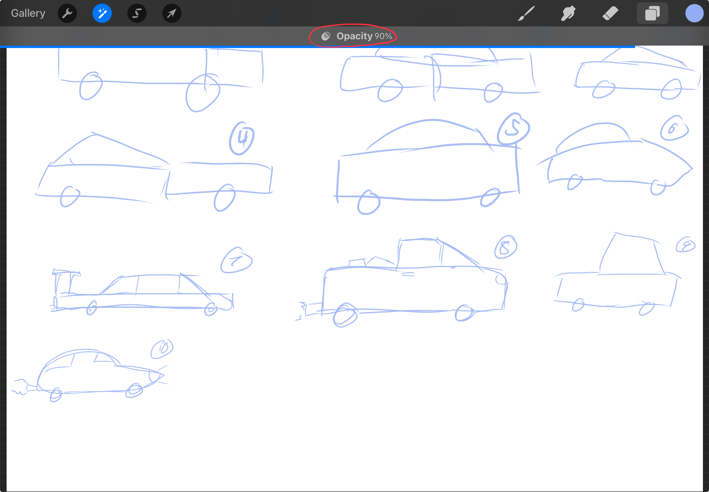

# Layer Settings

## Reduce Opacity of Layer
### Method 1: Open layer options

1. Open up the layers menu.

2. Open the settings by pressing the `N` icon

3. Adjust Opacity using the slider

### Method 2: Two-finger tap

1. Press the layer with two fingers

2. Move left and right to adjust opacity
