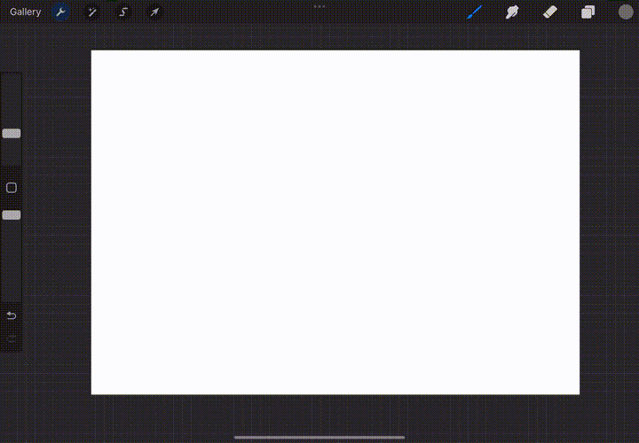

# Thumbnail Sketches

## Create Thumbnail Template
1. Create thumbnail rectangles using a combination of the **Drawing Guide**, **Selection Tool**, and **Transform Tool** pinch to combine multiple layers. Enable **Snapping** in the **Transform Tool** to help with alignment

2. Create a selection mask by **Select** the layer adding it under **Save & Load** and now when you draw it will not go outside the thumbnails
