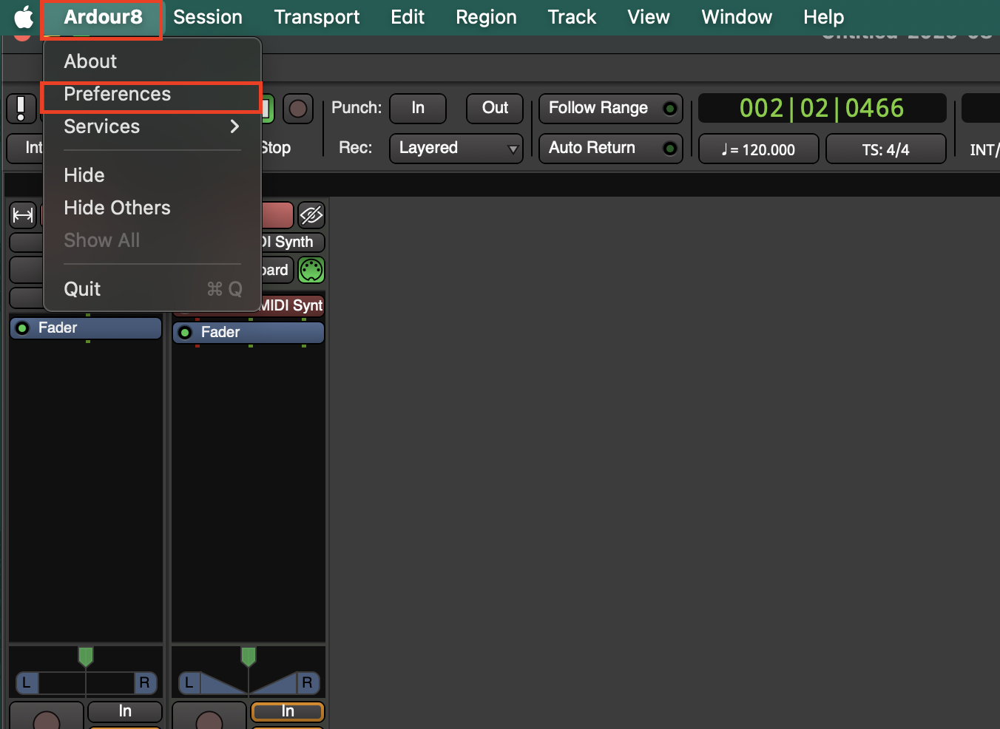
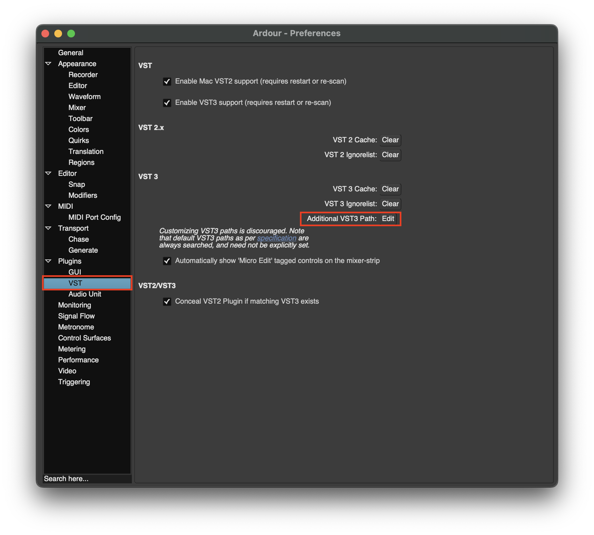
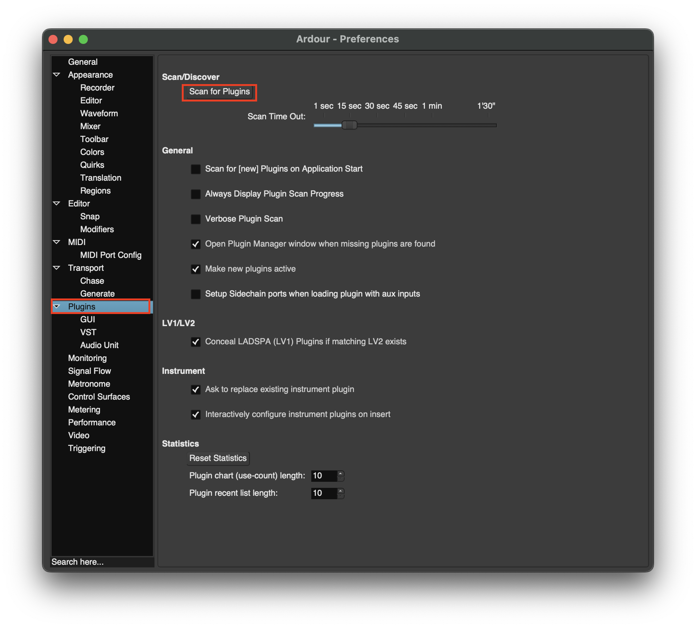
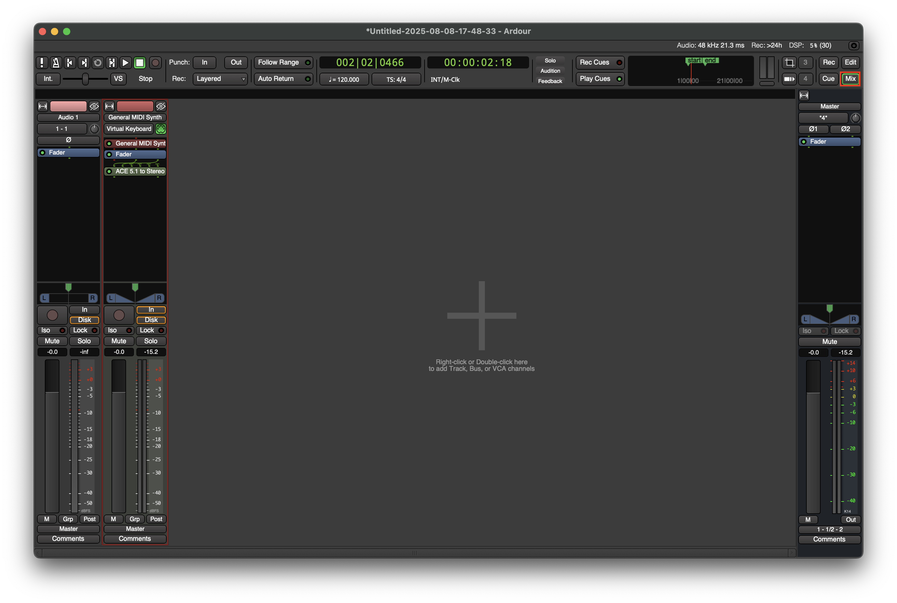
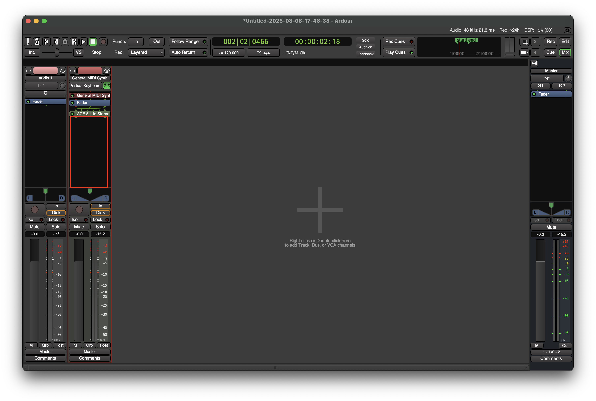
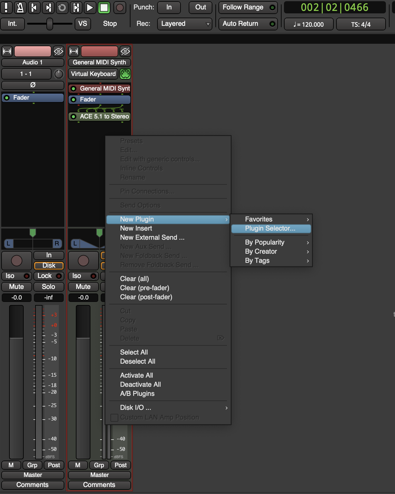
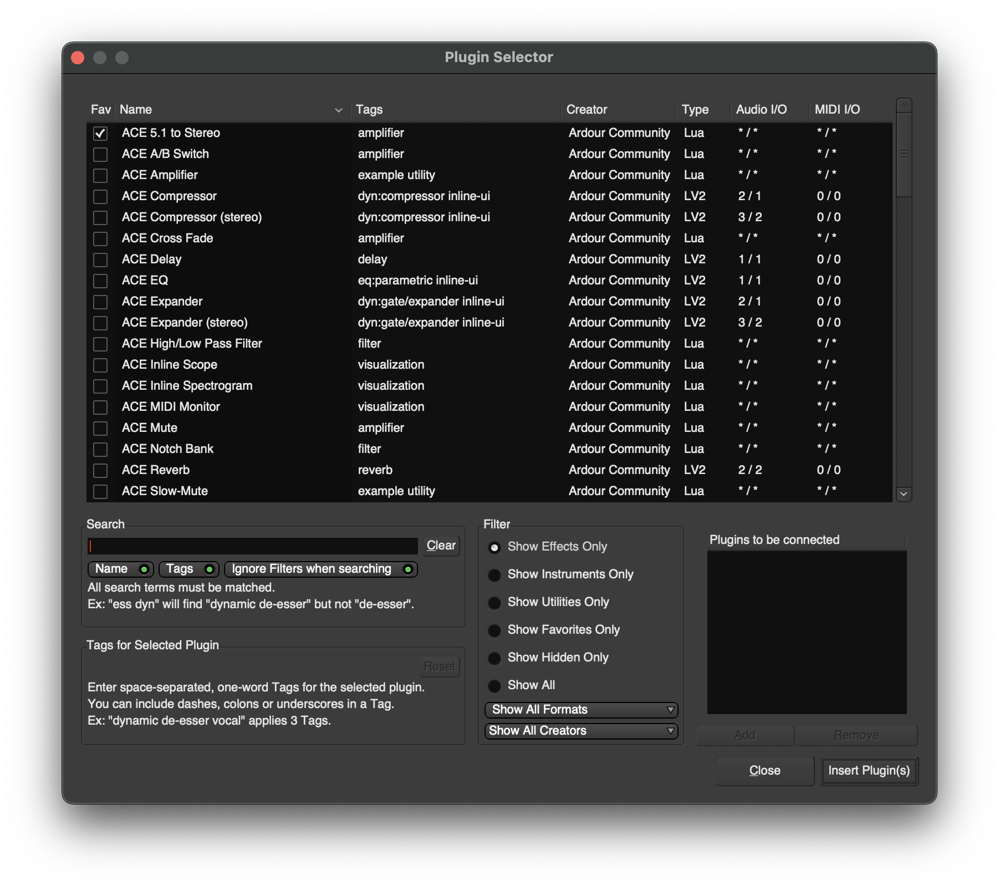

# Connecting VST's

1. First go to **Preferences**

2. Select **VST > Then Additional VST3Path: Edit**

3. Go to Plugins then **Scan for Plugins**

### Add Effects from VST's
1. Go to the **Mixer View**

2. **Right-click** under specific tracks to add effects

3. Select **New Plugin > Plugin Selector...** to add a new plugin

4. In the **Plugin Selector** panel select select the effect you want to add then click **Insert Plugin(s)**
