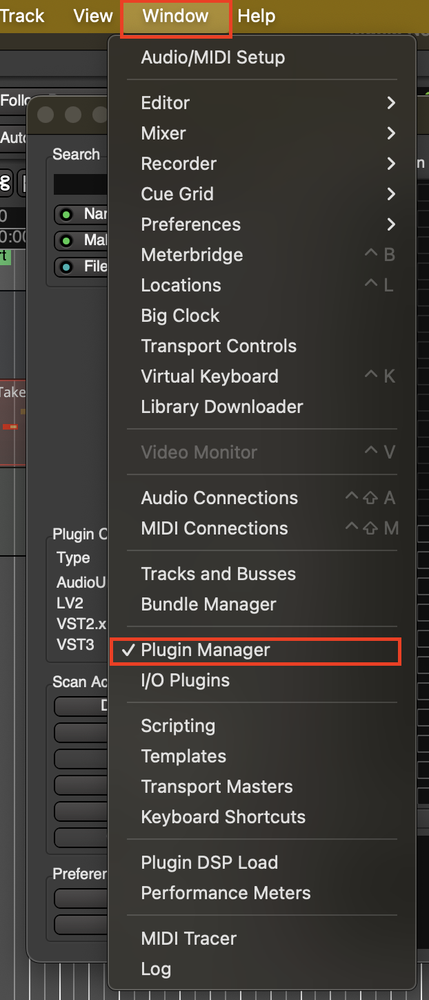
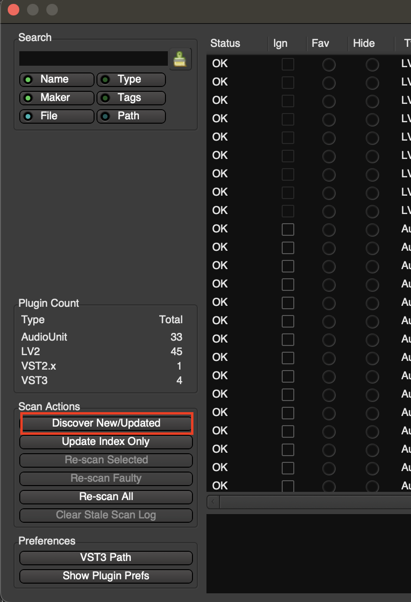
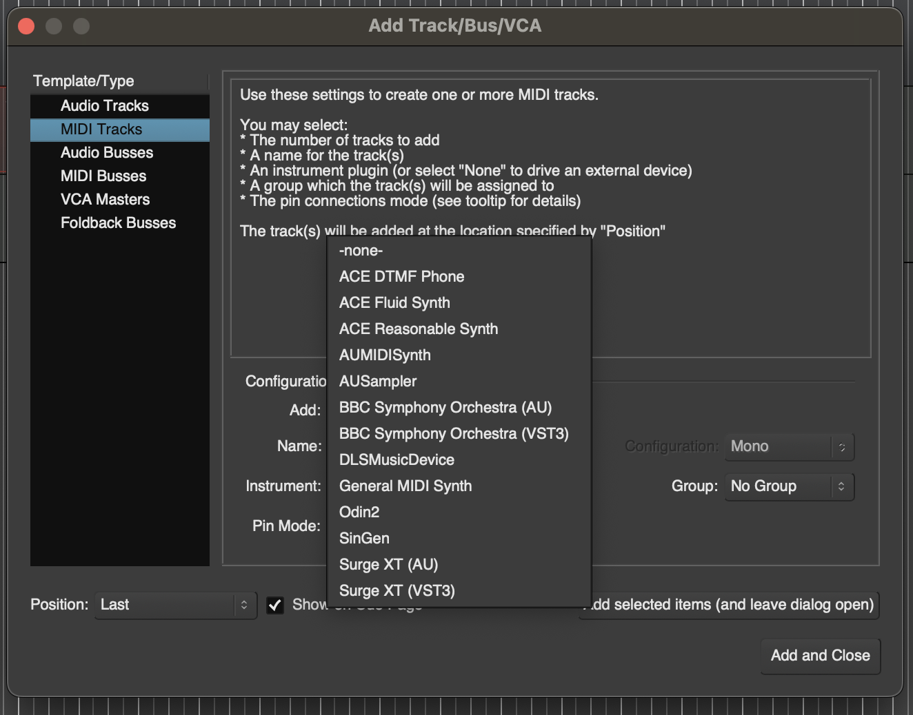

# Create a New Track

## Create a New Track
There are 3 ways to make a Track:

1. Add track via **Session > Add Track, Bus or VCA...**

2. Right Click on this area

3. Use shortcut **CMD + Shift + N**

## Create Track menu

| **Option** | **Purpose** | 
| ---------- | ----------- | 
| **Audio Track** | Record existing audio clips or record new ones using microphone |
| **MIDI Track** | Working with software synthesizers and plugins |

## Instruments in MIDI
1. To add a track with a certain instrument you will need to download plugins online to use. A few free recommended plugins:

| **Plugin** | **Link** | 
| ---------- | ----------- |
| Odin 2 Free Synthesizer | [https://thewavewarden.com/pages/odin-2](https://thewavewarden.com/pages/odin-2) |
| Surge XT | [https://surge-synthesizer.github.io/](https://surge-synthesizer.github.io/) |
| BBC Symphony Orchestra | [https://www.spitfireaudio.com/bbc-symphony-orchestra-discover](https://www.spitfireaudio.com/bbc-symphony-orchestra-discover) |

2. After downloading remember to update your plugins go to **Window > Plugin Manager**

3. Now you have to **Discover New/Updated** plugins to update your list of plugins

4. Now when you create a new track under **Instrument** you will have more options

> If you have multiple versions of a plugin it is recommended to use the **VST3** (provides for compatibility) over **AU** (AU is an older format used only for macOS)