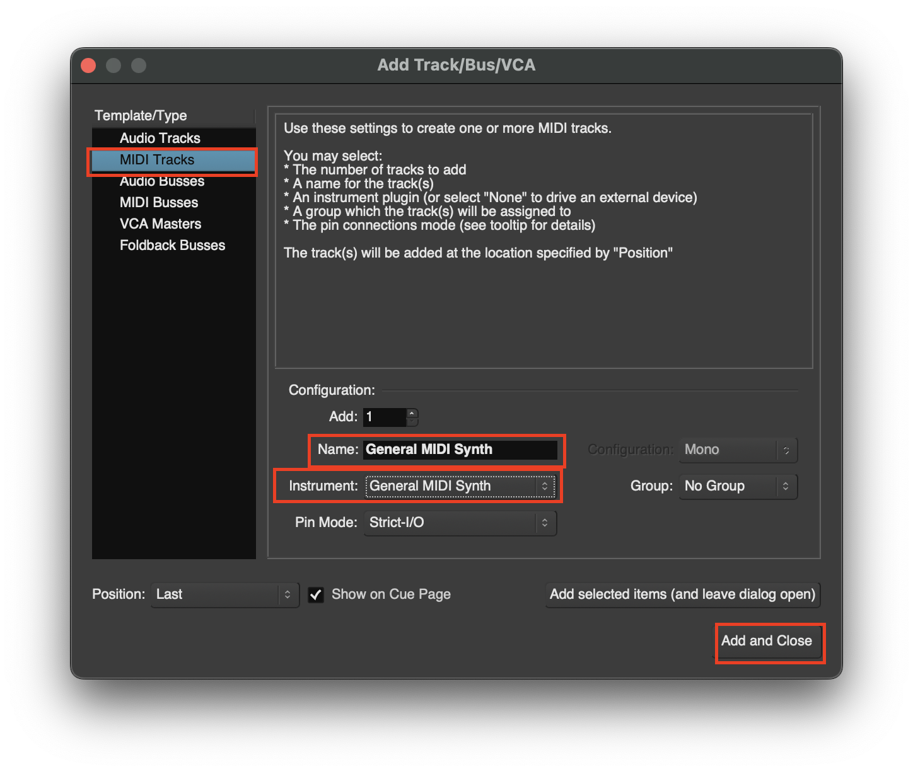

# Create a New Track

## Create a New Track
There are 3 ways to make a Track:

1. Add track via **Session > Add Track, Bus or VCA...**

2. Right Click on this area

3. Use shortcut **CMD + Shift + N**

## Create Track menu

| **Option** | **Purpose** | 
| ---------- | ----------- | 
| **Audio Track** | Record existing audio clips or record new ones using microphone |
| **MIDI Track** | Working with software synthesizers and plugins |

### Create a MIDI Clip
1. First add a MIDI clip with **CMD + Shift + N**

2. Drag the bottom of the track to see the **Piano Roll**

3. Use the draw tool to add an **Empty MIDI region**. Then you can add notes using the draw tool

4. You can move notes and extend them use the **Internal Edit Mode**. You can **Hold CTRL** while in the **Internal Edit Mode** to create notes

## 
