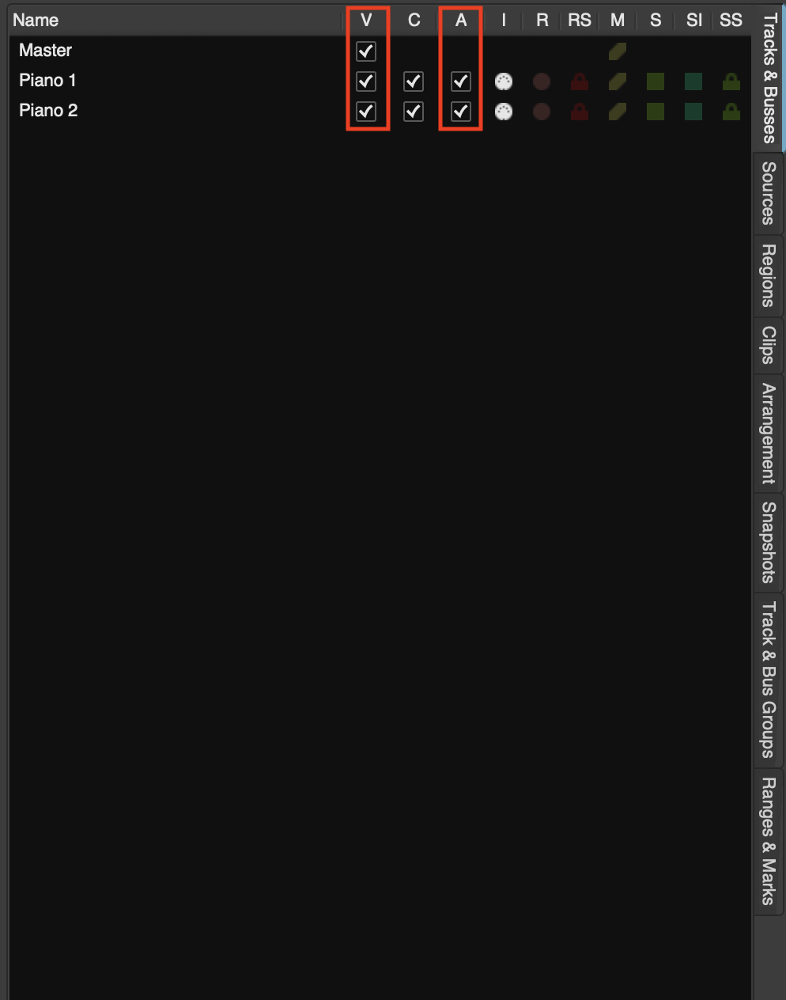
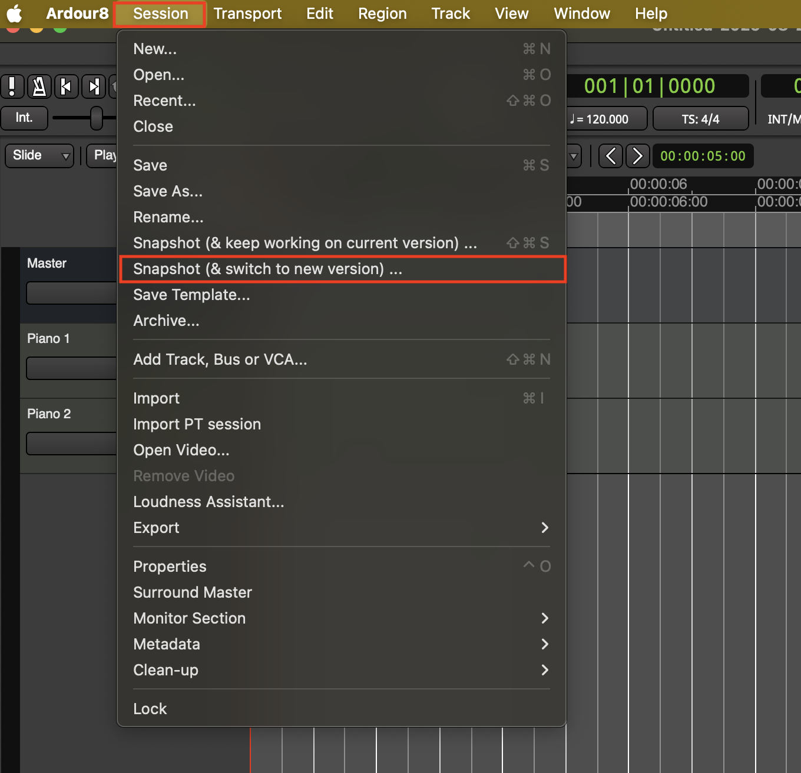
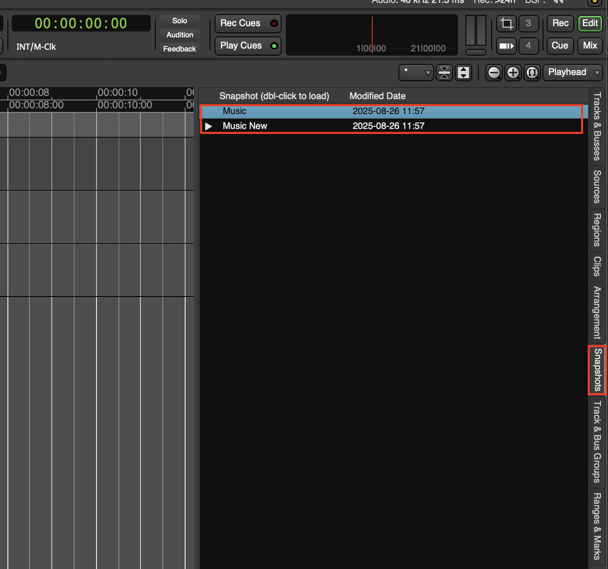

# Editor List
A powerful tool that allows you to navigate and organize your project

## Deactivate and Hide Tracks
1. **Deactivating tracks** are not processed by Ardour, so they do not consume any CPU time (They will still occupy your ram, you will need to remove the track to open up ram)

2. **Hidden tracks** are not deactivated by default, they are simply hidden

3. These are easily accessible in the **Editor List** **V** means Visible and **A** means active. Check and uncheck as needed

## Creating Snapshots
1. A good workflow is to save big changes as **Snapshots** so nothing is lost

2. Create a **Snapshot** by going to **Session > Snapshot(& switch to new version)...**

3. Your snapshot is now created and you can view it in the **Snapshots** section in the **Editor List**
