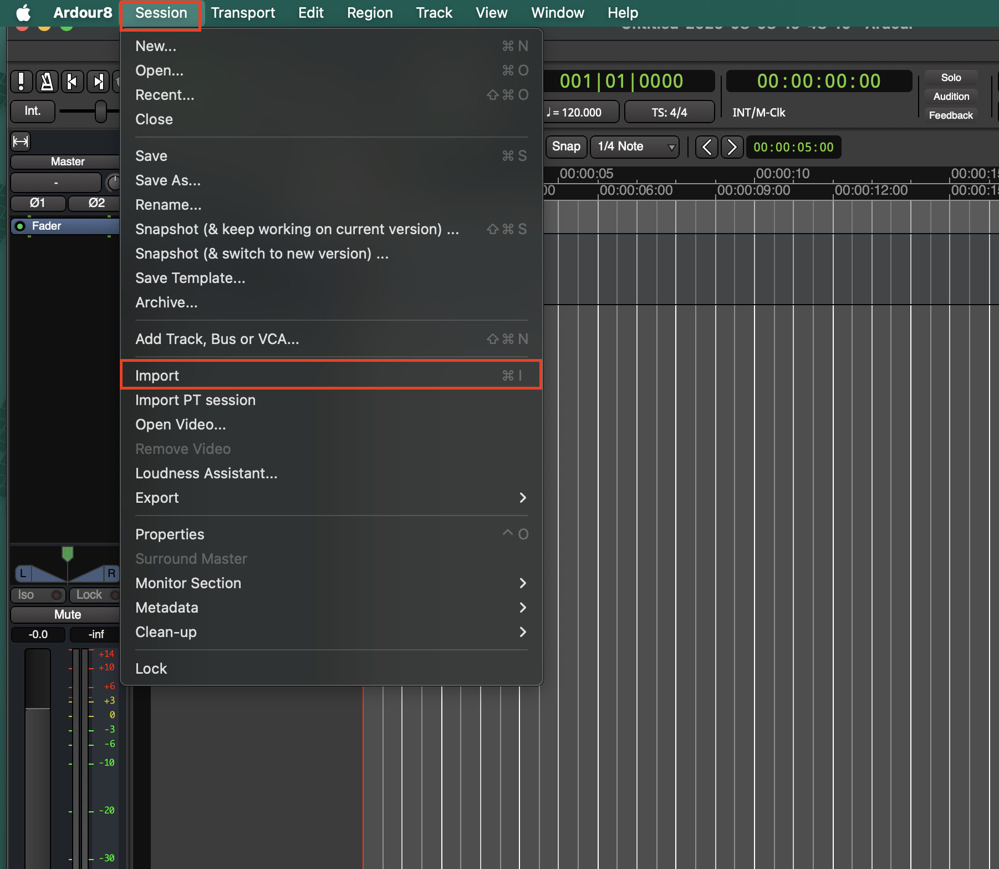
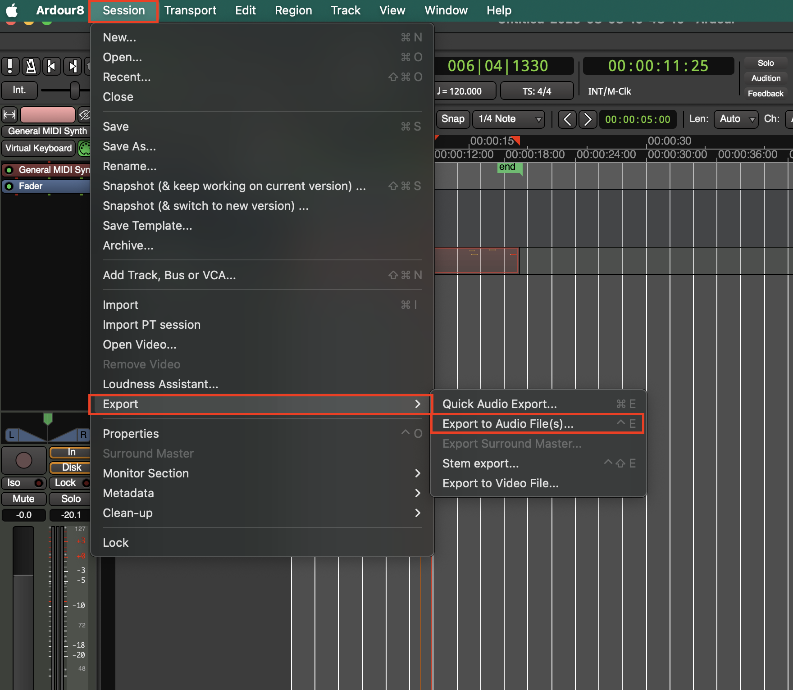
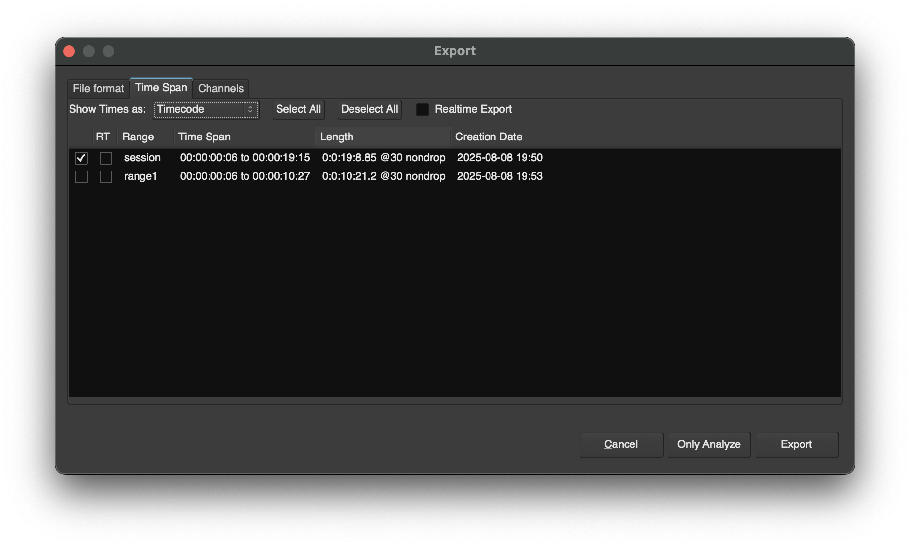
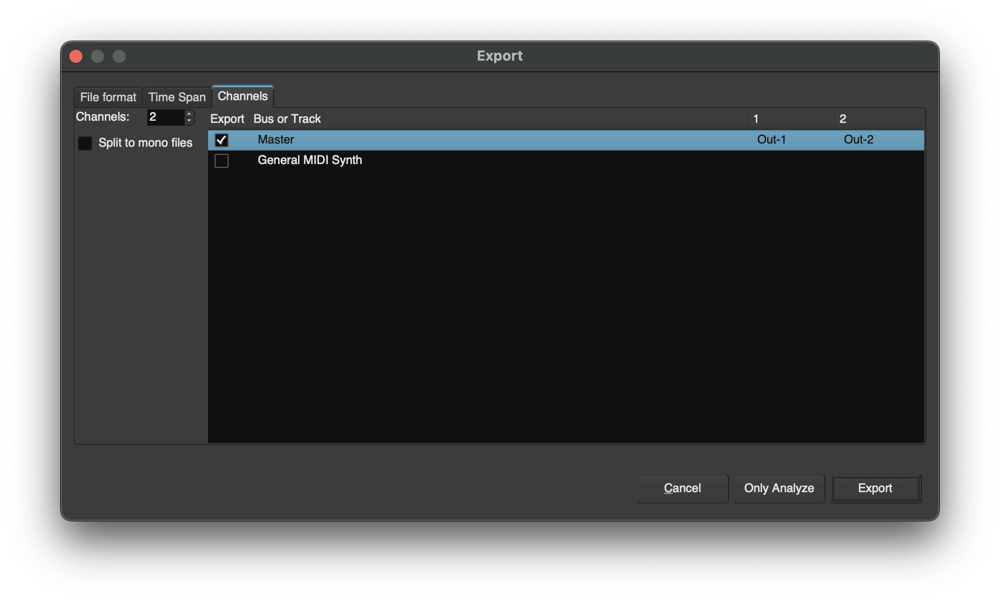
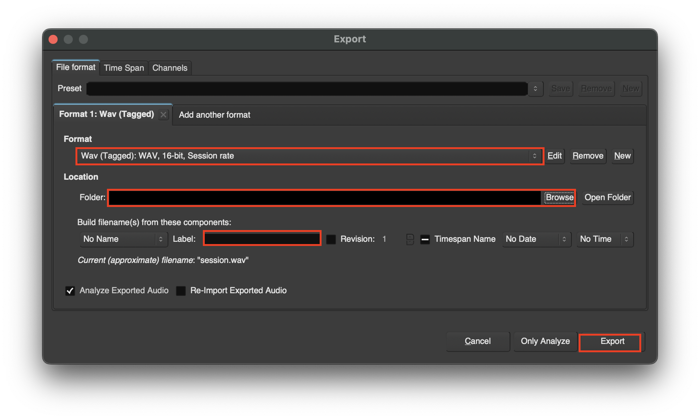

# Exporting and Importing Tracks

## Import Tracks
1. To import go to **Session > Import**

## Export Tracks
1. To export select **Session > Export > Export to Audio File(s)...**

2. Additionally if you wanted to you could select a range for what you are exporting

3. You could also select specific tracks to export

4. In the export window edit the **Format**, **Export Location**, **File Name**, and then select **Export**
