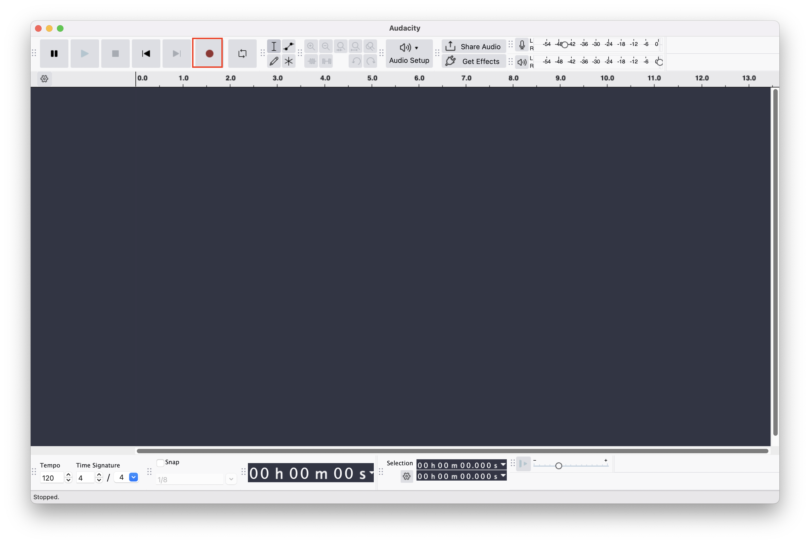
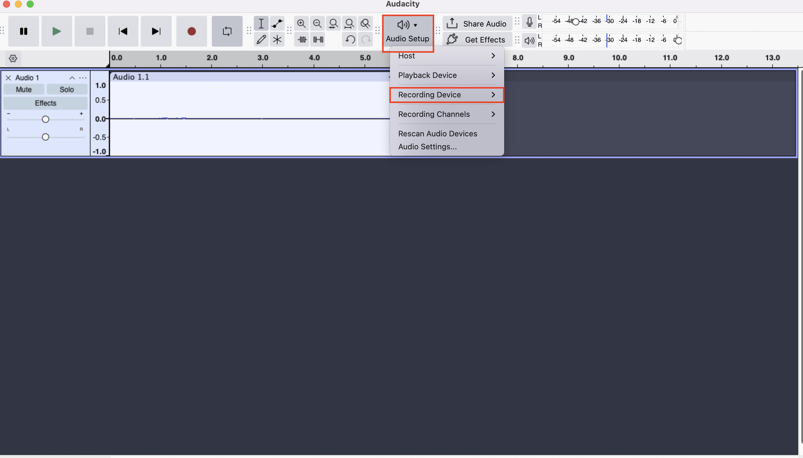
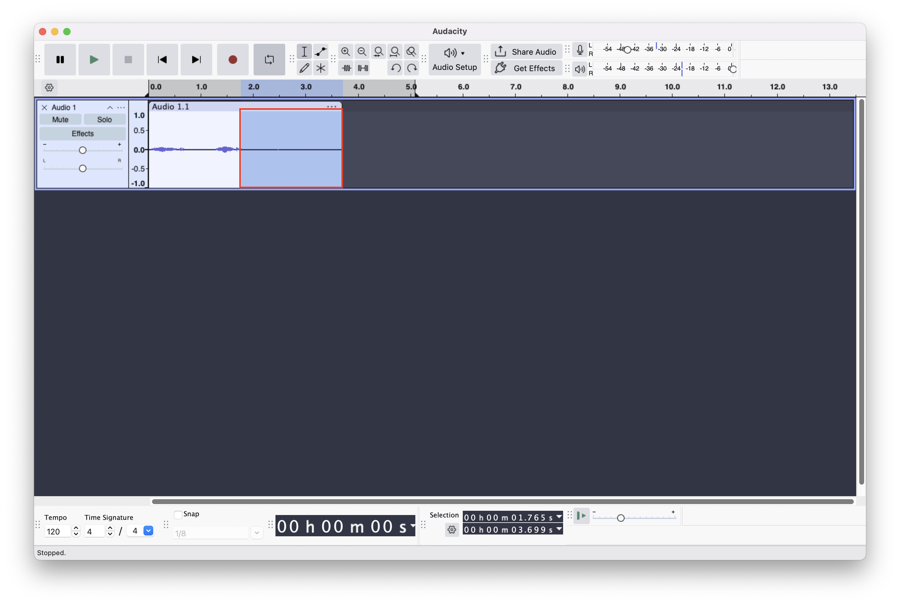
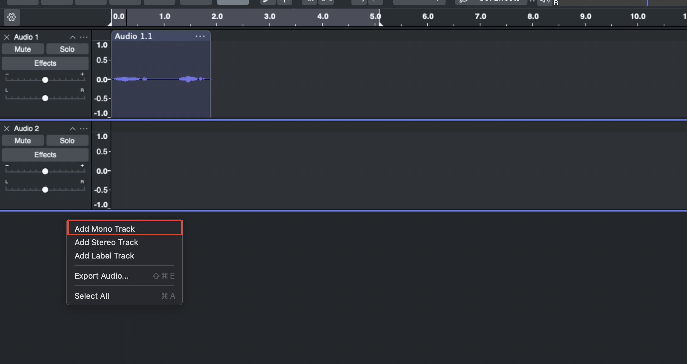
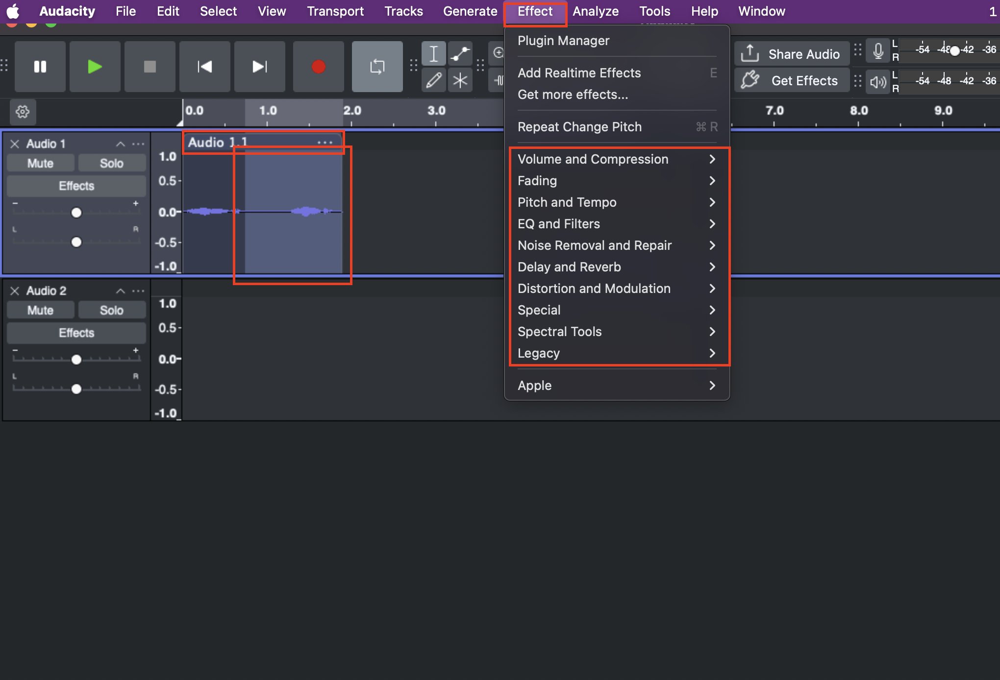

# Create Sound Effects

1. Select the red button to **Record**

2. To change recording source select **Audio Setup > Recording Device**

3. To delete highlight the track section inside the track, making it blue then press **Delete** on your keyboard

4. To add more tracks **Righ-click** on the empty space the select **Add More Track**

5. To add an effect highlight a part of the track or you can select the whole track by selecting the top bar of the track. Then select **Effect** and apply available effects
