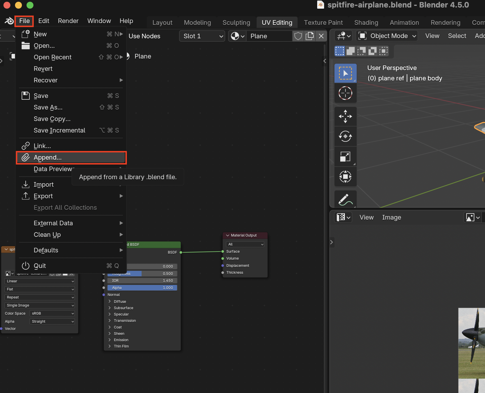
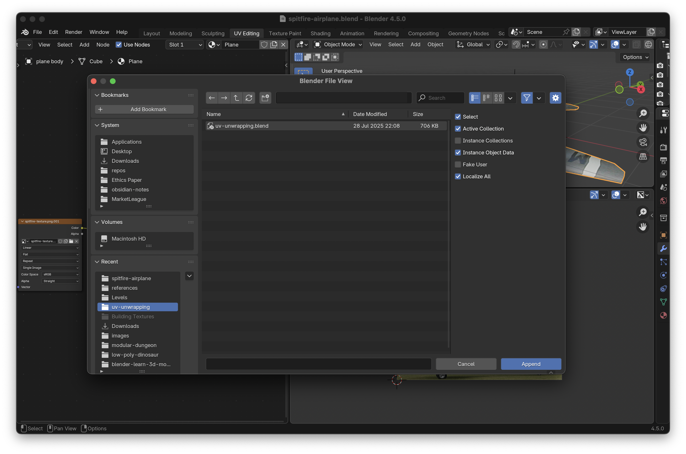
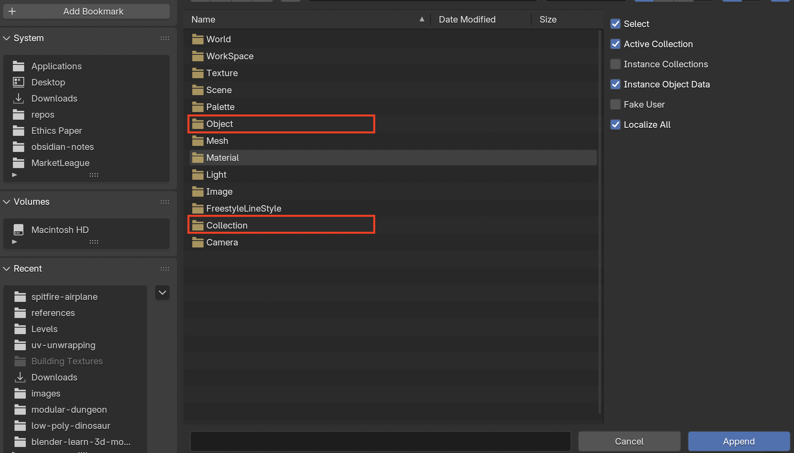
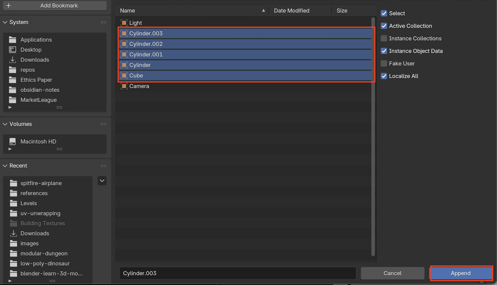

# Add Objects From Other Blend Projects

1. Select **File > Append...** 

2. Find the blend file then double click it

3. Here you can select a whole collection or individual objects. I will select objects

4. Select the needed objects then select **Append**

5. Now the objects are added to your Blender Project
