# Animating with Bones

## Create a Bone
1. **Shift + A** to Add, then select **Armature**
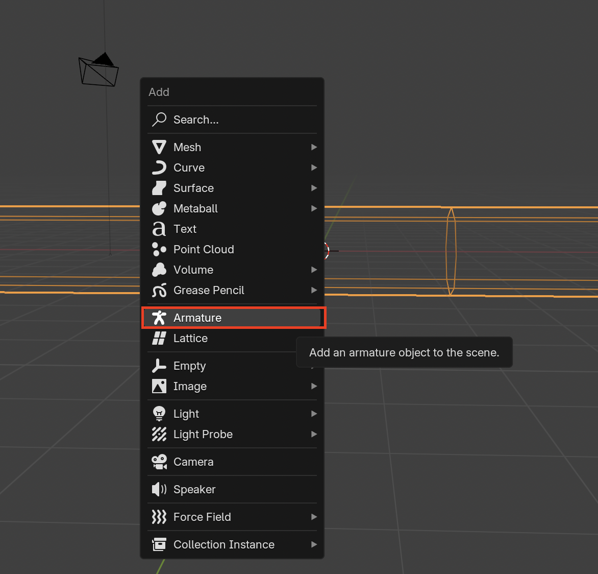

2. Go to the **Data** tab while the bone is selected and enabled **In Front** to see the bone even if it is behind the character
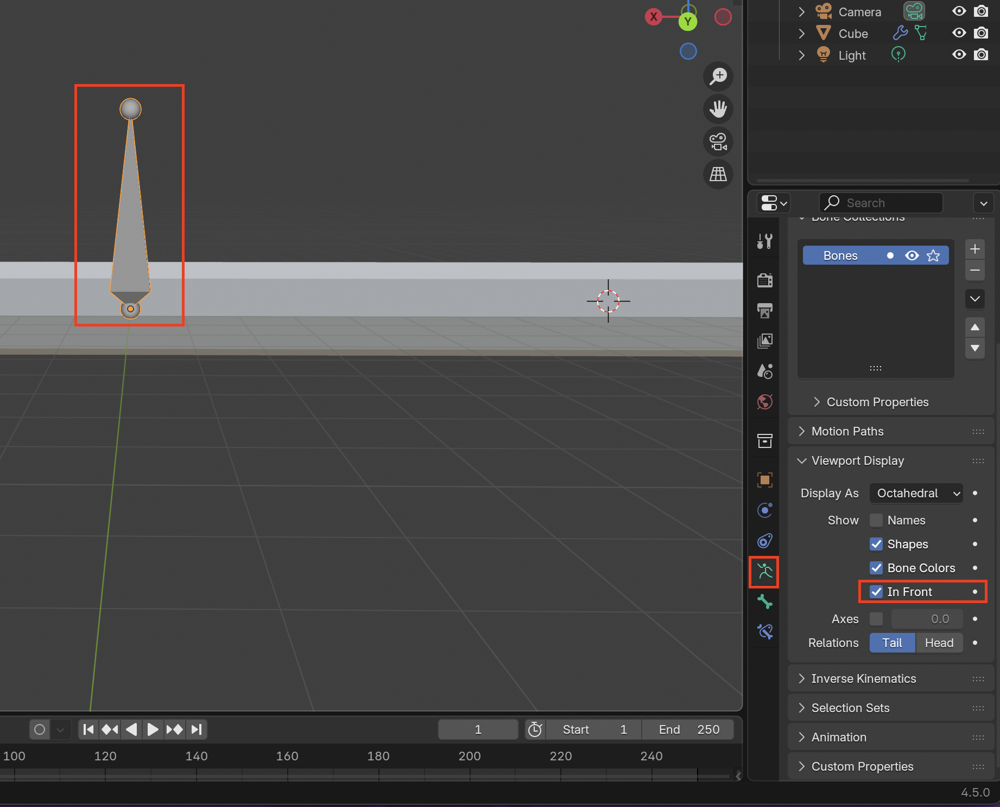

3. To edit bone structure in **Edit Mode** move the bones around to fit your character
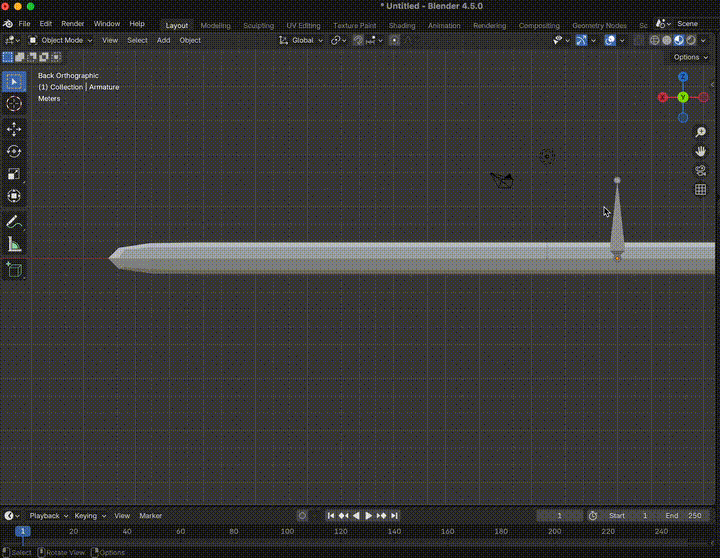

4. To make more bones press **E** while the bone is selected
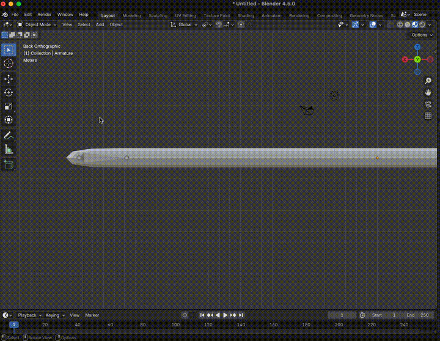

5. If you created bones nearby that you want to connect without using the **E** method, you can still connect them by selecting the bone you want to parent to second **Ctrl + P** to parent

> **Connected** just connects them, Offset keep the distance between the two bones, but still connects them

## Animate Bones
1. Check that bones are within your object. Because we enabled the **In Front** setting it can be hard to tell where the bones are stationed

2. It is useful to **Apply** the **Rotation & Scale**
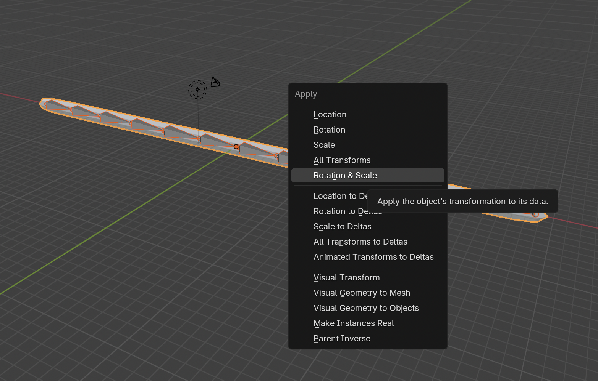
> This ensures that there are no weird values in the **Rotation** and **Scale** values
> 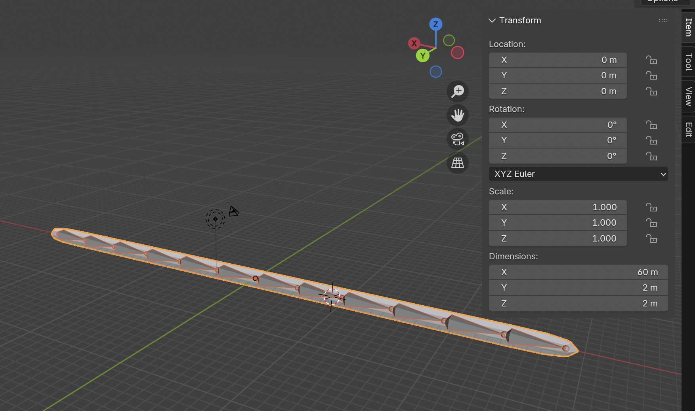

3. We need to parent the Bones to the Mesh so first select the Mesh then select the Bones last
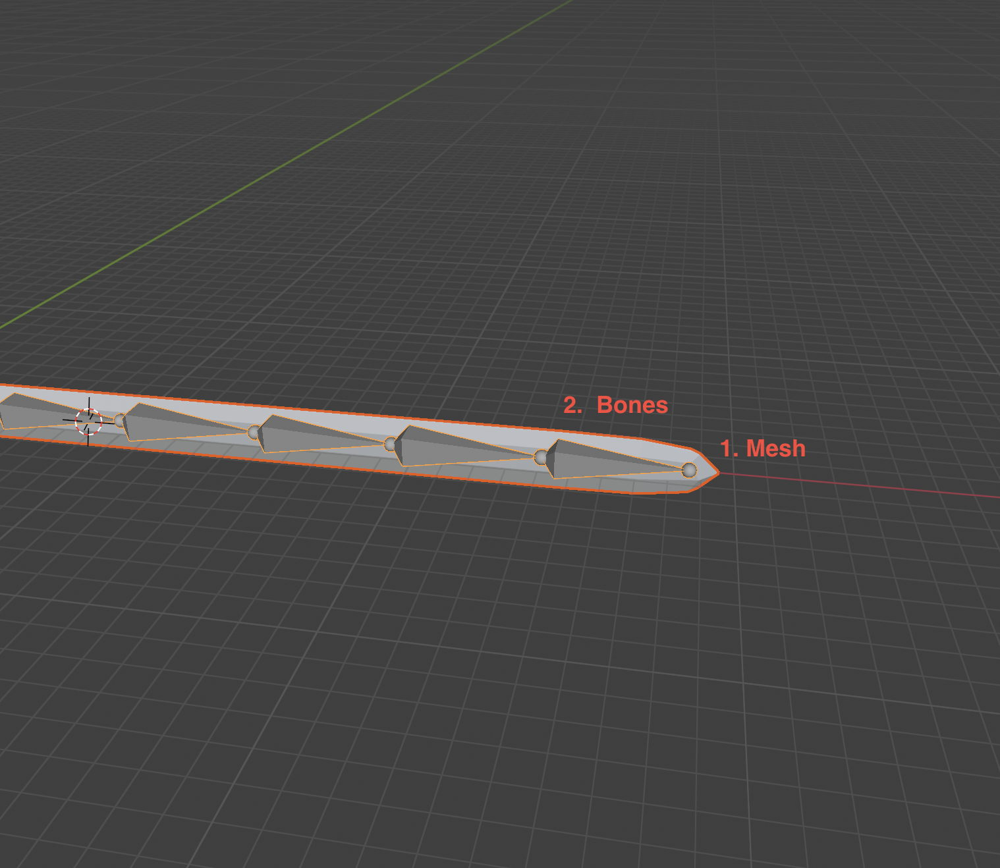

4. **Ctrl + P** to bring up the parent menu. The easiest one is **Automatic Weights**
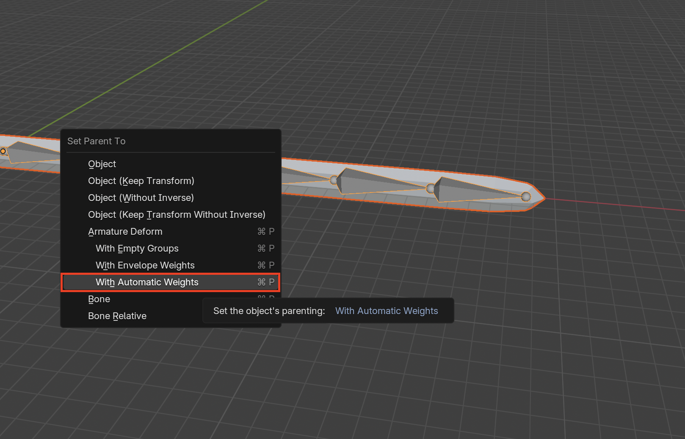

5. Now we can move the snake mesh using the bones
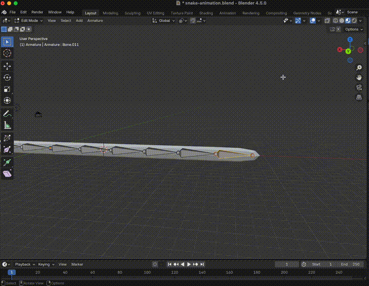
> **Alt + R** to remove rotation
> 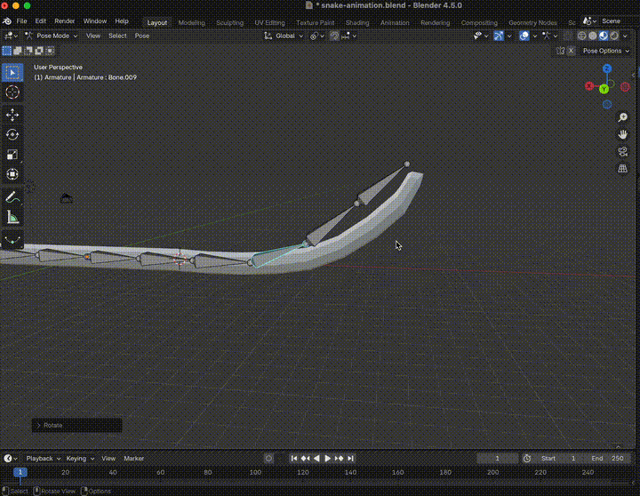

6. To see which bones control which parts of the mesh, **Select** the mesh, then go into **Weight Paint** Mode
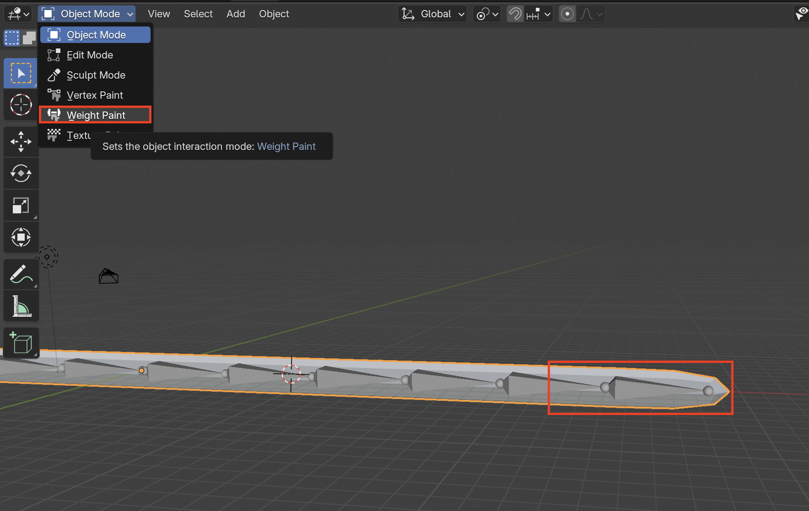

7. The area in red shows how much influence a bone will have on the mesh

> This dent effect is called "pinching" and is caused because the mesh is low-poly. Solutions: Create more Topology or create more Bones
> 

8. If you need to edit bones and the weights a better way is to select the bones first, then **Shift + Click** the mesh, then go into **Weight Paint** Mode
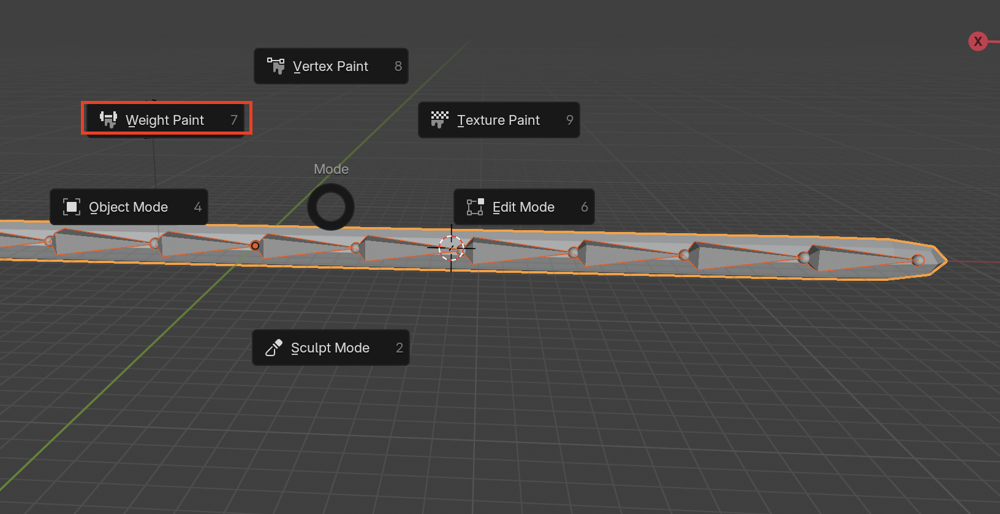

9. From here you can now directly select the bones to see what their weights are by **Shift + Ctrl + Click** the bones
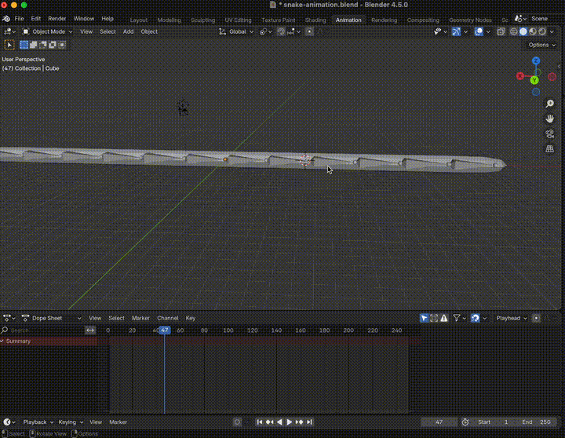

10. Go to the **Animation Workspace**
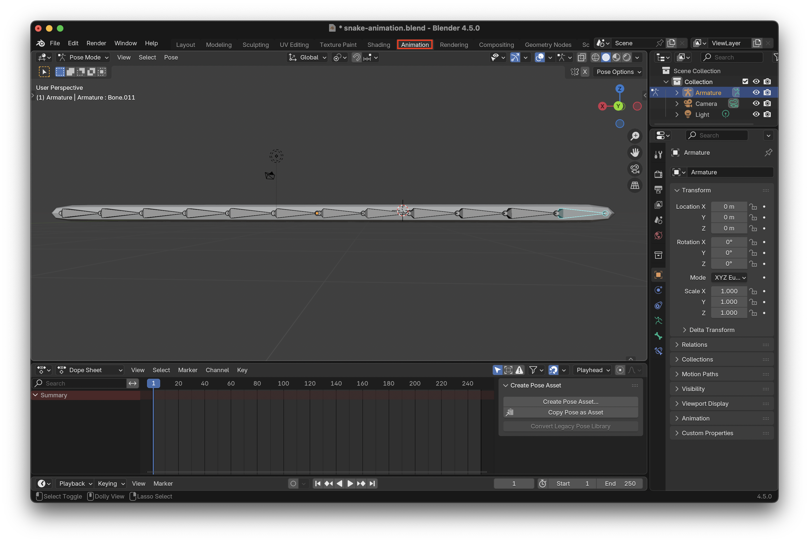

11. Make sure to select all bones with **A** then add a keyframe using **K** then selecting **Location & Rotation**
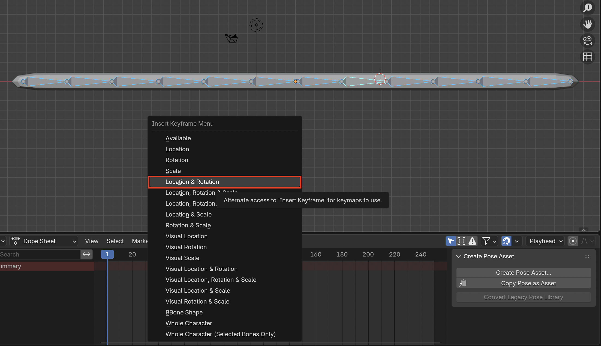