# Blender Animation

## Animation Prep

1. You may want to put separate objects as children to an **Empty**
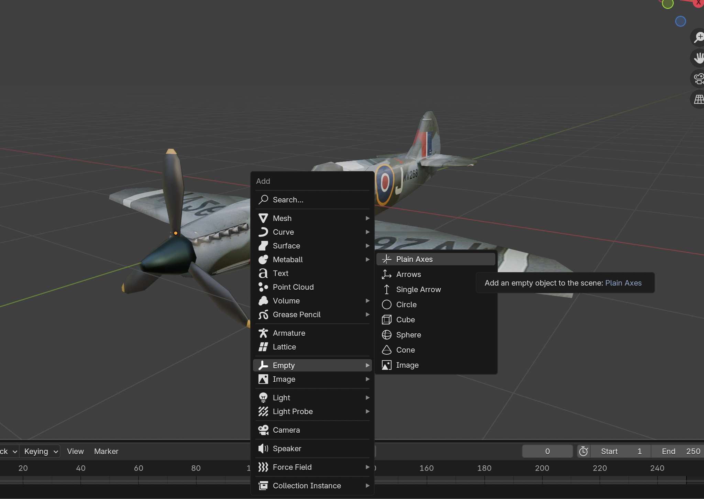

2. Rename the **Empty** to something that makes sense, like a controller
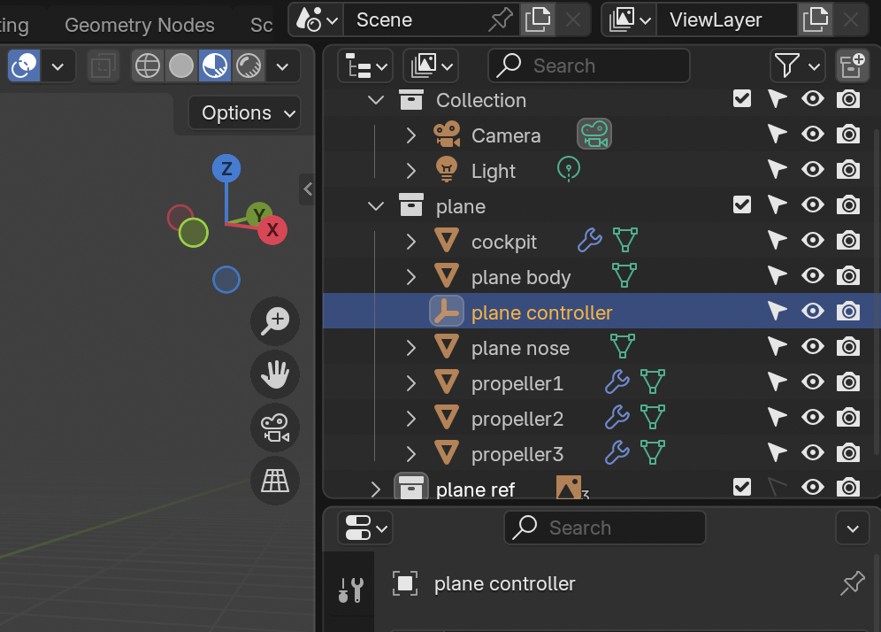

3. Select all the objects you want to include and make sure that the **Empty** is the **Active Object** by **Ctrl+Clicking** it
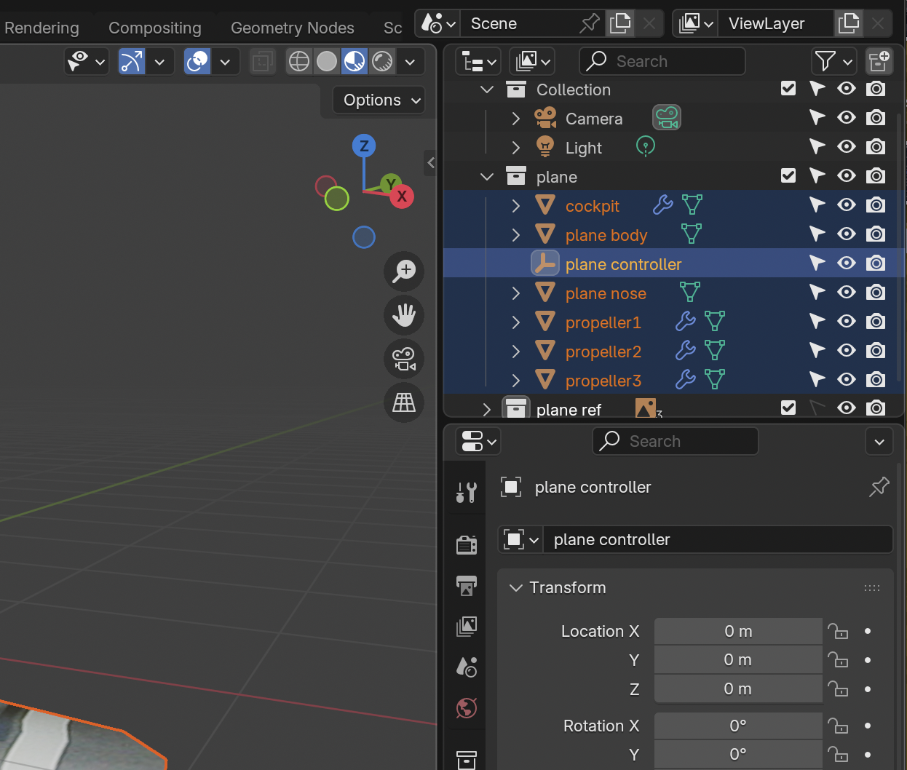

4. Now select **Object > Parent > Object**
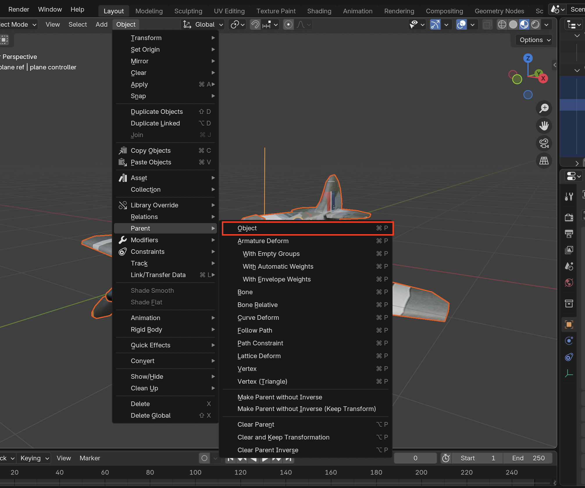

5. You can do this for multiple parents nested inside, this will allow for animation to be easier
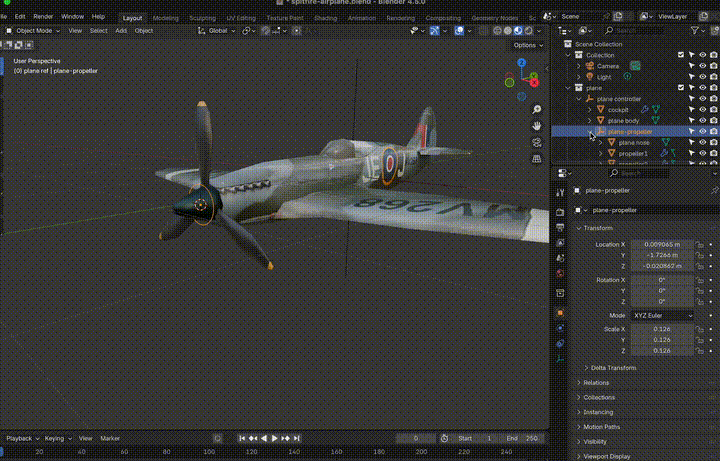

## Animation
1. Select the **Animation** Workspace
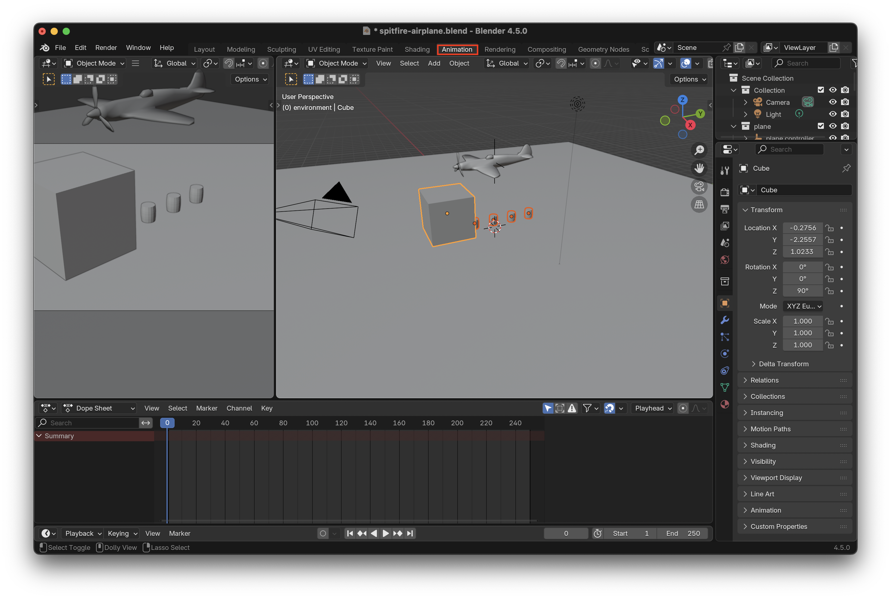

2. Update your **Frame Rate** to desired amount
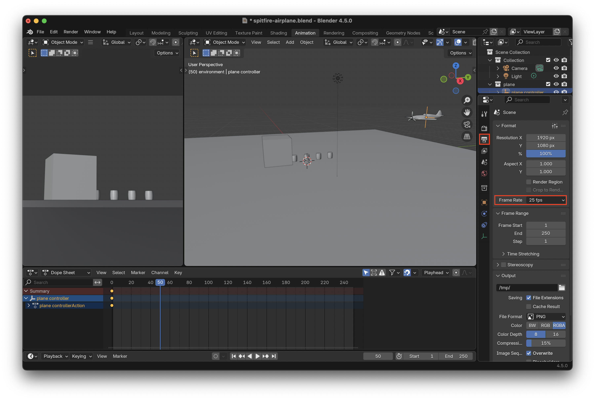

3. Set **Playhead** to starting position
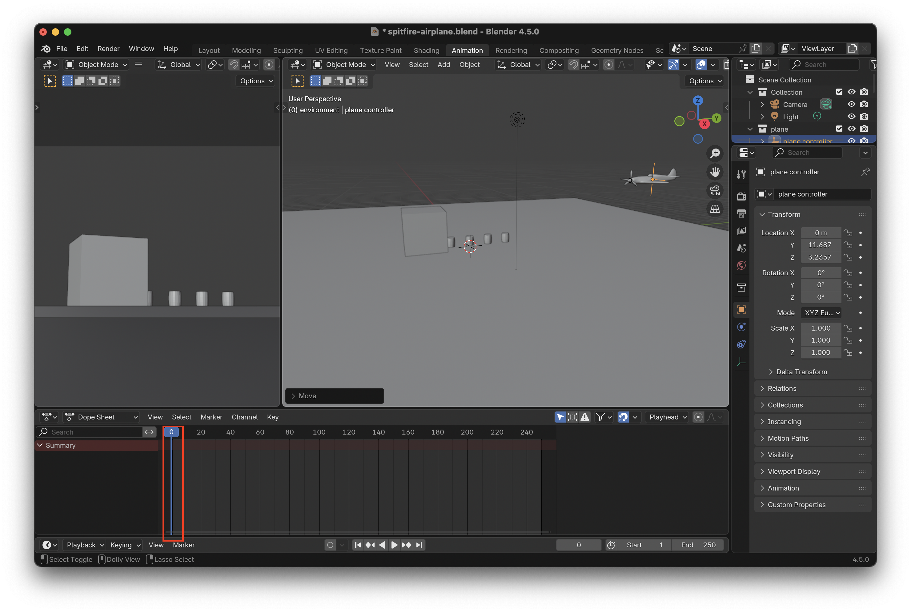

4. Press **I** in the **3D Viewport** to add keyframes
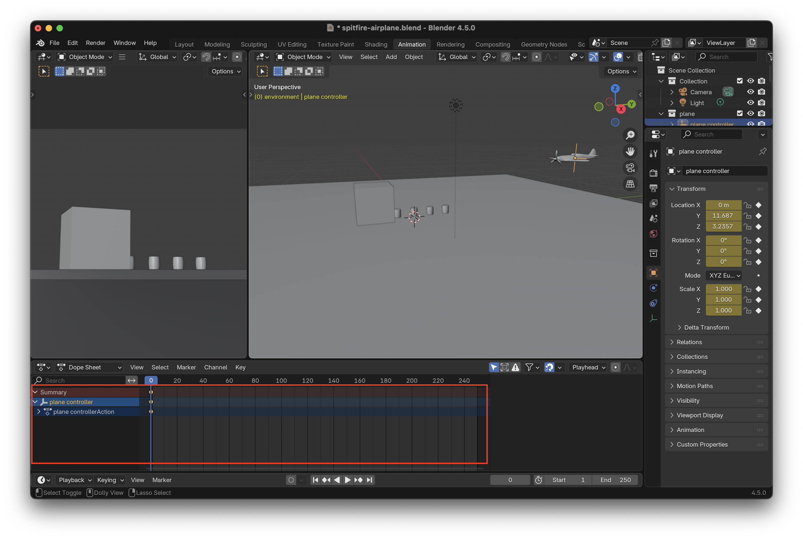

5. Add a second keyframe
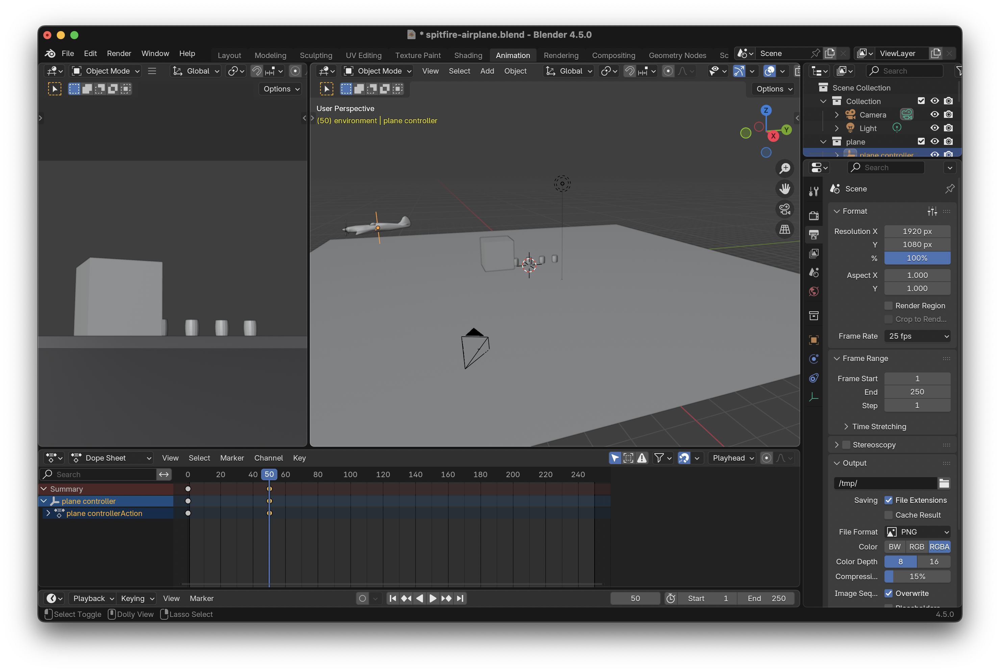

6. Make the **End** match with when you want the animation to terminate
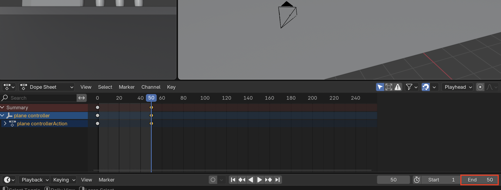