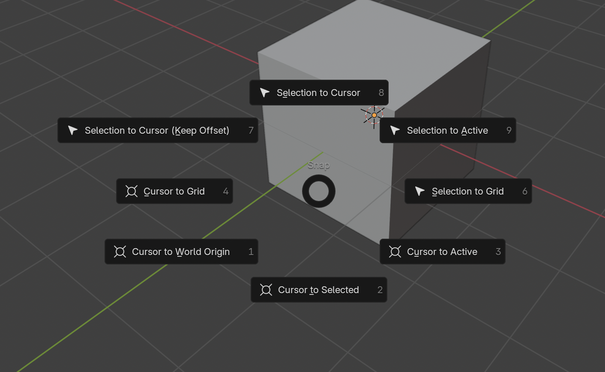
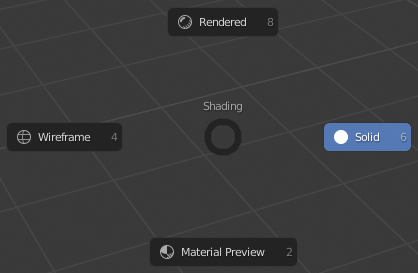

# Blender Pie Menus

| Shortcut | Description | Image |
|----------|-------------|-------|
| **Tab** | Object Interaction Mode Menu |  |
| **Tilde (`~` key)** | View Menu |  |
| **Shift + S** | 3D Cursor Menu |  |
| **Z** | Shading Menu |  |
