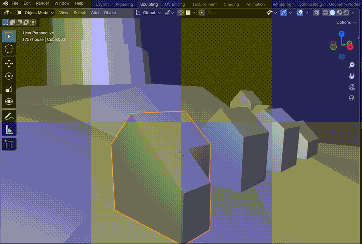
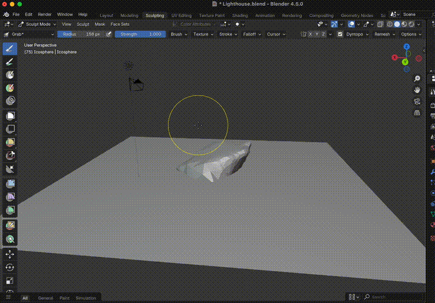
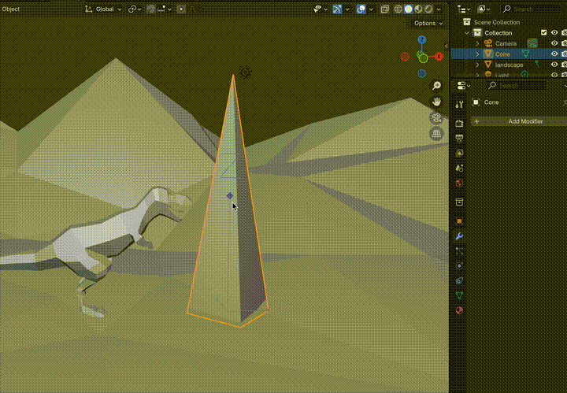
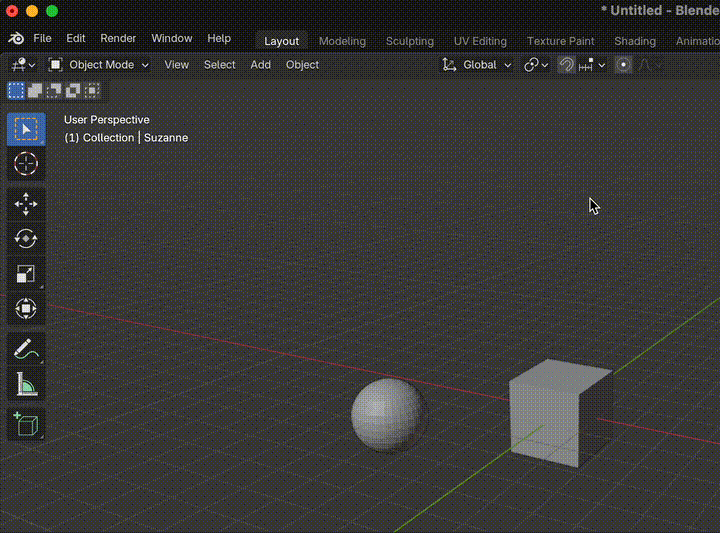
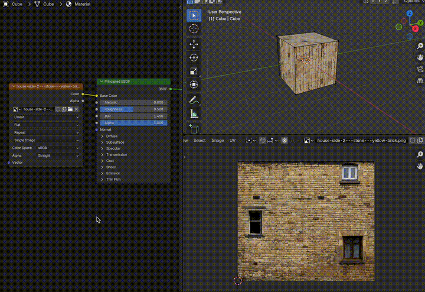

# Blender Shortcuts

## General Navigation & Interface

| Shortcut | Description | Image |
|----------|-------------|-------|
| **Middle Mouse Button** or **Two-finger trackpad**| Rotate view |
| **Shift + Middle Mouse** or **Shift + Two-finger trackpad**| Pan view |
| **Scroll Wheel** or **Ctrl + Ctrl-Key + Two-finger trackpad** | Zoom in/out |
| **Shift + ~** | Fly mode |  |
| **Q** | Quick Favorites |  |
| **/** | Toggle Local View |  |
| **Shift + R** | Repeat last action |

## Selection & Object Management

| Shortcut | Description |
|----------|------------|
| **A** | Select all |
| **Alt + A** | Deselect all |
| **Ctrl + I** | Invert selection |
| **B** | Box select |
| **C** | Circle select |
| **L** | Select linked |
| **Shift + L** | Select linked (menu) |
| **Ctrl + L** | Make links menu |

## Transform Operations

| Shortcut | Description |
|----------|------------|
| **G** | Grab/move |
| **R** | Rotate |
| **S** | Scale |
| **Shift + S** | Snap menu |
| **Shift + Right Click** | Move 3D Cursor to cursor |
| **Tab** | Toggle Edit/Object mode |
| **Shift + A** | Add menu |
| **X** or **Delete** | Delete menu |
| **Ctrl + A** | Apply transformations menu |
| **Ctrl + J** | Join selected objects |
| **P** | Separate (in Edit mode) |
| **Alt + D** | Duplicate linked |
| **Shift + D** | Duplicate |

## Axis Constraints (During Transform)

| Shortcut | Description |
|----------|------------|
| **X** | Constrain to X-axis |
| **Y** | Constrain to Y-axis |
| **Z** | Constrain to Z-axis |
| **Shift + X** | Constrain to YZ plane |
| **Shift + Y** | Constrain to XZ plane |
| **Shift + Z** | Constrain to XY plane |

## Transform Modifiers

| Shortcut | Description |
|----------|------------|
| **Shift** (during transform) | Precise movement |
| **Ctrl** (during transform) | Snap to grid |
| **Alt** (during transform) | Move in small increments |

## Workspace & UI

| Shortcut | Description | Image |
|----------|-------------|-------|
| **T** | Toggle toolbar |  |
| **N** | Toggle properties panel |  |
| **Ctrl + Spacebar** | Fullscreen window | 